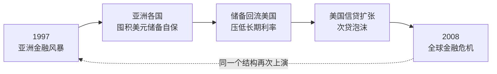

🌐 **简体中文** ｜ [English](./en/index.md)

# 📘 十年轮回 · 读书笔记与决策训练存档

**沈联涛《十年轮回：从亚洲到全球的金融危机》——14 个主题，全部扔进 AI 沙盘里被极限施压之后，留下的那份记录。**

> **EN** · A decision-training archive built by throwing Andrew Sheng's *From Asian to Global Financial Crisis* into an AI wargaming loop — 14 macro-finance concepts, each split into **"what the book actually says"** vs **"how it rewired my decisions"**, plus a 30-rule risk-control pipeline you can paste into a finance-analysis agent. Written in Simplified Chinese, with a [condensed English edition](./en/README.md).

原书：**[《十年轮回：从亚洲到全球的金融危机》](https://book.douban.com/subject/26824470/)** · 沈联涛（Andrew Sheng）· 香港金管局前副总裁、**1997 年港元保卫战的当事人**

### [👉 零基础？从这篇 30 秒导览开始 →](./docs/00-导览-30秒看懂-术语急救包-演化地图.md)
### [📂 或直接进分篇目录 →](./docs/index.md)
### [🇬🇧 English edition →](./en/README.md)

---

## 🧨 一句话核心

**1997 年亚洲金融风暴与 2008 年全球海啸，不是两场危机，是同一场危机的两个半场。** 亚洲当年为了自保而囤积的美元储备，十年后回流华尔街——亲手为下一场更大的爆炸注满了燃料。

---

## 🤔 这是什么

一份**决策训练存档**，不是读书摘要。

原始素材来自一条与 AI 的对练对话链：把《十年轮回》里的 14 个宏观金融概念逐一扔进「生活化沙盘」——每个概念都被翻译成一个日常商业困境，配上两三个「听起来都有道理」的选项，做出选择后再被推到极端，看见它怎么死。

读完之后留下的不是 14 个知识点，而是**三把判断的尺子**。

## 🎯 为什么值得点开

| | |
| :--- | :--- |
| **不假设你读过原书** | 开篇「30 秒导览」+ 27 条术语大白话 + 人物机构速查，零背景也能跟下来 |
| **不给标准答案，给失败过程** | 每个主题严格切成两半：📖 原书核心精髓 ／ ⚡ 我原本怎么想、被什么打醒、现在怎么做 |
| **全部是中文的具体场景** | 老温的农贸市场、阿豪的餐饮连锁、老柯的智能硬件供应链——没有一句「假设有一个代表性主体」 |
| **标注置信度，也标注边界** | 引文与数据逐条核验并标「高／中／低」；未覆盖章节、AI 寓言、沙盘的说服力偏误全部写进边界一节，不藏 |
| **附一条可直接抄走的流水线** | 附录 A 的 30 条风控规则，专为个人金融分析 Agent 设计 |

---

## 🗂 14 个主题（点标题进单页）

| # | 主题 | 一句话 |
| :--: | :--- | :--- |
| [01](./docs/01-双重错配-期限错配与货币错配.md) | **双重错配** | 用短期外债撑长期资产——生意再赚钱，也会被「暂时掏不出整本」逼死 |
| [02](./docs/02-流动性危机vs清偿能力危机.md) | **流动性 vs 清偿能力** | 判错这一种，药方立刻变成毒药 |
| [03](./docs/03-抵押品永动机-按市值清算.md) | **抵押品永动机** | 杀死你的不是你自己的经营，是别人跳楼价成交的那一笔 |
| [04](./docs/04-制度性毒素-道德风险.md) | **制度性毒素** | 毒死百年投行的不是贪婪，是「利益个人化、风险组织化」 |
| [05](./docs/05-监管孤岛-价格信号压抑-合成谬误.md) | **监管孤岛** | 局部合规的总和，等于整体毁灭 |
| [06](./docs/06-刚性兑付-连环担保-大而不能倒.md) | **刚性兑付与连环担保** | 交叉担保亲手炸毁有限责任防火墙 |
| [07](./docs/07-三元悖论-固定汇率-看跌期权.md) | **三元悖论与固定汇率** | 官方承诺，是一张免费发给投机者的看跌期权 |
| [08](./docs/08-1998香港保卫战-港元-索罗斯.md) | **1998 香港保卫战** | 赢的关键是改规则，不是比谁的钱多 |
| [09](./docs/09-全球失衡-十年轮回-储备国是人质.md) | **全球失衡与十年轮回** | 储备国不是债主，是人质 |
| [10](./docs/10-东亚融资模式-裙带资本主义.md) | **东亚融资模式与裙带资本** | 把「股权投资」做成「债务连带」，是东亚体系最大的毒瘤 |
| [11](./docs/11-最后贷款人陷阱-bail-out.md) | **最后贷款人陷阱** | 当救世主同时是清道夫 |
| [12](./docs/12-中国宏观免疫力-坏账手术-资本管制.md) | **中国宏观免疫力与坏账手术** | 为什么坏账 35% 的没死，坏账 15% 的先死 |
| [13](./docs/13-赤壁连环船-CDO-CDS-系统性传染.md) | **赤壁连环船** | 相关性从 0.05 跳到 0.99——「分散风险」的数学魔术瞬间失效 |
| [14](./docs/14-零波动神话-VaR-动态对冲-黑天鹅.md) | **零波动神话** | 「99% 安全」掩盖了那 1% 里的无限下行——动态对冲是人造踩踏机 |

**附录与边界**

- 🧾 **[附录 A：30 条 Agent 风控规则](./docs/A-附录A-30条Agent风控规则.md)** — 把 14 个维度蒸馏成一条可直接抄进 prompt 的风控审核流水线
- ⚠️ **[方法论的边界与已知盲区](./docs/B-方法论边界与已知盲区.md)** — 6 项盲区 + 5 条对话自身的自我反驳
- 📎 **[附录 B：书目信息与数据核验](./docs/C-附录B-书目信息与数据核验.md)** — 版本、关键数据、逐条置信度
- 🧩 **[收束：这份笔记真正改变的东西](./docs/Z-收束-这份笔记真正改变的东西.md)**

📄 也提供 **[单文件完整版](./十年轮回-核心精髓与思维演化笔记.md)**（1931 行，一次下载离线读）。

---

## ✨ 三种读法

| 你想要的 | 怎么读 | 时长 |
| :--- | :--- | :--- |
| **快速知道这本书在讲什么** | 读 [30 秒导览](./docs/00-导览-30秒看懂-术语急救包-演化地图.md) + [边界一节](./docs/B-方法论边界与已知盲区.md) | ~10 分钟 |
| **拿它当决策工具** | 直接跳 [附录 A 的 30 条风控流水线](./docs/A-附录A-30条Agent风控规则.md)，抄进你自己的工作流 | ~15 分钟 |
| **完整跟一遍思维演化** | 从 01 顺读到 14，每个主题**先自己做选择**，再看它被推翻 | ~90 分钟 |

## 🙋 谁会从中拿到东西

- 想弄懂 **1997 亚洲金融风暴到底怎么发生的**，又不想啃学术书的人
- 在 **2008 次贷危机**之后仍搞不清 **CDO / CDS / 影子银行** 在干嘛的人
- 做投资、风控、资产管理，需要一套**能立刻用的检查清单**的人
- 在建**金融分析 Agent / LLM 工作流**，缺一套中文风控 prompt 的人
- 想看**人类直觉是怎么被 AI 一步步打脸**的人（全过程原样保留，包括那些错得离谱的第一反应）

---

## ❓ 常见问题

<b>《十年轮回》到底讲了什么？三句话能说完吗？</b>

能：

1. **1997 年亚洲金融风暴与 2008 年全球海啸是同一场危机的两个半场**——亚洲囤积的外储回流美国，压低长期利率，喂出了次贷泡沫。
2. **危机的引信很少是「坏人作恶」，多数是「结构错配」**：短期负债配长期资产、本币收入配外币负债、个体理性配集体毁灭。
3. **每一次金融危机，本质上都是一次治理危机。**

<b>1997 年亚洲金融风暴的根本原因是什么？</b>

不是索罗斯，不是「亚洲价值观破产」，而是**双重错配**：东南亚企业与银行大量借入**短期美元外债**，投向**长期本币资产**（房地产、基建）。只要外资持续流入，这个结构就能转；一旦外资转向，本币贬值会让美元负债在本币账面上自动暴增，而短债到期却无法展期——**生意明明赚钱，却被「暂时掏不出整本」逼死**。

详见 [01. 双重错配](./docs/01-双重错配-期限错配与货币错配.md)。

<b>为什么中国 1997 年坏账率 30%–40% 却没倒，泰国、韩国反而先崩？</b>

因为**决定生死的不是坏账率，是融资结构**。中国当时**资本账户不可兑换**，外部热钱进不来也做空不了，负债端几乎 100% 依赖本币居民储蓄——**没有外债敞口，就没有挤兑的入口**。一场可能引发休克的清算危机，被锁死成封闭系统内可长期消化的内部重整。

但代价同样真实：长期**金融压抑**（居民存款实际负利率，等于向储户征收隐性通胀税）+ 全域道德风险。

详见 [12. 中国宏观免疫力与坏账手术](./docs/12-中国宏观免疫力-坏账手术-资本管制.md)。

<b>1998 年香港是怎么打赢索罗斯的？</b>

不是靠「钱比空头多」。金管局的打法是**改规则**：把战场从「看谁现金多」换成「抬高对手的每日持有成本 + 卡死实物交割」。空头的命门不是输掉某个合约，而是**全局资产负债表的流动性断裂**。

详见 [08. 1998 香港保卫战](./docs/08-1998香港保卫战-港元-索罗斯.md)。

<b>CDO 和 CDS 到底是怎么把风险「变没」的？为什么最后没变没？</b>

变没的是**账面上的风险**，不是真实的风险。打包切片让评级机构只审查**切完之后的统计方差**，不审查底层资产是不是已经停发工资。更致命的是**相关性假设**：模型假设火锅店与奶茶店的相关系数是 0.05，但系统性冲击来临时，所有资产的**相关性会内生突变到 0.99**——分散瞬间变成导火索。

详见 [13. 赤壁连环船](./docs/13-赤壁连环船-CDO-CDS-系统性传染.md)。

<b>VaR 说「99% 置信度下安全」，问题出在哪？</b>

出在**没说出口的那 1%**。VaR 回答的是「平常日子里最多亏多少」，它刻意不回答「极端日子里会亏多少」——而后者**没有上限**。1987 年黑色星期一道指单日暴跌 22.6%，元凶正是当时被视为「科学风控」的**组合保险（动态对冲）**算法：所有机构的算法在同一毫秒触发卖出，**避险动作本身变成了砸盘的火力**。

详见 [14. 零波动神话](./docs/14-零波动神话-VaR-动态对冲-黑天鹅.md)。

<b>这份笔记是 AI 写的吗？</b>

**是与人合写的，而且这一点被明确标注。** 场景、公司、人物全部是 AI 生成的商业寓言；「我的演化」部分是人类在沙盘中的真实选择与被打脸过程。方法论边界一节里写明了这种写法的 6 项盲区，包括「沙盘的后果推演有强说服力设计，不能当作实证证据」。

<b>我可以拿去用吗？</b>

笔记正文（演化与实践部分）采用 **CC BY-NC-SA 4.0**，署名、非商业、相同方式共享即可。原书观点与引文版权归沈联涛及出版方所有。

---

## 🔍 如果你在搜这些词

`十年轮回 读书笔记` · `沈联涛` · `From Asian to Global Financial Crisis` · `1997 亚洲金融风暴 原因` · `亚洲金融危机` · `2008 全球金融危机` · `次贷危机` · `双重错配` · `期限错配` · `货币错配` · `流动性危机 vs 清偿能力` · `挤兑 bank run` · `抵押品永动机` · `按市值清算` · `道德风险` · `监管套利` · `影子银行` · `刚性兑付` · `连环担保` · `大而不能倒` · `bail-in` · `三元悖论` · `不可能三角` · `固定汇率` · `联系汇率` · `1998 香港保卫战` · `港元` · `索罗斯` · `全球失衡` · `储蓄过剩` · `裙带资本主义` · `最后贷款人` · `资本管制` · `资本账户可兑换` · `AMC 资产管理公司` · `金融压抑` · `CDO` · `CDS` · `高斯联结模型` · `相关性突变` · `系统性传染` · `巴塞尔协议` · `VaR 在险价值` · `动态对冲` · `组合保险` · `1987 黑色星期一` · `黑天鹅` · `肥尾` · `物理学嫉妒` · `反身性` · `风控 prompt` · `金融分析 Agent`

---

## ⚠️ 免责声明

1. **本文中所有场景、公司、人物**（老温、老陈、阿强、老林、老赵、阿豪、老柯、戴总、戴文……）**均为 AI 生成的商业寓言，没有真实对应主体**，只为承载理论而构造，不是案例研究。
2. **沙盘的「后果推演」具有强说服力设计**——它总能构造出让你选错的那条连锁反应。它适合训练批判思维，**不能当作实证证据**。
3. 本笔记**不构成任何投资建议**。
4. 「原书核心精髓」部分是从沙盘对话中**反向提炼**，并非原书逐页摘录；引文未与纸质书页码逐条比对，核验状态见 [附录 B](./docs/C-附录B-书目信息与数据核验.md)。

## 📄 授权

- **笔记正文**（我的演化与实践部分）：[CC BY-NC-SA 4.0](https://github.com/wai-21/ten-years-cycle-notes/blob/main/LICENSE)
- **原书观点与引文**：版权归沈联涛及出版方所有，此处仅作学习评论之用

---

*核心精髓归沈联涛，演化与踩坑归我。*

**如果对你有用，点个 ⭐ 让更多人看到。**

