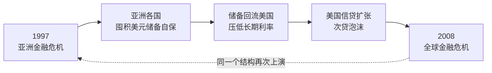

> [📚 总目录](../README.md)　·　[下一篇 ➡️](01-双重错配-期限错配与货币错配.md)

---

# 🚪 先读这里：30 秒看懂这份笔记

**这份笔记不需要你先读过原书。** 它是一个普通人把一本宏观经济学的书扔进 AI 沙盘、反复拷打之后留下的**决策训练存档**。下面四小节是给完全零背景的读者准备的入场券。

### 一、原书在讲什么

*《十年轮回：从亚洲到全球的金融危机》*，作者**沈联涛（Andrew Sheng）**——马来西亚央行首席经济师出身，1993–1998 年任香港金融管理局副总裁（**1997 年港元保卫战，他是当事人**），1998–2005 年连续三届出任香港证监会主席。他不是财经记者，是真正坐在驾驶舱里的人。

全书用三句话可以说清：

1. **1997 年亚洲金融风暴与 2008 年全球海啸，不是两场危机，是同一场危机的两个半场。** 亚洲当年为了自保而囤积的美元储备，十年后回流华尔街，亲手为下一场更大的爆炸注满了燃料。
2. **危机的引信很少是“坏人作恶”，多数是“结构错配”**——短期负债配长期资产、本币收入配外币负债、个体理性配集体毁灭。
3. **每一次金融危机，本质上都是一次治理危机。**



### 二、这个“沙盘”是怎么玩的

原始素材来自一条与 AI 的对练对话链。每一轮都跑同一个循环：

```text
① 日常场景      → 一个生活化的商业困境，不堆砌金融术语
② 两三个选项    → 每个选项都“听起来有道理”
③ 我做选择      → 通常是第一直觉，而且通常是错的
④ 后果推演      → AI 把我的选择推到极端，让我看见它怎么死
⑤ 四向认知扩展  → 补上我完全没想到的维度，再回到原书理论
```

**为什么要这样设计：** 宏观金融理论读起来句句都对，一遇到具体决策就用不上。沙盘的作用是**把抽象理论逼到墙角，让你用自己的直觉先撞一次墙**，然后才告诉你墙在哪。

> **⚠️ 使用前必读的两句免责**
>
> 1. **所有场景、公司、人物（老温、老陈、阿强、老林……）都是 AI 生成的商业寓言，没有真实对应主体。** 它们只为承载理论而构造，不是案例研究。
> 2. **沙盘的“后果推演”有强说服力设计**——它总能构造出让你选错的那条连锁反应。**它适合训练批判思维，不能当作实证证据。**

### 三、三个背景常识（没有它们，后面会看不懂）

| 常识 | 一句话解释 | 为什么重要 |
| :--- | :--- | :--- |
| **期限错配** | 用 3 个月就要还的钱，去盖 5 年才回本的楼 | 1997 年亚洲企业集体猝死的头号死因：生意明明赚钱，却被“暂时掏不出整本”逼死 |
| **货币错配** | 赚的是本国货币，欠的是美元 | 本币一跌，债务本金在账面上自动暴增，辛苦利润被吃得一干二净 |
| **资本账户可兑换与否** | 外国人的钱能不能自由进出你的国家 | 决定一场危机是“内部慢慢消化”，还是“当场休克猝死”——全书最关键的开关 |

### 四、出场人物与机构速查

| 名字 | 是谁 | 在书里扮演什么角色 |
| :--- | :--- | :--- |
| **沈联涛** | 作者。马来西亚央行 → 世界银行 → 香港金管局副总裁 → 香港证监会主席 | 既是监管者也是当事人，全书是一份“内部视角” |
| **索罗斯 / 对冲基金** | 1997 年狙击泰铢、港元的国际投机资本 | “空头”的具象代表——他们的命门不是钱多，是持有成本 |
| **IMF（国际货币基金组织）** | 危机时提供救助贷款的国际机构 | 它的处方（紧缩 + 加息 + 开放）被本书严厉质疑 |
| **AMF（亚洲货币基金）** | 日本 1997 年提议的区域救助基金 | 被美国与 IMF 反对而搁置——这件事本身就是“治理危机”的标本 |
| **LTCM（长期资本管理公司）** | 1998 年爆仓的美国对冲基金 | 证明“最聪明的人 + 最高杠杆”照样会死 |
| **AMC（资产管理公司）** | 专门收购、处置银行坏账的机构 | 坏账手术的核心工具（中国 1999 年成立四大 AMC） |


<details>
<summary><b>🔤 一分钟术语急救包（读到哪里卡住就展开）</b></summary>

| 术语 | 大白话 |
| :--- | :--- |
| **流动性（Liquidity）** | 手边能不能立刻掏出钱。缺流动性 = 有钱但暂时变不了现 |
| **清偿能力（Solvency）** | 全部家当卖了够不够还债。缺清偿能力 = 真的一无所有 |
| **流动性危机 vs 清偿能力危机** | 前者能救（缺的是时间），后者救不活（缺的是钱）。**判错这一点，药方立刻变毒药** |
| **挤兑（Run）** | 所有债主同时上门要钱。哪怕机构资产健康，也会被当场挤死 |
| **期限错配** | 短钱投长项目。进水管细、出水管粗，水池必然见底 |
| **货币错配** | 收入一种货币、负债另一种货币。汇率一动，负债自动涨 |
| **三元悖论** | 资本自由流动、固定汇率、独立货币政策——**三样只能同时要两样**，这是物理约束不是政策选择 |
| **资本管制** | 限制资金跨境进出。代价是效率，收益是隔断恐慌传染 |
| **对冲（Hedge）** | 买一份保险，抵消某个风险。对冲动机一旦消失，泡沫就开始积累 |
| **利差交易（Carry Trade）** | 借低息货币、买高息资产，赚中间的差。**利差是保费，不是白送的钱** |
| **抵押品永动机** | 抵押品涨价 → 能借更多 → 买更多抵押品 → 再涨。反向坍缩时加速度相同 |
| **按市值清算（Mark-to-Market）** | 按当前市价重算资产价值。市价崩了，账面立刻爆 |
| **最后贷款人（Lender of Last Resort）** | 危机时出手救市的央行。它同时是清道夫，救助附带条件 |
| **刚兑（刚性兑付）** | 承诺一定还本付息。它消灭了风险定价，制造了道德风险 |
| **交叉担保 / 连环担保** | 企业之间互相做担保。一处断裂，全线崩塌，有限责任防火墙形同虚设 |
| **Bail-out（救助）** | 用纳税人的钱救机构。**Bail-in（内部纾困）** = 让债权人自己承担损失（债转股、减记） |
| **道德风险（Moral Hazard）** | 知道有人兜底，就敢冒更大的险 |
| **金融压抑（Financial Repression）** | 人为压低存款利率，让储户补贴低效部门。本质是**向储户征收的隐性通胀税** |
| **AMC（资产管理公司）** | 把银行的烂账搬到专门机构去处理。**搬走的是账，不是损失** |
| **影子银行** | 不受常规监管、却干着银行业务的机构（信托、理财、地下钱庄） |
| **监管套利** | 哪里有漏洞钱就往哪里钻。被压制的资金不会消失，只会绕道 |
| **裙带资本主义（Crony Capitalism）** | 靠关系而非效率拿资源。**权力的更迭日，就是这类资产的清零日** |
| **华盛顿共识** | “紧缩 + 私有化 + 自由化”的标准救助处方。本书认为它在亚洲水土不服 |
| **系统性重要机构（大而不能倒）** | 它一倒，全系统陪葬。因此它获得了对决策者的**逆向勒索权** |
| **尾部风险（Tail Risk）** | 概率极低、一旦发生就致命的事件。常规风险管理最容易忽略它 |
| **凸性（Convexity）** | 上行空间远大于下行损失的收益结构。“只做凸性决策”是本书给我的最实用一条 |

</details>

---


# 🧭 学习演化地图 (Evolution Roadmap)

> **怎么读这张表**：左列 🔑 是沈联涛在书里的逻辑（客观）；右列 💡 是同一条逻辑落到我自己的决策上之后，变成的那句话（主观）。
>
> **第一次看可以直接跳过右列**——它引用了沙盘里的场景与人物，脱离上下文会读不懂。右列每格的**第一句**是可以直接拿走的规则，括号里才是沙盘出处；等你读到对应主题再回来看，那一格就会立刻变清楚。

| 章节 / 主题 | 🔑 原书核心精髓 (Author) | 💡 我的演化与实践 · 可迁移结论 (Me) | 目前状态 |
| :--- | :--- | :--- | :--- |
| **01. 双重错配** | 危机的引信不是贪婪，是“短期外币负债 + 长期本币资产”的结构性错配。 | **负债的期限与币种，必须和它支撑的资产对齐**——先对齐结构，再谈收益率。（沙盘里我原想用黄金当避险锚，被打醒：0% 殖利率的资产，持有即刚性付息） | 🚀 已内化 |
| **02. 流动性 vs 清偿能力** | 挤兑能在 24 小时内摧毁一家健康的银行；但资不抵债的机构借钱救不活，只会把债主一起拖下水。 | **先判「缺现金」还是「资不抵债」，再谈救不救**——前者缺的是时间可救，后者缺的是钱救不活。（沙盘里我先分清「小李 / 小张」再动手） | 🚀 已内化 |
| **03. 抵押品永动机** | 抵押品涨 → 信贷扩张 → 再推高抵押品价；反向以同样加速度坍缩。杀死企业的不是经营失败，是别人跳楼价成交的那一笔。 | **防守要建在资产负债表的顶层结构，不是靠囤现金**——借钱囤现金是负利差慢性失血。（沙盘里我原本想留 1,500 万现金当保险栓） | ✅ 已内化 |
| **04. 制度性毒素** | 毒死百年投行的不是侥幸贪婪，而是“利益个人化、风险组织化”的激励结构 + SIV 监管套利。 | **改行为靠改结构，不靠道德劝**——谁拿走收益，就让谁承担下行。（我的修正：不是「大家以为不会炸到自己」，而是「卖出者抽佣、不承担后续成本」） | 🚀 已内化 |
| **05. 监管孤岛与价格信号压抑** | 局部合规的总和等于整体毁灭；被压抑的价格信号不会消失，只会绕道流入影子暗池。 | **补丁打到第三层就必须重构**——连续行政修补本身就是「不敢拒绝用户」的症状。（沙盘里我连打五层：补贴→配额→特权→限量→错峰） | 🔄 迭代中 |
| **06. 刚性兑付与连环担保** | 交叉担保亲手炸毁有限责任防火墙；接管经营权 + 债权人承担损失（Bail-in）是破“大而不能倒”的唯一刀法。 | **只给股权、绝不背书**——股权切割不是防火墙，背书才是引线。（我原以为「股权切割」就是隔离，后来知道那只是一张薄纸） | ✅ 已内化 |
| **07. 三元悖论与固定汇率** | 固定汇率 + 高于境外的本币利率 = 免费发给投机者的看跌期权，并摧毁全社会的对冲动机。 | **三条痛路（关门 / 加息 / 浮动）要提前排好取舍顺序**，并分清微观自杀式自救与宏观系统性停付——别等危机来了才选。 | ⏳ 实践中 |
| **08. 1998 香港保卫战** | 空头的命门不是输掉某个合约，而是全局资产负债表的流动性断裂；防守要打“保证金 × 交割期限”。 | **防守要打对手的持有成本与交割期限，不是比谁现金多**。（我原本以为是拼现金储备，被纠正为抬高对手每日持有成本 + 卡死实物交割） | ✅ 已内化 |
| **09. 全球失衡与十年轮回** | 储备国不是债主，是人质：不买就窒息，买了就是替别人的泡沫买单。 | **别幻想「跳车」**——在失衡结构里，先跑的人先蒸发自己的存量。（沙盘里我抓到「兑换失衡即产业不保」，被推进一层：跳车先亏的是自己箱底的货） | ✅ 已内化 |
| **10. 东亚融资模式与裙带资本** | 股权是海绵，债务是绞索；把“股权投资”做成“债务连带”，是东亚体系最大的毒瘤。 | **想拿资本的钱，就得让出治理筹码**——「既要钱、又要家长式独裁」是幻想。（股权是海绵，债务是绞索，别把前者做成后者） | ⏳ 实践中 |
| **11. 最后贷款人陷阱** | 误把流动性休克当偿付力危机来医，处方本身就是毒药；救助方同时是最后贷款人与资产清道夫。 | **把道义换成可定价的合约**——底牌从「抱团 + 未来愿景」换成动态债转股 + 反恶意触发条款。 | 🚀 已产品化 |
| **12. 宏观免疫力与坏账手术** | 坏账率高低**不决定**生死，融资结构才决定生死；坏账处置必须“先锁门 → 再手术 → 后开门”，顺序不可逆。 | **坏账率不决定生死，融资结构才决定**；处置顺序「先锁门 → 再手术 → 后开门」不可逆。（老温大院局：第一次把主题 02 升级到国家级规模，并学会为一个不受欢迎的防守决定辩护） | ✅ 已内化 |
| **13. 赤壁连环船** | 「分散」的数学魔术在极端冲击下瞬间失效——相关性的内生突变是把独立火柴捆成导火索的真正推手。 | **先问「我和担保人会不会同时倒」**——危机里相关性会跳到 1。（阿豪局：看到「合约有效」不等于「风险转移」，CDS 的偿付能力会和我同时崩塌） | ✅ 已内化 |
| **14. 零波动神话** | 「99% 安全」的模型掩盖了那 1% 里的无限下行——动态对冲本身是一台人造踩踏机，物理学嫉妒把社会系统塞进了热力学方程。 | **当遵守纪律会杀死公司时，破坏纪律才是对纪律真正的遵守**——任何自动风控都必须留一个人工断电开关。（老柯局） | 🚀 已产品化 |
| **🧾 30 条规则** | — | 把上述 **14** 个维度蒸馏成给个人金融分析 Agent 的风控审核流水线（见 [附录 A](A-附录A-30条Agent风控规则.md)）。 | 🚀 已产品化 |

---

---

> [📚 总目录](../README.md)　·　[下一篇 ➡️](01-双重错配-期限错配与货币错配.md)
>
> 📖 本文是《[十年轮回：从亚洲到全球的金融危机](../README.md)》（沈联涛）读书笔记的分篇之一。 完整单文件版见 [`十年轮回-核心精髓与思维演化笔记.md`](../%E5%8D%81%E5%B9%B4%E8%BD%AE%E5%9B%9E-%E6%A0%B8%E5%BF%83%E7%B2%BE%E9%AB%93%E4%B8%8E%E6%80%9D%E7%BB%B4%E6%BC%94%E5%8C%96%E7%AC%94%E8%AE%B0.md)。
