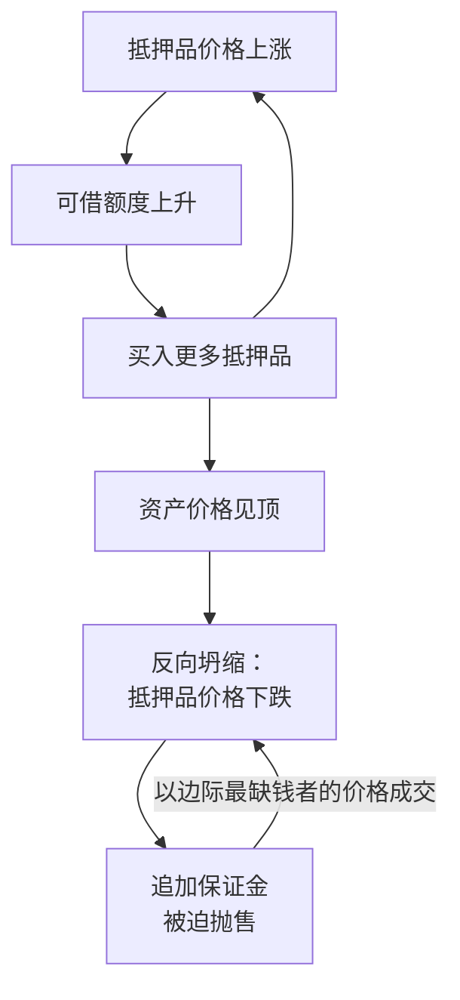

> [📚 总目录](../README.md)　·　[⬅️ 上一篇](02-流动性危机vs清偿能力危机.md)　·　[下一篇 ➡️](04-制度性毒素-道德风险.md)
>
> 🏷 **关键词**：抵押品周期 · 按市值清算 mark-to-market · 死亡螺旋 · 去杠杆 · 信贷扩张 · 跳楼价 fire sale

---

# 抵押品永动机：杀死你的不是你自己的经营

#### 📖 原书核心精髓

- **顺周期正反馈循环（Procyclicality Spiral）：** 抵押品价格上涨 → 激发信贷扩张 → 涌入的资金反向再推高抵押品市价。**这不是实体创造了财富，而是一场“自己拽着自己头发升空”的流动性泡沫。** 边际流动性一停滞，整个系统就以同样的加速度反向坍缩。
- **最反直觉的一点：** 逼死一家订单饱满、三十年从不逾期的企业，只需要**隔壁邻居以 5 折跳楼价卖掉一块小地皮**。银行的风控系统捕捉到“最新成交公允价”，一键把抵押品估值腰斩，触发追缴保证金（Margin Call）→ 三天内补足差额或提前还款。经营完全正常，现金流却被瞬间抽干。
- **静态现金流模型必然失效：** 现金流从来不是独立的数学常数，而是**信贷环境的内生变数**——行情好时源源不绝，崩溃时所有人的现金流会同时瞬间干涸。你赖以计算的“每月 100 万利润、500 万流水”，在宏观紧缩时会同时变成三角债。
- **破局位置在顶层，不在末端：** 答案不是“算得更精细”，而是做**资产负债结构（ALM）的降维解耦**：
  - **核心资产绝不质押（Unencumbered Core）：** 真正维持生死的厂房与核心产线保持 100% 产权干净。哪怕市值跌 90%，只要没抵押，银行没有法律权利进场查封。
  - **负债只匹配自偿性资产（Self-Liquidating Assets）：** 借的钱只能投入周期极短、本身具备变现自偿能力的业务（高周转订单采购、应收账款保理）。银行抽贷时，只要不再接新单，交付完就能自动冲销。
  - **备用流动性用“承诺性备用信用额度”：** 平时只付极低的承诺费，不出事不抽贷、不计息，出事才提款。而不是把借来的钱放在活期账上被负利差吸干。

**黄金金句：**

> “危机中最恐怖的，是市场逼迫所有人以‘边际上最缺钱的那个人’的价格，重新为你的资产定价。”



#### ⚡ 我的演化与实践

- **认知盲点（Before）：** 我的直觉是“精算现金流、留出安全边际，绝不能把借来的钱全额砸进重资产”。借 3,500 万，只投 2,000 万，留 1,500 万现金躺在账上当保险栓——自觉稳健克制。
- **思维演化（After）：** 被压力测试打穿：
  - **“静态现金流”是精明人死得最惨的墓志铭。** 地价腰斩 → 银行要 3 天补 2,000 万 → 账上 1,500 万，缺口 500 万 → 想靠“每月 100 万利润 + 收回账款”凑，但宏观紧缩时下游客户同步被抽贷、应收全变三角债 → 现金流归零。
  - **双向失血：** 1,500 万被强制划扣，厂房照样被查封拍卖，而那 1,500 万在过去两年还白付了几十万负利差利息。
  - **现在我的分层是：** 哪一块资产**永远不进抵押池**（核心）、哪一笔负债**只配自偿性资产**（周转）、哪一笔是**不出事不计息的备用承诺**（保命）。

```text
【资产负债三道防火墙】

┌─ 第一道：Unencumbered Core（无负担核心） ───────────────┐
│  自住房 / 核心产线 / 开门接单的关键资产                 │
│  产权干净度 = 100%，任何情况下不作抵押品                │
│  硬指标：未抵押资产残值 ≥ 极端清算下 18 个月生存底线    │
└─────────────────────────────────────────────────────────┘

┌─ 第二道：Self-Liquidating（自偿性资金池） ──────────────┐
│  动用杠杆前，商业计划第一行必须回答：                   │
│  问：这笔钱是盖一座抽不出钱的城堡，                     │
│      还是采购一批 90 天内自动收回本息的货物？           │
│  无法在既定期限内自动清盘自偿 → 禁止动用杠杆            │
└─────────────────────────────────────────────────────────┘

┌─ 第三道：Committed Facility（承诺性备用额度） ──────────┐
│  在业务最繁荣、现金流最充沛的周期顶点签下               │
│  平时付承诺费、不抽贷、不计息；出事才提款               │
│  永远不要在最渴的时候才去谈水价                         │
└─────────────────────────────────────────────────────────┘
```

<details>
<summary><b>📂 原始踩坑记录：模具厂老陈的“抵押品永动机”</b></summary>

**场景：** 老陈的工业地皮原值 1,000 万，因新区规划飙到 5,000 万。银行上门：“按 7 成质押率，立刻给你 3,500 万低息扩张贷。”老陈拿钱买了更多地、订了高阶机床；次年地价再涨，银行再上调估值，继续滚动质押、贷出更多……

**我的选择：** `1B / 2B`（顺周期泡沫 + 公允价值触发被动爆仓）。

**我提出的关键追问：** “生路是不盲目按揭、确保现金流？但这样借出来的钱不投入生产，是白白给银行交利息。”

**这个追问引出的残酷结论：**

> 全额投入重资产 ➔ 赌外部环境永远不变，抵押品回调或银行抽贷立刻猝死。
> 借款囤积死现金 ➔ 每天承担负利差，在对手的规模攻势下慢性失血。

**更进一步：** “动也死、不动也死”的死局，根因不是我算得不够准，而是我**一开始就把核心资产放进了抵押池**。真正的错是这个入池动作本身。

</details>

---

---

> [📚 总目录](../README.md)　·　[⬅️ 上一篇](02-流动性危机vs清偿能力危机.md)　·　[下一篇 ➡️](04-制度性毒素-道德风险.md)
>
> 📖 本文是《[十年轮回：从亚洲到全球的金融危机](../README.md)》（沈联涛）读书笔记的分篇之一。 完整单文件版见 [`十年轮回-核心精髓与思维演化笔记.md`](../%E5%8D%81%E5%B9%B4%E8%BD%AE%E5%9B%9E-%E6%A0%B8%E5%BF%83%E7%B2%BE%E9%AB%93%E4%B8%8E%E6%80%9D%E7%BB%B4%E6%BC%94%E5%8C%96%E7%AC%94%E8%AE%B0.md)。
