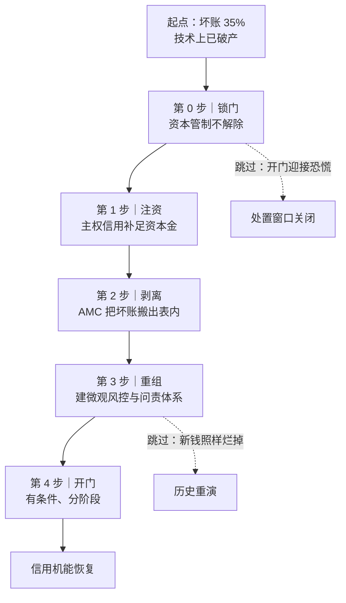

> [📚 总目录](../README.md)　·　[⬅️ 上一篇](11-最后贷款人陷阱-bail-out.md)　·　[下一篇 ➡️](13-赤壁连环船-CDO-CDS-系统性传染.md)

---

# 中国的宏观免疫力与坏账手术：为什么坏账 35% 的没死，坏账 15% 的先死

> **📌 一句话说人话：** 隔壁两家坏账只有 15% 的市场，一周内被债主抽贷抽死；一家坏账 35% 的大院，却照常开门收租。生死差别不在“谁欠了更多烂账”，而在**“谁的债主能跑”**——院墙挡住的不是债主，是恐慌。
>
> **这一局对应原书第十一章**（原书该章标题是“中国：龙的腾飞”）。整整一章，沈联涛只回答一个反常问题：**1997 年中国银行体系的烂账比韩国、泰国还重，为什么唯独它没爆？**

#### 📖 原书核心精髓

**先破除一个财务直觉：资产质量不是生死线，融资结构才是。**

教科书说“坏账率高的机构该死”。1997 年的现实正好相反：**坏账 15% 上下的韩国、泰国金融机构先死，坏账率高得多的中国银行体系没死。** 决定生死的不是资产端“烂了多少”，是负债端“债主能不能跑、跑得多快”。

**三道宏观防线——中国免疫力的物理结构：**

1. **资本账户不可自由兑换（最外层院墙）。** 外国热钱进不来、做空不了，也抽不走。隔壁市场真正的死因不是“有坏账”，而是“短期外资随时可以撤”，资金一撤，健康的资产也被逼着跳楼卖——这是**流动性挤兑（Run）**，不是**资不抵债（Insolvency）**。这两件事的区别，是整本书最核心的一把手术刀。
2. **负债端以本币、以国内储蓄为主（最厚的内衬）。** 当年中国外债规模小、期限长、外商直接投资（FDI，建厂买设备那种，不能今天投明天跑）占比高。银行体系九成以上的钱来自本国居民存款——**存款人跑不掉，挤兑就无从发生。**
3. **国家信用的隐性兜底（最后的心理防线）。** 存款人相信“银行不会倒”，所以不去排队取钱。**这个“相信”本身就是最重要的流动性**——恐慌不发作，就不需要真的掏出那么多现金。

> “中国之所以能够避免危机，不是因为它的银行更健康，而是因为它的人民更愿意相信，也因为它的门更晚才打开。”

**坏账手术的铁律：顺序绝对不能颠倒。**

沈联涛的结论是——**必须先在封闭状态下把内部烂账割干净，才有资格谈开门。**



```text
坏账手术四步（顺序不可逆）

第 0 步｜锁门（先决条件）
        资本管制不解除，外部资金进不出
        → 好处：坏账处置不会触发外资出逃的连锁反应
        → 代价：这一步也锁死了效率，后面要还

第 1 步｜注资（国家信用顶上）
        用主权信用给银行补资本金
        → 关键：输血必须一次性给够。挤牙膏式注资 = 反复失血

第 2 步｜剥离（坏账搬到专门的“垃圾处理厂”）
        成立 AMC（资产管理公司），把烂账从银行的账上搬走
        → 关键：搬走的是账，不是损失。损失只是被“显性化”了

第 3 步｜重组（真正治病）
        建立微观风控、审计、问责体系
        → 关键：这一步最慢、最不性感，但没有它，前三步只是把病推迟

第 4 步｜开门（有条件、分阶段）
        内部机能恢复后，才逐步放开资金闸口
        → 关键：开门是终点，不是起点
```

**黄金金句：**

> “每一次金融危机，本质上都是一次治理危机。”

> “如果你在伤口还在流血的时候就打开大门，进来的不会是医生，而是闻到血腥味的鲨鱼。”

> “中国的经验说明：你可以用时间换空间——但前提是你必须先关上门，把病灶同外界隔离开。”

#### ⚡ 我的演化与实践

> **🎯 可迁移结论**：**坏账率不决定生死，融资结构才决定**
> 处置顺序「先锁门 → 再注资 → 再剥离 → 再重组 → 后开门」不可逆，伤口还在流血时开门就是送死。
>
> <sub>下面这段进入本局沙盘语境，引用了场景与人物；只想拿走结论的话，读到这儿就够了。</sub>

**这一局的沙盘：老温的“封闭大院”。**

场景换成了一座经营二十年的“聚联农贸冷链物流园”——园区里驻扎 800 家批发商户，年交易额几十亿。为了帮商户扩大规模，大院内部搞了个结算中心，发行只在院内流通的“园区记账凭证”，商户之间互相赊账、三角债横行。

一场最严格的资产摸底之后，审计团队冷汗直冒：**结算中心借出去的 10 亿内部贷款里，实质性坏账 3.5 亿——不良率 35%。** 按现代商法标准，这座大院早已技术性破产。

然后诡异的事情发生了。

隔壁两家标榜“完全与国际接轨、外来资金自由进出”的现代化批发市场，坏账率只有 15%，却在一周内被各路短期债权人疯狂抽贷挤兑，**48 小时内集体关门休克，被法院送上拍卖席**。

而坏账 35% 的老温情大院，**内部运转如常、鸡犬相闻，甚至还在接收从隔壁逃难过来的优质商户。**

门口站着华尔街派来的“洋顾问”，提着 2 亿低息美元过桥款喊话：“你这是野蛮落后、金融压抑！砸开大门，商户估值立刻翻倍！”院内以倒卖进口水果的大户为首，也联名逼宫，要求“解除资金出入管制，让大家自由去外面炒楼炒汇”。

**第 1 题｜反直觉常识陷阱：坏账 35% 的大院为什么反而没死？**

- **我的选择：** `1B`——资本账户不可兑换所构筑的**主权流动性防火墙**。
- **这一题的陷阱在哪：** 它精准地勾住了一个财务人员的肌肉记忆——“坏账率高必死”。但 1997 年的韩国、泰国，坏账率比中国低得多，却先倒。**尸体上写的死因是“流动性枯竭”，不是“资产烂”。**
- **为什么 B 正确：**
  - 隔壁市场不是死于“有坏账”，是死于**“外部短期热钱随时可以自由撤离，引发流动性挤兑”**。
  - 老温大院严禁资金自由跨界外逃，负债端几乎全部依赖本地商户沉淀的深厚储蓄，**没有外债敞口**，外部投机资本“进不来也做空不了”。
  - 于是，一场随时可能引发休克的清算危机，被硬生生**锁死为封闭系统内可长期消化的内部重整**。
- **为什么其他选项错：**
  - A（商户道德水平高）——把结构性防线偷换成道德叙事了。1997 年东亚的商户们同样勤劳守信，照样被挤兑死。**道德不设防，制度才设防。**
  - C（雇了保安挡法院传票）——物理阻挡解决不了资本外逃，且法制崩坏本身就是危机的一部分。
  - D（虚假重估掩盖亏损）——这只能掩盖账面，不能让外部债权人不来提款。**会计粉饰不产生流动性。**
- **📎 一个必须补上的精度：** “无外债敞口”是通俗简化。1997 年的中国**有**外债（约 1,300 亿美元），但结构安全：**短债占比极低（约 12%–20%）、以长期和官方债务为主**，且配合严格资本管制。**真正救命的是“外债期限结构 + 资本管制”的组合，不是“零外债”。** 这正是泰国反过来死掉的地方——泰国短债占外储比例一度超过 100%。

**第 2 题｜巨额沉积坏账，主权外科手术的先后顺序是什么？**

- **我的选择：** `2C`——**严格锁死大门 → 主权信用注资 → AMC 坏账隔离剥离 → 体制内重组 → 才逐步有条件开门。**
- **这一题的承重墙在哪：** 顺序。A、B 都犯了同一个致命错误——**在伤口还在流血的时候打开大门。**
- **为什么 C 正确（每一步都在防什么）：**

| 步骤 | 做什么 | 如果不按这个顺序，会死在哪 |
| :--- | :--- | :--- |
| ① 锁死大门 | 维持资本管制 | 若提前开门：坏账消息一经确认，外资第一时间出逃，处置窗口在启动前就关上了 |
| ② 主权信用注资 | 发长期承诺凭证补资本金 | 若先剥离后注资：结算中心净资产为负，一剥离就直接技术性破产清盘 |
| ③ AMC 剥离 | 成立独立“不良资产处置办”，把 3.5 亿烂账搬出结算中心 | 若不剥离：烂账继续吃掉好业务的现金流，**好血喂坏肉**，最终全大院一起死 |
| ④ 体制内重组 | 建微观审计与风控体系 | 若不重建：新钱进来照样烂掉，历史必然重演 |
| ⑤ 有条件开门 | 逐步放开资金闸口 | 若这步跳过：奇迹不可持续，或永久锁死在低效率 |

- **为什么其他选项错：**
  - A（同步并行）——一边开门引外资，一边向商户摊牌追缴。这等于**在拆弹的同时把炸弹的引信接到外部电网**，任何一个外资金融机构听到 35% 不良率都会先跑。
  - B（先开门，用外部流动性冲淡坏账）——这是**最有迷惑性的错项**，因为它听起来很“市场化”。但外部流动性是**债权**不是**股权**：它随时可以走。用短期外部资金冲长期坏账，等于用汽油灭火。
  - D（让储户共同分摊损失，本金打 6 折）——这是**最危险**的选项。它把损失从“国家信用”转移到“普通储户”身上，看似公平，实则**瞬间摧毁了上面第三道防线——“相信”**。储户一挤兑，35% 的坏账立刻变成 100% 的灾难。**这就是“快速出清的社会边界”。**

**第 3 题｜这个奇迹的隐性账单是什么？**

- **我的选择：** `3B`——**深度金融压抑（Financial Repression）与全域道德风险。**
- **为什么这题最难：** 因为它要求你在“奇迹”和“代价”之间建立因果链，而不是选一个明显荒谬的选项（A/C/D 都荒谬到不成立）。这是本局真正的分水岭。
- **代价分两条线：**
  - **第一条线：诚实储户被征税。** 广大诚实储蓄的商户被迫接受极低的资金收益率（存款利率长期被压低至通货膨胀率以下），实质上是承担了一笔**“隐性通胀税”**，用来补贴亏损者与低效部门。**稳定是有账单的，只是账单没有寄到决策者手上，而是摊进了每个人的存款利息里。**
  - **第二条线：道德风险与堰塞湖。** 亏损者与管理层一旦确认“大院出了大事终究会兜底”，理性反应就是**下次加更大的杠杆**。这条链条的终点，原书写得很清楚：不良资产从银行体系被掩盖、被推迟，然后以**房地产与地方基建**的形式，在下一个十年酿成更大的堰塞湖。
- **📎 一个后续验证（值得记下来）：** 沈联涛这本书第 3 版成书于 2009–2013 年，就已经在警告“被推迟的坏账会转移到房地产与地方基建”。此后十余年，中国地方融资平台（LGFV）债务与房地产部门杠杆的膨胀，几乎是这条推演的时间序列验证。**这不是预言，这是把结构看清楚之后，必然能推出来的下一步。**

**本局结算：最优解 = `1B` / `2C` / `3B`。**

**行动指示｜如果我是老温，在商户大会上这样拒绝开门：**

```text
【老温在商户大会上的发言】

“各位，隔壁两家市场不是死于烂账，是死于‘债主能跑’。
 他们坏账只有 15%，但他们的钱是借来的，一笔电话就能撤走；
 我们的坏账 35%，但我们的钱是各位自己存进来的，跑不掉，外面的人也进不来。

 这道墙同时挡住了两种恐慌：外面的恐慌进不来，里面的恐慌出不去。
 今天砸开大门，等于把我们整座院子的命，交给一群随时可以走的人。
 洋顾问带来的不是钱，是一张随时可以抽走的借条。

 所以我的答复是：
 账面上的坏账，我来处置——注资、剥离、重建风控，两年内割干净。
 但院墙，我不能拆。
 等院子里的血是我们自己的血，门随时可以开。”

【一句话版本】
“我不是不让你自由，我是先要把‘能跑的钱’变成‘跑不掉的钱’。顺序错了，我们都得死。”
```

**这一局的第二层收获（我自己的追问）：**

- **“稳定”和“效率”从来不是同一件事，而且它们在同一张资产负债表的两端。** 关上门确实救了大院，但也让大院内所有人的资金收益率被压在低位——**安全感是从储户的利息里扣出来的。**
- **拒绝的门槛，比接受更高。** 洋顾问的方案听起来更“先进”、更有诱惑力，且指责占据了道义高地（“你野蛮落后”）。要顶住这种压力，必须能**用一句话讲清“先做什么、后做什么”**——顺序，是这一局唯一真正的武器。
- **区分“流动性危机”与“清偿能力危机”，是所有救援决策的第一道关。** 这个判断我在第 02 节学过（判断小李还是小张）；这一局把它升级成了**国家级规模的应用**——判错一种，药方立刻变成毒药。

**极限施压｜关门只能防猝死，治不了失血：**

我原本以为答案是“供应消费自成一体，关起门来谁也别想动我们”。但宏观经济的物理重力立刻反扑：

- **一阶连锁（产能过剩与通缩螺旋）：** 1997–1998 年的真实历史不是世外桃源，而是极度惨烈的**通缩海啸与下岗潮**。周边国家货币兑美元暴跌 50%–70% 时，外部市场的农产品与轻工业品价格腰斩。大院坚持本币不贬值且大门紧闭，**海外订单瞬间断崖式暴跌**；而内部早已产能过剩——800 家商户把菜烂在仓库里也卖不掉。**“内部自成一体”非但没有带来繁荣，反而让大院陷入长达三年的物价低迷与通缩泥潭。**
- **二阶隐翻车（AMC 剥离的“左手倒右手”魔术）：** 成立 AMC 剥离坏账确实是 1999 年中国的历史原貌（信达、华融、长城、东方）。但请直面资产负债表的铁律：**不良资产不会凭空消失。** 当年 AMC 按 1:1 账面原值收购银行坏账，资金来自财政部发行特别国债和央行再贷款——结算中心的账面看似干净，但**整个大院的公共信用被硬生生砸出一个 3.5 亿的巨洞。若没有增量财富注入，这笔债最终只能靠全院所有人勒紧裤腰带买单。**

**核心悖论：单纯的「关闭大门」只能防御急性猝死（流动性踩踏），却无法治愈慢性失血（实质性坏账与产能过剩）。**

**我的破局解法：逐步开放——把「钱的自由」和「货的自由」拆开。**

我给出的答案是四个字：**逐步开放**。但它真正的操作，是拆解成一个**非对称结构**：

```text
【非对称开放：门开一半，钥匙留在自己手上】

资本账户（钱的通道）    →  严格锁死
  外来投机热钱无法自由进出、无法做空本币
  汇率保持稳定
  → 防的是：金融攻击与资本外逃

实体贸易账户（货的通道）  →  极端开放
  农产品、轻工业品如海啸般倾泻至全球市场
  全力承接全球数十亿人口的消费需求
  → 换的是：真实外汇储备 + 真实生产力

时间差是关键：
  三年紧闭大门 → 完成结算中心外科手术
  手术完成后 → 对接全球需求，年交易额从 10 亿飙到 100 亿
```

**那 3.5 亿的坏账是怎么消失的？** 答案是：**分子没缩小，分母膨胀了十倍。**

实体生产力与真实外汇储备的暴涨，把那笔看似能压垮大院的 3.5 亿，无情地稀释成了无足轻重的尘埃。**这就是「以增量冲淡存量」的全过程。**

**两条打破西方新自由主义教条的底层铁律：**

| 铁律 | 内容 | 反面教材 |
| :--- | :--- | :--- |
| **① 债务出清的「分母扩容法则」** | 拒绝通缩式清算。教科书认为面对 35% 的技术性破产坏账，必须大规模破产清算、紧缩财政、任由机构倒闭——**但这会诱发致命的资产贱卖（Fire Sale）与人道灾难**。中国的破局在于**以时间换空间，用未来的生产力增量稀释历史沉没成本**：坏账剥离至 AMC 封存挂账，随后借加入 WTO 的窗口释放数亿高素质劳动力产能，推动名义 GDP 与财政收入几何级增长，**最终把坏账率自然拉降至国际健康水位** | 1997 年 IMF 给韩国、印尼开出的“紧缩 + 高利率 + 破产清算”处方，制造了本可避免的大规模失业 |
| **② 开放顺序的物理铁律：实体流动在前，金融自由在后** | **精密的非对称开放**。中国坚决捍卫资本账户管制——外来投机热钱无法自由进出、无法做空人民币——但对实体外商直接投资（FDI）与跨国制造业贸易给予极致绿灯 | **逆向教训：** 东南亚各国的崩溃根源正是**「实体制造尚未升级，金融门户先开」**，导致短期游资兴风作浪。**中国先筑防火墙、专心做实体制造链，待银行资本金注满、风控体系重构完毕后才逐步放宽微观市场化作业** |

<details>
<summary><b>🚀 四向扩展：边界测试 · 跨域映射 · 行动清单 · 时代更新</b></summary>

**🔍 维度一：边界测试与漏洞挖掘（理论盲区）**

- **「分母扩容模型」遭遇逆全球化与人口拐点时的极限死局。** 沈联涛极度推崇「以增长稀释债务」的智慧，但该模式存在一个未明言的脆弱前提：外部市场容量近乎无限，且内部人口红利极度充沛。当全球地缘政治转向保护主义（关税壁垒封堵贸易出口），同时国内老龄化导致潜在经济增速放缓时，「分母扩容」引擎将彻底熄火——此时若依然试图以旧手法掩盖债务，累积的城投债与房地产坏账将失去稀释载体，转化为漫长的资产负债表衰退。
- **长期「金融压抑」对居民部门的隐性抽血。** 为让国有银行与 AMC 体系能以超低成本消化巨额坏账，体制长期将居民存款利率压制在通胀率以下（实质负利率）。这本质上是**一场数十年规模的隐性转移支付**——由数亿普通储蓄家庭承担了坏账兜底的代价，居民消费份额在 GDP 中长期受挫，埋下了内需拉动不足的结构性暗伤。

**🧬 维度二：跨领域认知映射**

| 领域 | 现象 | 与本局的同构性 |
| :--- | :--- | :--- |
| **细胞生物学** | 「生长稀释（Growth Dilution）」：单细胞细菌遭遇微量抗生素时，高效耐药菌株的策略是「启动超速分裂」——只要生物量扩张速度远超毒素积累，毒素浓度就被几何级稀释到致命阈值之下 | AMC 的坏账剥离 + 入世增长，本质就是经济体在宏观层面完成的一次极限生长稀释 |
| **分布式架构** | 「异步解耦（Decoupling）」：互联网系统遭遇脏数据与死锁时，不让主业务停摆，而是把所有问题扔进低速的冷数据隔离队列（AMC 模式）；主数据库清空缓存，全力承接外部真实用户的新订单流量（入世贸易爆发）；等主系统赚够算力后，再在背景慢慢出清垃圾 | 与本局完全同构：**先隔离、再增长、后清理** |

**📋 维度三：日常行动算法化（个人逆境与债务防御检核清单）**

- [ ] **检核点 1：困顿时恪守「分母优先于分子」。** 遭遇收入锐减或历史负债危机时，不要陷入极端自虐式的紧缩节流（过度节省只会损害身心与核心生产力）。将 80% 的注意力锚定在「如何开辟第二增长曲线、提升核心单位时薪」上，**用生产力增量去碾碎历史包袱**。
- [ ] **检核点 2：系统升级严格遵循「内核先于接口」。** 个人专业技能、交付品质（内部风控）尚未打磨至行业顶级之前，严格限制自己的社交圈拓展与外部合作敞口。过早「对外全面开放」只会把脆弱性与半成品缺陷暴露在激烈的市场绞杀中。
- [ ] **检核点 3：构建个人专属的「认知单向阀」。** 外部环境充斥焦虑、裁员与暴跌噪音时，**物理切断高频信息流与有毒社交**（单向封闭资本账户）；但同时保持专业技能、作品与产品向市场的稳定输出（全面开放贸易账户）。
- [ ] **检核点 4：果断实施失败项目的「隔离性剥离」。** 当某个项目或投资确定陷入泥潭且不可逆时，立即建立**个人 AMC**：将亏损部位封存并停止追加沉没成本，彻底从日常营运现金流中切离，轻装上阵投入高赔率新机会。

**⏳ 维度四：时代版本更新（当前地缘环境下的范式失效）**

| 分析维度 | 1997–2001 年亚洲金融风暴时代 | 当前最新全球环境 | 迭代结论 |
| :--- | :--- | :--- | :--- |
| **外部消化引擎** | 美欧主动接纳全球分工，WTO 框架下关税大幅下调，外部市场具备无限吸纳能力 | 地缘碎片化与关税壁垒高筑，美欧对外部产能实施极限围堵 | **外向型稀释通道严重收窄**：仅靠扩大制造业出口无法重演当年分母倍增奇迹，必须将出清重心转向「内部真实全要素生产率（科技创新）」与「国内收入结构分配改革」 |
| **金融与贸易边界** | 贸易账户开放与资本账户管制可长期稳定并存，外部世界默认这种双轨运行 | 跨境制裁、长臂管辖与金融透明度（CRS、反洗钱）高度联动，资本穿透力显著增强 | **边界隔离难度呈指数级上升**：数字货币桥与本币跨境结算网络成为新一代主权防护罩的核心基石 |
| **不良资产底层标的** | 1999 年坏账多为传统国企三角债与老旧工厂，随后被城市化与工业化浪潮顺利变现 | 当前沉积债务主要绑定在土地信用、房地产泡沫与地方城投平台等低流动性资产上 | **资产盘活难度发生质变**：缺乏新的超级实体产业（如当年的入世外贸）承接，无法通过简单的土地重估来化解，必须依赖中央主权资产负债表的直接介入与漫长的债务重组 |

</details>

<details>
<summary><b>📂 原始沙盘存档：老温的“封闭大院”与三成烂账奇迹</b></summary>

**场景原文（沙盘第 11 章局）：**

> 你是城中规模最大、运营了 20 年的“聚联农贸冷链物流园”大管家兼创始人老温。大院内部入驻了 800 家批发商户，年交易额达数十亿。
>
> 过去五年，为了帮商户扩大规模，大院成立了内部金融结算中心，发行了封闭流通的“园区记账凭证”。大院内部信用极度膨胀，商户之间频繁互相赊账、三角债横行。上个月，你私下做了一次最严格的资产摸底，结果令审计团队冷汗直冒：
>
> 大院结算中心借出的 10 亿元内部贷款中，实质性坏账已经突破 3.5 亿元（不良率高达 35%）！按现代商法标准，大院早已技术性破产。
>
> 但诡异的事情发生了。此时，整座城市的金融海啸爆发。外部高利贷崩盘、跨国小贷连锁催收，隔壁两个标榜“完全与国际接轨、外来资金自由进出”的现代化批发市场，其坏账率仅为 15%，却在一周内遭遇各路短期债权人疯狂抽贷挤兑。两个看似健康的市场在 48 小时内集体关门休克、商户流血踩踏，被法院直接送上拍卖席。
>
> 而坏账高达 35% 的老温大院，内部却运转如常、鸡犬相闻，甚至还在对外接收从隔壁逃难过来的优质商户。

**三题原题（选项存档）：**

| 题号 | 题目类型 | 正确选项 | 三个干扰项的设计意图 |
| :--- | :--- | :--- | :--- |
| 第 1 题 | 反直觉常识陷阱 | **B** 资本账户不可兑换的主权流动性防火墙 | A 归因于道德、C 归因于暴力、D 归因于会计粉饰——**三个都是“不看负债结构”的偷换** |
| 第 2 题 | 角色代入决策 | **C** 锁门 → 注资 → AMC 剥离 → 重组 → 有条件开门 | A 同步并行、B 开门冲淡——**两个都在“伤口流血时开门”**；D 让储户分摊——**摧毁第三道防线** |
| 第 3 题 | 二阶效应连锁 | **B** 金融压抑 + 道德风险 | A 以物易物、C 国际诉讼、D 丧失劳动意愿——**三个都荒谬到不构成真实选项**，逼你在“奇迹”与“代价”之间建立因果链 |

**这一局暴露的一个思维缺陷（值得记下来）：**

我最初在第 2 题上犹豫过 A（同步并行），理由是“效率更高、不用等”。被推演打回来的是——**处置坏账需要的不是效率，是“隔离”**。只要外部资金还在自由进出，任何坏账确认动作都会先触发资本外逃，处置窗口会在启动前就被关上。

这与第 05 节学到的“监管孤岛”是同一个病的两个面：**你以为并行的动作，在系统里其实是串联的。**

</details>

---

---

> [📚 总目录](../README.md)　·　[⬅️ 上一篇](11-最后贷款人陷阱-bail-out.md)　·　[下一篇 ➡️](13-赤壁连环船-CDO-CDS-系统性传染.md)
>
> 📖 本文是《[十年轮回：从亚洲到全球的金融危机](../README.md)》（沈联涛）读书笔记的分篇之一。 完整单文件版见 [`十年轮回-核心精髓与思维演化笔记.md`](../%E5%8D%81%E5%B9%B4%E8%BD%AE%E5%9B%9E-%E6%A0%B8%E5%BF%83%E7%B2%BE%E9%AB%93%E4%B8%8E%E6%80%9D%E7%BB%B4%E6%BC%94%E5%8C%96%E7%AC%94%E8%AE%B0.md)。
