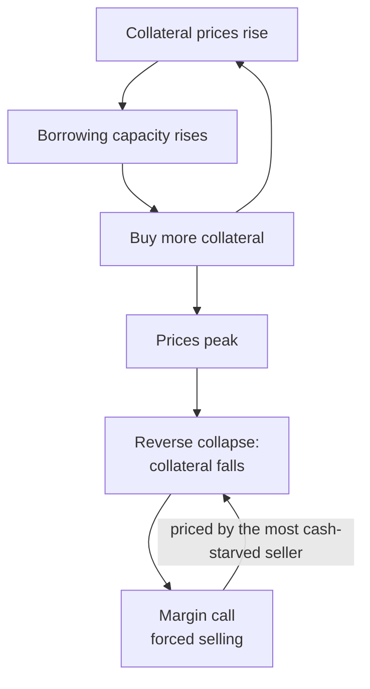

> [📚 Index](README.md) · [⬅️ Previous](02-liquidity-vs-solvency.md) · [Next ➡️](04-institutional-toxins.md)
> 🇨🇳 [Chinese full version of this topic](../docs/03-抵押品永动机-按市值清算.md)

# 03. The Collateral Machine: What Kills You Is Not Your Own Business

> **⚡ Transferable rule:** **Defend with balance-sheet structure, not with a pile of hoarded cash.** Borrowed cash bleeds negative carry and gets seized anyway — the defense has to live in the architecture of assets and liabilities.

## 📖 What the book actually says

- **The procyclical spiral:** collateral prices rise → credit expands → the new money pushes collateral prices higher still. No real wealth is created; it is a liquidity bubble pulling itself up by its own hair. When marginal liquidity stalls, the whole system collapses at the same acceleration, in reverse.
- **The most counterintuitive kill:** what destroys a firm with full order books and thirty years of zero defaults is **the neighbor selling a small plot at half price**. Risk systems capture the "latest fair transaction price," halve your collateral valuation, and fire a margin call — three days to top up or prepay. Operations perfectly normal; cash flow instantly drained.
- **Static cash-flow models must fail:** cash flow is not an independent constant — it is an **endogenous variable of the credit environment**. In a tightening, every counterparty's receivables turn into triangular debt at the same time, and your "monthly profit of 1M" evaporates on schedule with everyone else's.
- **The exit is at the top of the balance sheet, not in finer math:**
  - **Unencumbered core:** the assets that keep you alive — the plant, the core line — carry a 100% clean title. Even at −90% market value, an unpledged asset gives the bank no legal right to seize.
  - **Debt only against self-liquidating assets:** borrowed money may only fund very short-cycle, self-extinguishing operations (fast-turnover inventory, receivables factoring). When credit is pulled, stop taking new orders and existing ones repay the loan by themselves.
  - **Standby liquidity as a committed facility:** pay a small commitment fee in good times; undrawn, uninterest-bearing; draw only in crisis. Never park borrowed cash in a current account being eaten by negative carry.

> *"The most terrifying thing in a crisis is the market forcing everyone to reprice your assets at the price of the person who needs cash most."*

## 💡 How it rewired my decisions

- **Before:** my instinct was prudence — borrow 35M, deploy only 20M, leave 15M of borrowed cash as a safety cushion.
- **After:** the stress test broke it. Land halves → bank demands 20M in three days → I have 15M → "collect receivables" fails because every debtor is being squeezed simultaneously → the 15M gets swept anyway, the plant is sealed, and the 15M had been paying negative carry for two years.
- **Now the layering is explicit:** which asset never enters the collateral pool (core), which liability only touches self-liquidating assets (working), which commitment sits unused until disaster (lifeline).

## 🔗 Go deeper

- 🇨🇳 [Chinese full version](../docs/03-抵押品永动机-按市值清算.md) — Old Chen's mold factory wargame and the three-fortress checklist with hard numbers
