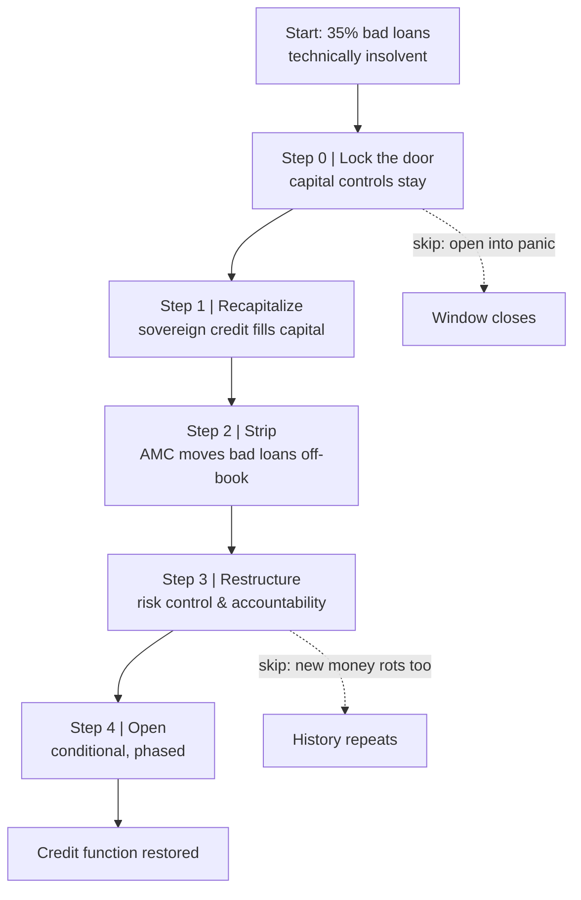

> [📚 Index](README.md) · [⬅️ Previous](11-lender-of-last-resort-trap.md) · [Next ➡️](13-cdo-cds-systemic-contagion.md)
> 🇨🇳 [Chinese full version of this topic](../docs/12-中国宏观免疫力-坏账手术-资本管制.md)

# 12. China's Macro Immunity and the Bad-Loan Surgery: Why the 35%-Bad-Loan System Didn't Die and the 15% Ones Did

> **⚡ Transferable rule:** **The bad-loan ratio doesn't decide survival; the funding structure does.** And the surgery order — lock the door → recapitalize → strip → restructure → then open — is irreversible.

## 📖 What the book actually says

**First, kill a piece of textbook intuition: asset quality is not the survival line. Funding structure is.**

In 1997, Korea's and Thailand's financial systems — bad loans around 15% — died first. China's, far worse, did not. What decided it was not how rotten the assets were, but **whether creditors could run, and how fast.**

**The three macro defense lines:**

1. **An inconvertible capital account (the outer wall).** Hot money can't rush in, can't short, can't flee. The neighbors died not of "having bad loans" but of "short-term foreign money that could leave at any moment" — a **liquidity run**, not **insolvency**. That distinction is the sharpest scalpel in the whole book.
2. **A liability side in local currency, funded by domestic savings.** Small external debt, long maturities, high FDI share (factories can't flee overnight). Over 90% of bank funding was domestic household deposits — **depositors can't run, so a run cannot happen.**
3. **The implicit backstop of state credit.** Depositors believed banks wouldn't fall, so they didn't queue. **That belief itself is the most important liquidity** — panic that never fires costs nothing to extinguish.

> *"China avoided the crisis not because its banks were healthier, but because its people were more willing to believe — and because its door opened later."*

**The surgery: order is everything.**

- **Step 0 — lock the door:** no capital-account liberalization while the wound is open. Benefit: no foreign-flight cascade during restructuring. Cost: efficiency stays locked too — paid back later.
- **Step 1 — recapitalize, once and enough.** Sovereign credit fills the capital hole. Dripping capital in = repeated bleeding.
- **Step 2 — strip via AMCs.** Move the rot to a dedicated disposal vehicle. **What moves is the account, not the loss** — the loss is only made explicit.
- **Step 3 — restructure: the slow, unsexy cure.** Micro risk control, audit, accountability. Without it, the first three steps merely postpone the disease.
- **Step 4 — open, conditionally and in stages.** Opening is the endpoint, not the starting point.

**How the 3.5 billion actually dissolved:** the numerator never shrank — **the denominator grew tenfold.** With the capital account sealed, China threw the trade account wide open (WTO 2001); exports exploded, nominal GDP and fiscal revenue compounded, and the bad-loan ratio fell to international norms **by growth dilution, not by write-offs**.

**The hidden bill:** decades of **financial repression** — deposit rates held below inflation, a multi-decade hidden transfer from hundreds of millions of savers to the cleanup — plus system-wide moral hazard ("the state always bails us out"), which later funneled into property and local-government debt.

> *"If you open the door while the wound is still bleeding, what comes in is not the doctor — it's the sharks."*
> *"China's lesson: you can trade time for space — but only if you first close the door and isolate the lesion."*

## 💡 How it rewired my decisions

- **Before:** I thought the answer to "why did Old Wen's sealed compound survive" was "supply and consumption are self-contained — nobody outside can touch us."
- **After:** macro gravity pushed back — the closure meant the 1997–98 deflation tsunami and mass layoffs hit in full force. Closure prevents acute death (the run); it does nothing for chronic bleeding (rotten assets, overcapacity). The real breakthrough was **asymmetric opening**: capital account sealed, trade account flung open — and the good-loan ratio dissolved in the growing denominator.
- **And I learned to defend an unpopular decision:** in the compound assembly, the argument that held was — *"the neighbors didn't die of bad books; they died because their creditors could run. Our money belongs to people who can't flee. Open the door today and you hand our fate to whoever can walk away. I'll cut the bad loans; the wall stays until the bleeding stops."*

## 🔗 Go deeper

- [07. The impossible trinity](07-impossible-trinity-pegged-exchange-rate.md) — the physics behind the sealed capital account
- 🇨🇳 [Chinese full version](../docs/12-中国宏观免疫力-坏账手术-资本管制.md) — Old Wen's compound wargame, the 1,300-billion-dollar external-debt precision correction, and the four-dimension modern update
