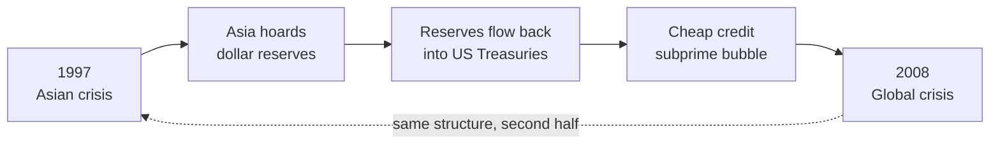

# 📘 Ten Years Cycle · English Edition

**Notes on Andrew Sheng's *From Asian to Global Financial Crisis* — 14 macro-finance concepts, each thrown into an AI wargame until it broke.**

[🇨🇳 中文完整版（7.5 万字）](../README.md) · **English edition (condensed)** · [30 risk rules →](A-30-risk-rules.md)

---

## 🧨 The one-line core

**The 1997 Asian financial crisis and the 2008 global crisis are not two crises — they are two halves of the same one.** The dollar reserves Asia hoarded to protect itself after 1997 flowed back into US bonds, crushed long-term rates, and hand-filled the fuel tank of the next, bigger explosion.

## 🤔 What this is

A **decision-training archive**, not a book summary. Every concept from the book was translated into a life-scale business dilemma, offered 3 plausible options, and then pushed to its extreme so I could watch my own first instinct die. What survives is not 14 facts — it is **14 judgment rules**.

Each topic page is split the same way:

| Block | What it contains |
| :--- | :--- |
| **What the book actually says** | Sheng's underlying logic, stripped to mechanism |
| **How it rewired my decisions** | What I first thought, what broke it, what I do now |
| **⚡ Transferable rule** | One sentence you can take without reading anything else |

> The Chinese edition is the **full archive** (75,000 characters, original wargame transcripts, four-way expansions, data verification appendix). This English edition is a **faithful condensed rewrite** — same 14 rules, same order, less detail.

## 🗂 The 14 rules

| # | Page | ⚡ Transferable rule |
| :--: | :--- | :--- |
| 01 | [Double mismatch](01-double-mismatch.md) | **Match the maturity and currency of debt to the assets it funds** — don't hunt for a magic third asset |
| 02 | [Liquidity vs solvency](02-liquidity-vs-solvency.md) | **Ask "who takes the first loss" before "who rescues"** |
| 03 | [The collateral machine](03-collateral-machine.md) | **Defend with balance-sheet structure, not with a pile of hoarded cash** |
| 04 | [Institutional toxins](04-institutional-toxins.md) | **Change behavior by changing structure, not by moral appeal** |
| 05 | [Regulatory silos](05-regulatory-silos.md) | **Three patches in a row means rebuild** |
| 06 | [Too-big-to-fail & cross-guarantees](06-implicit-guarantees-too-big-to-fail.md) | **Give equity, never credit; give ammunition, never a fuse** |
| 07 | [The impossible trinity](07-impossible-trinity-pegged-exchange-rate.md) | **Pick two of three, and pay the price honestly — in advance** |
| 08 | [The 1998 Hong Kong battle](08-hong-kong-1998-peg-defense.md) | **Attack the attacker's daily cost of carry and settlement deadline, not his wallet** |
| 09 | [Global imbalances](09-global-imbalances-ten-year-cycle.md) | **Know whether you are the creditor or the hostage — before you try to jump off** |
| 10 | [Crony capitalism](10-crony-capitalism-east-asia.md) | **Capital that doesn't demand repayment demands control — you cannot have both** |
| 11 | [Lender-of-last-resort trap](11-lender-of-last-resort-trap.md) | **Replace moral solidarity with priceable contracts** |
| 12 | [China's bad-loan surgery](12-china-capital-controls-bad-loan-surgery.md) | **The bad-loan ratio doesn't decide survival; the funding structure does** |
| 13 | [CDO/CDS contagion](13-cdo-cds-systemic-contagion.md) | **Ask "can my guarantor fall at the same time I do?"** |
| 14 | [The zero-volatility myth](14-var-dynamic-hedging-black-swan.md) | **Every automated risk system needs a human circuit breaker** |

## ❓ FAQ

<b>What is the root cause of the 1997 Asian financial crisis?</b>

Not Soros, not "Asian values" — a **double mismatch**. Southeast Asian firms borrowed short-term in dollars to fund long-term local-currency assets (property, plants). As long as foreign capital flowed in, the structure spun; when it reversed, depreciation inflated dollar debts on local books while maturing short debt couldn't be rolled — **profitable businesses were killed by "temporarily can't pay the lump sum"**.

<b>Why did China survive 1997 with 30–40% bad loans while Thailand and Korea collapsed at 15%?</b>

**Funding structure, not asset quality.** China's capital account was not convertible: hot money couldn't rush in or flee, and the liability side was almost entirely local-currency household deposits — no foreign-debt exposure means no entrance for a run. The cost was equally real: decades of **financial repression** (negative real deposit rates — a hidden inflation tax on savers).

<b>How did Hong Kong beat the hedge funds in 1998?</b>

Not by out-spending them. The HKMA **changed the rules**: raised margin requirements, enforced T+2 physical delivery, banned naked shorting, and bought up every lendable share — engineering a short squeeze. A short seller's fatal weakness is not losing one contract; it is a **liquidity break in his whole balance sheet**.

<b>How did CDOs and CDS make risk "disappear" — and why didn't it?</b>

Only on paper. Tranching let rating agencies grade the **statistics of the slice**, not the solvency of the underlying. Worse, correlation was modeled as a constant (0.05), but correlation is a function of liquidity — in a systemic shock **every asset's correlation jumps toward 1.0**, and "diversification" becomes a fuse.

<b>What's wrong with VaR's "99% confidence"?</b>

The unspoken 1%. VaR answers "how much do I lose on a normal day" and deliberately refuses to answer "how much on an extreme day" — where the loss is **unbounded**. On Black Monday 1987 (−22.6%), the culprit was portfolio insurance: every algorithm sold at the same millisecond, and **the hedge itself became the crash**.

<b>Is this AI-written?</b>

**Co-written with AI, and labeled as such.** All scenarios and characters are AI-generated fables; the "how it rewired my decisions" parts are a human's real choices and faceplants inside the wargame. Six known blind spots are documented in the Chinese edition's methodology-boundary section.

<b>Can I use this?</b>

The notes (my decisions parts) are **CC BY-NC-SA 4.0**. Views and quotations from the book remain the property of Andrew Sheng and his publishers; used here for study and commentary only.

## 🔍 If you searched for any of these

`Andrew Sheng book notes` · `From Asian to Global Financial Crisis summary` · `Ten Years Cycle` · `Asian financial crisis 1997 causes` · `double mismatch maturity currency` · `liquidity crisis vs solvency crisis` · `collateral cycle fire sale` · `moral hazard originate to distribute` · `regulatory arbitrage shadow banking` · `implicit guarantee too big to fail` · `cross guarantees chaebol` · `impossible trinity explained` · `pegged exchange rate put option` · `Hong Kong 1998 stock market intervention` · `global savings glut` · `Triffin dilemma` · `crony capitalism Asia` · `lender of last resort IMF conditionality` · `China capital controls 1997` · `AMC asset management company` · `financial repression` · `Gaussian copula correlation breakdown` · `CDO CDS explained` · `Basel systemic risk` · `VaR tail risk` · `portfolio insurance 1987 Black Monday` · `dynamic hedging procyclical run` · `risk management checklist for AI agent`

---

## ⚠️ Disclaimer

1. **All scenarios, companies and people** in the linked Chinese archive are AI-generated business fables with no real-world counterparts.
2. The wargame's "consequence simulations" are **persuasion-engineered** — good for training judgment, not usable as evidence.
3. Nothing here is investment advice.
4. "What the book says" blocks are **reverse-distilled** from wargame dialogues, not page-by-page quotations; verification status is in the Chinese edition's Appendix B.

## 📄 License

- Notes (the decisions parts): [CC BY-NC-SA 4.0](../LICENSE)
- The book's views and quotations: © Andrew Sheng and publishers

---

*The core insights belong to Andrew Sheng. The faceplants belong to me.*

**If this helped, ⭐ the repo.**

