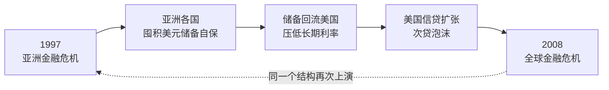
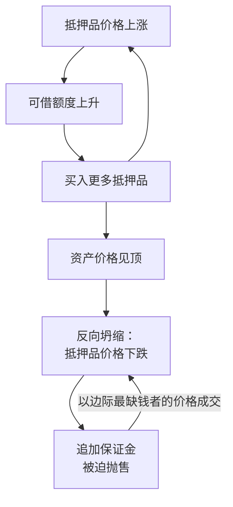
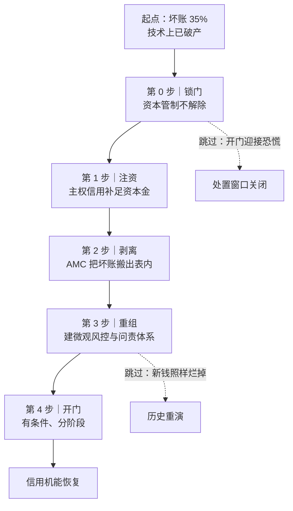

# 📘 《十年轮回：从亚洲到全球的金融危机》- 核心精髓与思维演化笔记

> 📅 最后更新：2026-09-17　·　🌐 [English edition](./en/README.md)　·　📖 **14 个主题**　·　📝 约 7.5 万字　·　⏱️ 约 90 分钟　·　🌐 简体中文

> **一句话核心提炼：** 1997 年亚洲金融风暴与 2008 年全球海啸不是两场危机，而是同一场危机的两个半场——亚洲为了自保而囤积的美元储备，十年后回流华尔街，亲手为下一场更大的爆炸注满了燃料。
>
> **我的思维演化：** 从“找标准答案的读者”，变成“在生活沙盘里被极限施压的决策者”——我停止背诵宏观术语，改用 `谁承担不可逆损失` 这把尺子，去量每一张资产负债表、每一条担保链、每一份救助协议。

> [!NOTE]
> **这份笔记是什么**
> 它不是读书摘要，而是一份**决策训练存档**。原始素材来自一条与 AI 对练的“生活化沙盘”对话链：每一轮都是“日常场景 → 两三题博弈选项 → 我的选择 → 后果推演与极限施压 → 四向认知扩展”。
> 下面每个主题都严格切成两块：**📖 原书核心精髓**（沈联涛的底层逻辑，去芜存菁）与 **⚡ 我的演化与实践**（我原本怎么想、被什么打醒、现在怎么做）。
> 引文与数字的核验状态、方法论的已知边界，见文末 [附录 B](docs/C-附录B-书目信息与数据核验.md)。

<details>
<summary><b>📑 目录（点击展开）</b></summary>

**向导**
- [🚪 先读这里：30 秒看懂这份笔记](docs/00-导览-30秒看懂-术语急救包-演化地图.md)
- [🧭 学习演化地图（14 个主题总览）](docs/00-导览-30秒看懂-术语急救包-演化地图.md)
- [🔤 一分钟术语急救包](docs/00-导览-30秒看懂-术语急救包-演化地图.md)

**14 个主题**
- [01. 双重错配：一场“时间对不上、币种对不上”的慢性自杀](docs/01-双重错配-期限错配与货币错配.md)
- [02. 流动性 vs 清偿能力：谁该被救，谁必须死](docs/02-流动性危机vs清偿能力危机.md)
- [03. 抵押品永动机：杀死你的不是你自己的经营](docs/03-抵押品永动机-按市值清算.md)
- [04. 制度性毒素：为什么最聪明的人集体把炸弹抱在怀里](docs/04-制度性毒素-道德风险.md)
- [05. 监管孤岛、价格信号压抑与合成谬误](docs/05-监管孤岛-价格信号压抑-合成谬误.md)
- [06. 刚性兑付与连环担保：大而不能倒的人质结构](docs/06-刚性兑付-连环担保-大而不能倒.md)
- [07. 三元悖论与固定汇率：官方承诺是一张免费的看跌期权](docs/07-三元悖论-固定汇率-看跌期权.md)
- [08. 1998 香港保卫战：改规则，而不是比谁的钱多](docs/08-1998香港保卫战-港元-索罗斯.md)
- [09. 全球失衡与十年轮回：防御性囤积如何变成下一场海啸的燃料](docs/09-全球失衡-十年轮回-储备国是人质.md)
- [10. 东亚融资模式与裙带资本：把股权投资做成债务连带](docs/10-东亚融资模式-裙带资本主义.md)
- [11. 最后贷款人陷阱：当救世主同时是清道夫](docs/11-最后贷款人陷阱-bail-out.md)
- [12. 中国的宏观免疫力与坏账手术：为什么坏账 35% 的没死，坏账 15% 的先死](docs/12-中国宏观免疫力-坏账手术-资本管制.md)
- [13. 从危机到一体化：赤壁连环船——为什么“分散风险”的数学最终让全人类一起沉船](docs/13-赤壁连环船-CDO-CDS-系统性传染.md)
- [14. 金融工程的新世界：零波动神话——为什么“99% 安全”足以毁掉 100%](docs/14-零波动神话-VaR-动态对冲-黑天鹅.md)

**附录与边界**
- [🧾 附录 A：30 条 Agent 风控规则](docs/A-附录A-30条Agent风控规则.md)
- [⚠️ 方法论的边界与已知盲区](docs/B-方法论边界与已知盲区.md)
- [📎 附录 B：书目信息与数据核验](docs/C-附录B-书目信息与数据核验.md)
- [🧩 收束：这份笔记真正改变的东西](docs/Z-收束-这份笔记真正改变的东西.md)

</details>

> 📂 **也可按主题分篇阅读**：19 个单页在 [`docs/`](./docs/README.md)，每篇自带关键词与上一篇／下一篇导航。本文件为完整单文件版。

---

<a id="guide"></a>

## 🚪 先读这里：30 秒看懂这份笔记

**这份笔记不需要你先读过原书。** 它是一个普通人把一本宏观经济学的书扔进 AI 沙盘、反复拷打之后留下的**决策训练存档**。下面四小节是给完全零背景的读者准备的入场券。

### 一、原书在讲什么

*《十年轮回：从亚洲到全球的金融危机》*，作者**沈联涛（Andrew Sheng）**——马来西亚央行首席经济师出身，1993–1998 年任香港金融管理局副总裁（**1997 年港元保卫战，他是当事人**），1998–2005 年连续三届出任香港证监会主席。他不是财经记者，是真正坐在驾驶舱里的人。

全书用三句话可以说清：

1. **1997 年亚洲金融风暴与 2008 年全球海啸，不是两场危机，是同一场危机的两个半场。** 亚洲当年为了自保而囤积的美元储备，十年后回流华尔街，亲手为下一场更大的爆炸注满了燃料。
2. **危机的引信很少是“坏人作恶”，多数是“结构错配”**——短期负债配长期资产、本币收入配外币负债、个体理性配集体毁灭。
3. **每一次金融危机，本质上都是一次治理危机。**



### 二、这个“沙盘”是怎么玩的

原始素材来自一条与 AI 的对练对话链。每一轮都跑同一个循环：

```text
① 日常场景      → 一个生活化的商业困境，不堆砌金融术语
② 两三个选项    → 每个选项都“听起来有道理”
③ 我做选择      → 通常是第一直觉，而且通常是错的
④ 后果推演      → AI 把我的选择推到极端，让我看见它怎么死
⑤ 四向认知扩展  → 补上我完全没想到的维度，再回到原书理论
```

**为什么要这样设计：** 宏观金融理论读起来句句都对，一遇到具体决策就用不上。沙盘的作用是**把抽象理论逼到墙角，让你用自己的直觉先撞一次墙**，然后才告诉你墙在哪。

> **⚠️ 使用前必读的两句免责**
>
> 1. **所有场景、公司、人物（老温、老陈、阿强、老林……）都是 AI 生成的商业寓言，没有真实对应主体。** 它们只为承载理论而构造，不是案例研究。
> 2. **沙盘的“后果推演”有强说服力设计**——它总能构造出让你选错的那条连锁反应。**它适合训练批判思维，不能当作实证证据。**

### 三、三个背景常识（没有它们，后面会看不懂）

| 常识 | 一句话解释 | 为什么重要 |
| :--- | :--- | :--- |
| **期限错配** | 用 3 个月就要还的钱，去盖 5 年才回本的楼 | 1997 年亚洲企业集体猝死的头号死因：生意明明赚钱，却被“暂时掏不出整本”逼死 |
| **货币错配** | 赚的是本国货币，欠的是美元 | 本币一跌，债务本金在账面上自动暴增，辛苦利润被吃得一干二净 |
| **资本账户可兑换与否** | 外国人的钱能不能自由进出你的国家 | 决定一场危机是“内部慢慢消化”，还是“当场休克猝死”——全书最关键的开关 |

### 四、出场人物与机构速查

| 名字 | 是谁 | 在书里扮演什么角色 |
| :--- | :--- | :--- |
| **沈联涛** | 作者。马来西亚央行 → 世界银行 → 香港金管局副总裁 → 香港证监会主席 | 既是监管者也是当事人，全书是一份“内部视角” |
| **索罗斯 / 对冲基金** | 1997 年狙击泰铢、港元的国际投机资本 | “空头”的具象代表——他们的命门不是钱多，是持有成本 |
| **IMF（国际货币基金组织）** | 危机时提供救助贷款的国际机构 | 它的处方（紧缩 + 加息 + 开放）被本书严厉质疑 |
| **AMF（亚洲货币基金）** | 日本 1997 年提议的区域救助基金 | 被美国与 IMF 反对而搁置——这件事本身就是“治理危机”的标本 |
| **LTCM（长期资本管理公司）** | 1998 年爆仓的美国对冲基金 | 证明“最聪明的人 + 最高杠杆”照样会死 |
| **AMC（资产管理公司）** | 专门收购、处置银行坏账的机构 | 坏账手术的核心工具（中国 1999 年成立四大 AMC） |

<a id="glossary"></a>

<details>
<summary><b>🔤 一分钟术语急救包（读到哪里卡住就展开）</b></summary>

| 术语 | 大白话 |
| :--- | :--- |
| **流动性（Liquidity）** | 手边能不能立刻掏出钱。缺流动性 = 有钱但暂时变不了现 |
| **清偿能力（Solvency）** | 全部家当卖了够不够还债。缺清偿能力 = 真的一无所有 |
| **流动性危机 vs 清偿能力危机** | 前者能救（缺的是时间），后者救不活（缺的是钱）。**判错这一点，药方立刻变毒药** |
| **挤兑（Run）** | 所有债主同时上门要钱。哪怕机构资产健康，也会被当场挤死 |
| **期限错配** | 短钱投长项目。进水管细、出水管粗，水池必然见底 |
| **货币错配** | 收入一种货币、负债另一种货币。汇率一动，负债自动涨 |
| **三元悖论** | 资本自由流动、固定汇率、独立货币政策——**三样只能同时要两样**，这是物理约束不是政策选择 |
| **资本管制** | 限制资金跨境进出。代价是效率，收益是隔断恐慌传染 |
| **对冲（Hedge）** | 买一份保险，抵消某个风险。对冲动机一旦消失，泡沫就开始积累 |
| **利差交易（Carry Trade）** | 借低息货币、买高息资产，赚中间的差。**利差是保费，不是白送的钱** |
| **抵押品永动机** | 抵押品涨价 → 能借更多 → 买更多抵押品 → 再涨。反向坍缩时加速度相同 |
| **按市值清算（Mark-to-Market）** | 按当前市价重算资产价值。市价崩了，账面立刻爆 |
| **最后贷款人（Lender of Last Resort）** | 危机时出手救市的央行。它同时是清道夫，救助附带条件 |
| **刚兑（刚性兑付）** | 承诺一定还本付息。它消灭了风险定价，制造了道德风险 |
| **交叉担保 / 连环担保** | 企业之间互相做担保。一处断裂，全线崩塌，有限责任防火墙形同虚设 |
| **Bail-out（救助）** | 用纳税人的钱救机构。**Bail-in（内部纾困）** = 让债权人自己承担损失（债转股、减记） |
| **道德风险（Moral Hazard）** | 知道有人兜底，就敢冒更大的险 |
| **金融压抑（Financial Repression）** | 人为压低存款利率，让储户补贴低效部门。本质是**向储户征收的隐性通胀税** |
| **AMC（资产管理公司）** | 把银行的烂账搬到专门机构去处理。**搬走的是账，不是损失** |
| **影子银行** | 不受常规监管、却干着银行业务的机构（信托、理财、地下钱庄） |
| **监管套利** | 哪里有漏洞钱就往哪里钻。被压制的资金不会消失，只会绕道 |
| **裙带资本主义（Crony Capitalism）** | 靠关系而非效率拿资源。**权力的更迭日，就是这类资产的清零日** |
| **华盛顿共识** | “紧缩 + 私有化 + 自由化”的标准救助处方。本书认为它在亚洲水土不服 |
| **系统性重要机构（大而不能倒）** | 它一倒，全系统陪葬。因此它获得了对决策者的**逆向勒索权** |
| **尾部风险（Tail Risk）** | 概率极低、一旦发生就致命的事件。常规风险管理最容易忽略它 |
| **凸性（Convexity）** | 上行空间远大于下行损失的收益结构。“只做凸性决策”是本书给我的最实用一条 |

</details>

---

<a id="roadmap"></a>

## 🧭 学习演化地图 (Evolution Roadmap)

> **怎么读这张表**：左列 🔑 是沈联涛在书里的逻辑（客观）；右列 💡 是同一条逻辑落到我自己的决策上之后，变成的那句话（主观）。
>
> **第一次看可以直接跳过右列**——它引用了沙盘里的场景与人物，脱离上下文会读不懂。右列每格的**第一句**是可以直接拿走的规则，括号里才是沙盘出处；等你读到对应主题再回来看，那一格就会立刻变清楚。

| 章节 / 主题 | 🔑 原书核心精髓 (Author) | 💡 我的演化与实践 · 可迁移结论 (Me) | 目前状态 |
| :--- | :--- | :--- | :--- |
| **01. 双重错配** | 危机的引信不是贪婪，是“短期外币负债 + 长期本币资产”的结构性错配。 | **负债的期限与币种，必须和它支撑的资产对齐**——先对齐结构，再谈收益率。（沙盘里我原想用黄金当避险锚，被打醒：0% 殖利率的资产，持有即刚性付息） | 🚀 已内化 |
| **02. 流动性 vs 清偿能力** | 挤兑能在 24 小时内摧毁一家健康的银行；但资不抵债的机构借钱救不活，只会把债主一起拖下水。 | **先判「缺现金」还是「资不抵债」，再谈救不救**——前者缺的是时间可救，后者缺的是钱救不活。（沙盘里我先分清「小李 / 小张」再动手） | 🚀 已内化 |
| **03. 抵押品永动机** | 抵押品涨 → 信贷扩张 → 再推高抵押品价；反向以同样加速度坍缩。杀死企业的不是经营失败，是别人跳楼价成交的那一笔。 | **防守要建在资产负债表的顶层结构，不是靠囤现金**——借钱囤现金是负利差慢性失血。（沙盘里我原本想留 1,500 万现金当保险栓） | ✅ 已内化 |
| **04. 制度性毒素** | 毒死百年投行的不是侥幸贪婪，而是“利益个人化、风险组织化”的激励结构 + SIV 监管套利。 | **改行为靠改结构，不靠道德劝**——谁拿走收益，就让谁承担下行。（我的修正：不是「大家以为不会炸到自己」，而是「卖出者抽佣、不承担后续成本」） | 🚀 已内化 |
| **05. 监管孤岛与价格信号压抑** | 局部合规的总和等于整体毁灭；被压抑的价格信号不会消失，只会绕道流入影子暗池。 | **补丁打到第三层就必须重构**——连续行政修补本身就是「不敢拒绝用户」的症状。（沙盘里我连打五层：补贴→配额→特权→限量→错峰） | 🔄 迭代中 |
| **06. 刚性兑付与连环担保** | 交叉担保亲手炸毁有限责任防火墙；接管经营权 + 债权人承担损失（Bail-in）是破“大而不能倒”的唯一刀法。 | **只给股权、绝不背书**——股权切割不是防火墙，背书才是引线。（我原以为「股权切割」就是隔离，后来知道那只是一张薄纸） | ✅ 已内化 |
| **07. 三元悖论与固定汇率** | 固定汇率 + 高于境外的本币利率 = 免费发给投机者的看跌期权，并摧毁全社会的对冲动机。 | **三条痛路（关门 / 加息 / 浮动）要提前排好取舍顺序**，并分清微观自杀式自救与宏观系统性停付——别等危机来了才选。 | ⏳ 实践中 |
| **08. 1998 香港保卫战** | 空头的命门不是输掉某个合约，而是全局资产负债表的流动性断裂；防守要打“保证金 × 交割期限”。 | **防守要打对手的持有成本与交割期限，不是比谁现金多**。（我原本以为是拼现金储备，被纠正为抬高对手每日持有成本 + 卡死实物交割） | ✅ 已内化 |
| **09. 全球失衡与十年轮回** | 储备国不是债主，是人质：不买就窒息，买了就是替别人的泡沫买单。 | **别幻想「跳车」**——在失衡结构里，先跑的人先蒸发自己的存量。（沙盘里我抓到「兑换失衡即产业不保」，被推进一层：跳车先亏的是自己箱底的货） | ✅ 已内化 |
| **10. 东亚融资模式与裙带资本** | 股权是海绵，债务是绞索；把“股权投资”做成“债务连带”，是东亚体系最大的毒瘤。 | **想拿资本的钱，就得让出治理筹码**——「既要钱、又要家长式独裁」是幻想。（股权是海绵，债务是绞索，别把前者做成后者） | ⏳ 实践中 |
| **11. 最后贷款人陷阱** | 误把流动性休克当偿付力危机来医，处方本身就是毒药；救助方同时是最后贷款人与资产清道夫。 | **把道义换成可定价的合约**——底牌从「抱团 + 未来愿景」换成动态债转股 + 反恶意触发条款。 | 🚀 已产品化 |
| **12. 宏观免疫力与坏账手术** | 坏账率高低**不决定**生死，融资结构才决定生死；坏账处置必须“先锁门 → 再手术 → 后开门”，顺序不可逆。 | **坏账率不决定生死，融资结构才决定**；处置顺序「先锁门 → 再手术 → 后开门」不可逆。（老温大院局：第一次把主题 02 升级到国家级规模，并学会为一个不受欢迎的防守决定辩护） | ✅ 已内化 |
| **13. 赤壁连环船** | 「分散」的数学魔术在极端冲击下瞬间失效——相关性的内生突变是把独立火柴捆成导火索的真正推手。 | **先问「我和担保人会不会同时倒」**——危机里相关性会跳到 1。（阿豪局：看到「合约有效」不等于「风险转移」，CDS 的偿付能力会和我同时崩塌） | ✅ 已内化 |
| **14. 零波动神话** | 「99% 安全」的模型掩盖了那 1% 里的无限下行——动态对冲本身是一台人造踩踏机，物理学嫉妒把社会系统塞进了热力学方程。 | **当遵守纪律会杀死公司时，破坏纪律才是对纪律真正的遵守**——任何自动风控都必须留一个人工断电开关。（老柯局） | 🚀 已产品化 |
| **🧾 30 条规则** | — | 把上述 **14** 个维度蒸馏成给个人金融分析 Agent 的风控审核流水线（见 [附录 A](docs/A-附录A-30条Agent风控规则.md)）。 | 🚀 已产品化 |

---

## 🧠 深度拆解：精髓 vs 演化

> **每个主题都切成两块，读法不同：**
>
> | 区块 | 是什么 | 第一次看怎么读 |
> | :--- | :--- | :--- |
> | 📖 **原书核心精髓** | 沈联涛在书里的底层逻辑，去芜存菁 | **这段可以独立读**，不需要任何前置 |
> | ⚡ **我的演化与实践** | 同一条逻辑落到我自己的决策上之后，变成的那句话 | **这段引用了沙盘里的场景与人物**——先做一次选择再读会顺很多；只想看书里讲什么，可以跳过 |
>

<a id="d01"></a>

### 01. 双重错配：一场“时间对不上、币种对不上”的慢性自杀

#### 📖 原书核心精髓

- **核心观念：** 1997 年亚洲企业的致命伤不是经营无能，而是财务结构的两个独立错位同时发作：
  - **期限错配（进水太慢、抽水太快）：** 用 3 个月滚动的短期借款，去支撑 5 年才回本的高楼、厂房、重资产。即便生意稳赚，也会在半路因“暂时掏不出整本”被逼死。
  - **货币错配（赚的是毛票、欠的是硬币）：** 收入是泰铢、本币；负债是美元、日元。外币一升值，负债本金自动在账面上暴增，把辛苦利润吃得一干二净。
- **暴雷的真实顺序：** 外部资金方突然拒绝续贷（期限端断裂）→ 企业疯抢美元还债 → 本币崩跌（货币端断裂）→ 双重错配在同一周内集体处决。
- **黄金不是解药：** 黄金殖利率为 0%。借 1% 外币买黄金锁住，等于每年刚性付息却没有现金流来源；且黄金以美元计价，等于把“汇率赌局”升级成“汇率 + 大宗商品”的双重裸奔。
- **利差的本质是保费，不是白送的钱：** “低息外币存入高息本币”多出来的那段利差，是市场为你承担的**本币贬值风险 + 流动性断裂风险**标定的保险费。你收的是保费，押的是本金。
- **唯一没有刚性约束的长期资金是股权：** 无还本压力、无固定利息、亏了一起挨饿——这是消灭双重错配的结构性解药。

**黄金金句：**

> “危机本质不是流动性问题，而是清偿能力（Solvency）问题；延迟承认损失只会导致资产负债表衰退。”
>
> “绝不要用‘随时可能被按市值清算（Mark-to-Market）的短期抵押负债’，去为‘流动性极低的核心生产资产’融资。”
>
> “东亚没有备用轮胎。”——书中引述的判断：亚洲过度依赖银行短期信贷，缺乏成熟的长期股权资本市场作为缓冲。

#### ⚡ 我的演化与实践

> **🎯 可迁移结论**：**负债的期限与币种，必须和它支撑的资产一一对齐**
> 别去找「第三种神奇资产」来挡——问题从来不是拿什么挡，而是结构有没有对齐。
>
> <sub>下面这段进入本局沙盘语境，引用了场景与人物；只想拿走结论的话，读到这儿就够了。</sub>

- **认知盲点（Before）：** 我一开始把“境外借 1.8%、境内赚 6%”读成“资本运作天才”，甚至进一步想：**能不能用黄金卡在低息外币与高息人民币之间，做一个稳定的锚？** 我当时觉得黄金不属于任何国家、永远有价值，所以能当“绝缘体”。
- **思维演化（After）：** 被现金流守恒打醒——**黄金不生息**。资产端现金流为 0，负债端每年刚性付息，金价一跌 15% 就是本金亏损叠加负债刚性支出的双重夹击。更关键的转念是：**问题不是“用什么资产去挡”，而是“负债与资产的久期与币种必须对齐”。** 找“第三种神奇资产”是错的提问方式。
- **第二层演化：** 我原本以为“不借低息外币就会被同行价格战挤死”是无解困境。后来接受一个反直觉结论——**那些靠 3 个月短债支撑长期扩张的同行，已经进入明斯基的投机／庞氏阶段**。他们的狂欢不是竞争优势，是自我毁灭的前奏。策略是主动压缩负债率、收拢流动性、等他们出清后低价收拾残局。

```text
【双重错配除雷算法】
输入：任一笔融资提案（金额 / 期限 / 计价币种 / 用途）

STEP 1  久期对称性
        资产回本周期 N 年 → 要求负债到期日 ≥ N
        回本周期 > 1 年的项目，禁止使用：信用卡分期、可随时收回的
        民间借贷、1 年期以内滚动信贷

STEP 2  币种血缘纯洁性
        收入币种 ≠ 负债币种 → 一律否决，除非已完成全额远期对冲
        （注意：0% 利率的日元借款也是负债，不是礼物）

STEP 3  外生变数清点
        列出这笔钱的生死所系的“你无法控制”的清单
        例：汇率稳定 / 放贷方愿意续借 / 外部利率不上升
        ≥ 2 项 → 判定为结构性脆弱，强制降级或改用股权

STEP 4  工具替换
        拿不出抵押物 → 借不到长贷 → 卷不过低息对手
        → 唯一正解不是“硬借”，而是“出让股权换耐力资本”
```

<details>
<summary><b>📂 原始踩坑记录：深蓝智造的“低息死局”（第一轮沙盘）</b></summary>

**场景：** 跨境智能硬件企业。境外借 1.8% 短期外币 → 全部砸进 4–5 年回本的研发中心 + 囤地。黑天鹅降临：外币飙升、海外财团拒绝续贷、30 天内须还 40% 到期本金（约 2000 万美元）＋大客户账期从 45 天拉长到 120 天。账上现金只够撑 15 天。

**我的第一次落子：** `1d / 2d / 3a`

- 第 1 题（最致命的“自救”动作）→ 我选 **D：动用最后流动性去做外汇期权对冲**，理由是“这是在赌博”。
- 第 2 题（采纳谁的方案）→ 我选 **D：向香港法院申请债务重组与临时保护令**，理由是“等现金流撑过来”。
- 第 3 题（最可能引发二阶崩塌的战略）→ 我选 **A：联合上下游组建产业防御联盟，互相提供信用连带担保**，理由是“争取更大话语权”。

**被推演打回来的部分：**

1. **2D 的现实耳光：** 离岸贷款协议普遍载有“重大不利变化（MAC）”与“交叉违约”条款，并享有账户法定抵销权（Right of Set-off）。向法院递交重组申请的当天，境外银行就冻结了全部离岸美元贸易账户——保护令保护不了已经没有钱的账户。
2. **3A 是 1997 年韩国财阀的翻版：** 互保池本质上**不是增信，而是风险敞口放大器**。外部流动性枯竭时，银行不会因为互保给你更多授信，反而会连夜排查互保名单，联盟中最弱那家一倒，全体被抽贷。
3. **我的判断失误根源：** 我把“争取时间”与“扩大议价权”当成目标，却没先检查这两个目标在**没有最后贷款人的网络系统**里是否物理上可行。

**这一局留下的规则：** 在没有全球央行当最后贷款人的体系里，试图用**信用扩张**去解决**流动性枯竭**，方向本身就错了。

</details>

---

<a id="d02"></a>

### 02. 流动性 vs 清偿能力：谁该被救，谁必须死

#### 📖 原书核心精髓

- **两种完全不同的病：**
  - **流动性问题（小李）：** 有房产 300 万、零负债，只是卡里只剩 500 块现金付不出 3 万住院押金。借他钱是真救急，钱会回来。
  - **清偿能力问题（小张）：** 欠 100 万，全部家当只有一台事故车值 10 万。借他钱不是救他，只是延后崩溃，并把你的钱一起拖进无底洞。
- **银行的物理学：** 储户存 100 块，银行把 90 块借给工厂（约定 3–10 年后还），柜子里只留 10 块零钱。谣言一起、所有人同时排队，发完 10 块零钱之后就结束了——**哪怕手里握着一叠优质工厂借条，也来不及变成现钞**。
- **平息挤兑的唯一办法是消灭恐慌源头：** 不是维持秩序（“请排队”反而暗示物资有限、加剧踩踏），而是“政府提供全额存款担保，现金无限量供应，一分钱都不会少”。有些银行甚至把成捆现钞堆在玻璃柜台后面让所有人看见。
- **但这招的前提是“印钞机”：** 央行能印本币，印不出美元。若负债是外币，央行只能动用有限的外汇储备——“欠的美元远多于存的美元”时，储备见底就是主权违约。
- **坏账处置三步刀法：** ① 政府设 AMC／坏账银行，强制把死账剥离出去；② 骨折价拍卖清算，把客观损失**彻底承认在账面上**；③ 为原银行注入干净资本金，让它恢复存贷功能。（1997 年泰国 FRA、1999 年中国四大 AMC 均为此类。）
- **道德风险是这套刀法的副作用：** 每次兜底，都必须配套惩罚或代价机制（例如无限追溯、个人资产追缴、股东权益清零），否则下一次会有人赌得更大。

**黄金金句：**

> “流动性挤兑可以在瞬间摧毁一家看似健康的银行。”
>
> “必须承认损失——否认损失则注定失败。”
>
> “如果不愿承认损失，一味借新债拖延，私人机构的烂账最终都会被社会化，让全民来承担代价。”——亚洲金融危机与日本“失去的十年”的共同教训。

#### ⚡ 我的演化与实践

> **🎯 可迁移结论**：**先问「谁承担第一笔损失」，再问「谁来救」**
> 救助不是终点，它最后会变成税、通胀或被砍掉的公共服务；只救不认损失，就是把私人烂账社会化。
>
> <sub>下面这段进入本局沙盘语境，引用了场景与人物；只想拿走结论的话，读到这儿就够了。</sub>

- **认知盲点（Before）：** 面对“资不抵债的银行要不要救”，我的第一反应是找权威机构：`央行出面、破产管理部门`。我以为把坏账装进一个专门的“垃圾桶机构”就算解决了。
- **思维演化（After）：** 被追问“亏空最终落在谁头上”时我答出“全民、财政紧缩”，这个答案反过来改写了我的决策顺序——**现在我先问“谁承担第一笔损失”，而不是“谁来救”。** 因为兜底不是终点：它会转化为加税、公共服务压缩、或印钞稀释购买力。无底线救助 = 把私人烂账社会化。
- **第三层演化：** 我原本主张对倒闭机构“无限追溯”，后来补上了更关键的一环——**救助必须与损失确认同步进行**。只救不认损失，就是“借新还旧、假装活着”（Extend and Pretend），最终把整个国家的信贷资源输血给僵尸企业，优质企业被活活饿死，全社会进入通缩与长期停滞。

```text
【危机第一问：流动性还是清偿能力？】

Q1  把资产按“今日市场被迫变现价”清算后，能覆盖刚性负债吗？
    ├─ 能   → 流动性问题（小李）
    │         对策：注入流动性 + 消灭恐慌源头
    │         工具：全额担保 / 无限量供应承诺 / 实物现钞可见化
    └─ 不能 → 清偿能力问题（小张）
              对策：承认损失 → 剥离 → 骨折价出清 → 注资重建
              禁忌：用“时间”代替“损失确认”
                     （展期只是把死刑改成凌迟）

Q2  这次救助释放了什么信号？
    若信号是“只要绑架够大，终究有人买单”
    → 救助本身即在孕育下一轮更大规模的道德风险
    → 必须同步设计：股东权益清零 / 高阶主管追偿 / 个人资产连带
```

<details>
<summary><b>📂 原始踩坑记录：小张的 100 万欠条与 10 万事故车</b></summary>

**我的方案：** `先卖掉事故车换 5 万暂时安抚债主，再想办法用剩下的 5 万做生意，承诺分期还款。`

**被指出这是“向死而生的风险博弈（Gambling for Resurrection）”：**

- **债主心理底线：** 借出 100 万，看你变卖资产拿到 10 万，你却要扣下 5 万自己支配。债主会认定你在“拿他的钱替自己的未来赌博”，可能立刻申请强制执行。
- **残酷算术：** 5 万本金面对 95 万债务与滚动利息，即便每年净赚 20%，也要近百年还清。结果不是上岸，而是长期被债务压垮的**僵尸状态**。

**这一局学到的正解（债务重组三种经典做法）：**

| 手段 | 做法 | 债主视角 |
| :--- | :--- | :--- |
| 本金打折（Haircut） | 100 万借条改写成 30 万 | 账面立刻确认亏 70 万，但锁定收回 30 万的希望 |
| 拉长时间、免除利息（展期） | 30 万分 10 年还，每月 2,500 元 | 现金流可持续，不再被利息压垮 |
| 债权变股权（债转股） | 不按期还，改为持有汽修店 30% 利润 | 若生意做成，可能拿回更多 |

**我还追问了一个更深的问题：** 既然重组能让大家走出死局，为什么 1990 年代日本银行明知客户还不上，却极度抗拒第一步“给本金打折”？

答案是双重恐惧：**个人利益绑定**（一认亏，年终奖清零、面临追责撤职）＋ **资本充足率红线**（一次性认几千亿坏账，资本金跌破监管线，可能被强制接管）。于是选择了“借新还旧、假装活着”——用新钱专门支付旧贷利息，让借条在账面上永远保持“按时付息”的健康假象。

</details>

---

<a id="d03"></a>

### 03. 抵押品永动机：杀死你的不是你自己的经营

#### 📖 原书核心精髓

- **顺周期正反馈循环（Procyclicality Spiral）：** 抵押品价格上涨 → 激发信贷扩张 → 涌入的资金反向再推高抵押品市价。**这不是实体创造了财富，而是一场“自己拽着自己头发升空”的流动性泡沫。** 边际流动性一停滞，整个系统就以同样的加速度反向坍缩。
- **最反直觉的一点：** 逼死一家订单饱满、三十年从不逾期的企业，只需要**隔壁邻居以 5 折跳楼价卖掉一块小地皮**。银行的风控系统捕捉到“最新成交公允价”，一键把抵押品估值腰斩，触发追缴保证金（Margin Call）→ 三天内补足差额或提前还款。经营完全正常，现金流却被瞬间抽干。
- **静态现金流模型必然失效：** 现金流从来不是独立的数学常数，而是**信贷环境的内生变数**——行情好时源源不绝，崩溃时所有人的现金流会同时瞬间干涸。你赖以计算的“每月 100 万利润、500 万流水”，在宏观紧缩时会同时变成三角债。
- **破局位置在顶层，不在末端：** 答案不是“算得更精细”，而是做**资产负债结构（ALM）的降维解耦**：
  - **核心资产绝不质押（Unencumbered Core）：** 真正维持生死的厂房与核心产线保持 100% 产权干净。哪怕市值跌 90%，只要没抵押，银行没有法律权利进场查封。
  - **负债只匹配自偿性资产（Self-Liquidating Assets）：** 借的钱只能投入周期极短、本身具备变现自偿能力的业务（高周转订单采购、应收账款保理）。银行抽贷时，只要不再接新单，交付完就能自动冲销。
  - **备用流动性用“承诺性备用信用额度”：** 平时只付极低的承诺费，不出事不抽贷、不计息，出事才提款。而不是把借来的钱放在活期账上被负利差吸干。

**黄金金句：**

> “危机中最恐怖的，是市场逼迫所有人以‘边际上最缺钱的那个人’的价格，重新为你的资产定价。”



#### ⚡ 我的演化与实践

> **🎯 可迁移结论**：**防守要建在资产负债表的分层结构里，不是靠囤一笔死现金**
> 借钱囤现金要同时承受负利差与随时被划扣——两头都不归你。
>
> <sub>下面这段进入本局沙盘语境，引用了场景与人物；只想拿走结论的话，读到这儿就够了。</sub>

- **认知盲点（Before）：** 我的直觉是“精算现金流、留出安全边际，绝不能把借来的钱全额砸进重资产”。借 3,500 万，只投 2,000 万，留 1,500 万现金躺在账上当保险栓——自觉稳健克制。
- **思维演化（After）：** 被压力测试打穿：
  - **“静态现金流”是精明人死得最惨的墓志铭。** 地价腰斩 → 银行要 3 天补 2,000 万 → 账上 1,500 万，缺口 500 万 → 想靠“每月 100 万利润 + 收回账款”凑，但宏观紧缩时下游客户同步被抽贷、应收全变三角债 → 现金流归零。
  - **双向失血：** 1,500 万被强制划扣，厂房照样被查封拍卖，而那 1,500 万在过去两年还白付了几十万负利差利息。
  - **现在我的分层是：** 哪一块资产**永远不进抵押池**（核心）、哪一笔负债**只配自偿性资产**（周转）、哪一笔是**不出事不计息的备用承诺**（保命）。

```text
【资产负债三道防火墙】

┌─ 第一道：Unencumbered Core（无负担核心） ───────────────┐
│  自住房 / 核心产线 / 开门接单的关键资产                 │
│  产权干净度 = 100%，任何情况下不作抵押品                │
│  硬指标：未抵押资产残值 ≥ 极端清算下 18 个月生存底线    │
└─────────────────────────────────────────────────────────┘

┌─ 第二道：Self-Liquidating（自偿性资金池） ──────────────┐
│  动用杠杆前，商业计划第一行必须回答：                   │
│  问：这笔钱是盖一座抽不出钱的城堡，                     │
│      还是采购一批 90 天内自动收回本息的货物？           │
│  无法在既定期限内自动清盘自偿 → 禁止动用杠杆            │
└─────────────────────────────────────────────────────────┘

┌─ 第三道：Committed Facility（承诺性备用额度） ──────────┐
│  在业务最繁荣、现金流最充沛的周期顶点签下               │
│  平时付承诺费、不抽贷、不计息；出事才提款               │
│  永远不要在最渴的时候才去谈水价                         │
└─────────────────────────────────────────────────────────┘
```

<details>
<summary><b>📂 原始踩坑记录：模具厂老陈的“抵押品永动机”</b></summary>

**场景：** 老陈的工业地皮原值 1,000 万，因新区规划飙到 5,000 万。银行上门：“按 7 成质押率，立刻给你 3,500 万低息扩张贷。”老陈拿钱买了更多地、订了高阶机床；次年地价再涨，银行再上调估值，继续滚动质押、贷出更多……

**我的选择：** `1B / 2B`（顺周期泡沫 + 公允价值触发被动爆仓）。

**我提出的关键追问：** “生路是不盲目按揭、确保现金流？但这样借出来的钱不投入生产，是白白给银行交利息。”

**这个追问引出的残酷结论：**

> 全额投入重资产 ➔ 赌外部环境永远不变，抵押品回调或银行抽贷立刻猝死。
> 借款囤积死现金 ➔ 每天承担负利差，在对手的规模攻势下慢性失血。

**更进一步：** “动也死、不动也死”的死局，根因不是我算得不够准，而是我**一开始就把核心资产放进了抵押池**。真正的错是这个入池动作本身。

</details>

---

<a id="d04"></a>

### 04. 制度性毒素：为什么最聪明的人集体把炸弹抱在怀里

#### 📖 原书核心精髓

- **打包转卖（Originate-to-Distribute）摧毁了债主的审查动机：** 借条签完第二天就打包卖给投资人，自己赚走手续费与价差。于是“街上的流浪汉和学生都能签字送车”——**爆雷是别人的事**。
- **精算模型的核心假设是致命的：** “一千个借款人的违约是独立随机事件，所有人同时违约的概率接近于零”。现实是一旦宏观转折（加息、失业、消费降级），**相关性系数从 0 暴力跃升为 1**，AAA 级资产在 48 小时内失去所有流动性。
- **最深的病根不是道德，是制度：** 连雷曼兄弟、贝尔斯登这些自己资产负债表上还攥着数百亿次贷资产、高管身家深度绑定公司股票的机构，也没有提前离场。原因有三层：
  1. **激励结构：** 利益个人化（年终现金分红） vs 风险组织化（股东与机构承担归零）。
  2. **技术自戕（自产自销的 AAA 陷阱）：** 风险最高、收益 15% 的“劣后级”被对冲基金抢光；评为 AAA、收益只有 4%–5% 的“最安全部分”外部反而嫌回报太低不愿买。投行于是成立表外 SIV，以 30–40 倍杠杆借隔夜廉价资金，把自己造的 AAA 全额吞回自己的资产负债表——**真诚地相信“既然是 AAA，加 40 倍杠杆也是安全的”。**
  3. **监管套利：** 用 SIV 规避巴塞尔资本充足率。但恐慌来临时，若 SIV 破产将摧毁母行声誉，被迫把数千亿有毒资产重新“拉回表内”，资本金在几天内被彻底击穿。
- **盯市计价（Mark-to-Market）在非流动性市场中的制度性自杀：** 平时体现透明度；流动性冻结时，只要市场出现一笔跳楼价抛售，所有持仓机构必须集体计提巨额账面亏损——**把暂时的流动性枯竭，直接逼成永久的资产负债表破产**。
- **辨别“创新利刃”与“作恶毒药”的两把客观筛子：**
  - **损益对称性（Skin in the Game）：** 创新的特征是收益与风险对称；毒药的特征是利润即期私有化、尾部风险无限期外部化。
  - **解耦与可承受失败（Safe-to-Fail）：** 创新的架构具备模块化边界，崩溃只是局部火灾；毒药刻意破坏防火墙，把高风险模块与支付清算、核心就业、基础民生深度绑定，人为制造“牵一发动全身”。
  - **核心第一性原理：** 手术刀砍的从来不是“高风险”或“高利润”，砍的是**“未经同意就将他人资产作为防御肉盾”的负外部性架构**。

**黄金金句：**

> “只要音乐还在播放，你就必须站起来跳舞。”——时任花旗集团 CEO 查克·普林斯（Chuck Prince），2007 年。在制度性考核下，哪家机构的风控部门提前踩刹车，哪家机构的当季利润就暴跌，高管会在 24 小时内被撤职。**在系统性狂欢中，保持理智是职场自杀。**

#### ⚡ 我的演化与实践

> **🎯 可迁移结论**：**改行为靠改结构，不靠道德劝**
> 谁拿走收益，就让谁承担下行；另外记住：资产的安全性来自全市场认可的流动性，不是评级标签。
>
> <sub>下面这段进入本局沙盘语境，引用了场景与人物；只想拿走结论的话，读到这儿就够了。</sub>

- **认知盲点（Before）：** 我对“为什么聪明人集体被自己发明的武器炸死”的答案是 `都是以为不会炸到自己手上`——把病因归给侥幸与贪婪，本质上是一种道德解释。
- **思维演化（After）：** 被要求直面“雷曼自己还攥着几百亿毒资产”这个反常事实后，修正为**“卖出的人抽佣、不需要为后续还债风险承担成本”**——委托代理失衡与风险外部化。这个转念改变了我的干预方式：**不再靠道德呼吁，改去改结构**（追索条款、收益滞后兑现、损益对称性测试）。
- **第三层演化：** 我进一步追问“隔壁为什么肯借那 97 块”，把 AAA 陷阱拆到 Repo 质押的微观机制。结论让我改变了对“安全资产”的定义：**资产的安全性来自全市场共同认可的流动性，而不是评级机构的标签。** 大家愿意只收 3% 折价率（Haircut）把钱借给你，前提是所有人都相信这箱苹果明天仍能在市场上卖掉。一旦共识动摇，折价率会在几小时内跳升到 50%。

```text
【创新利刃 vs 作恶毒药：两道筛子】

筛子 A｜损益对称性
  Q：赚钱时谁拿走？出事的尾部损失落在谁身上？
  收益进个人腰包 + 损失由公共兜底/整条供应链承担
  → 判定为系统寄生虫，不论技术多炫

筛子 B｜能否“独立去死”
  Q：如果这个模块明天彻底归零，能否在 2 小时内无痛切断，
     且不影响基本盘正常运转？
  不能 → 否决上线（或强制先做业务解耦与物理隔离）

配套强制条款：
  ▸ 收益滞后兑现（Clawback）：3–5 年利润追索
  ▸ 依赖度单点集中率：单一技术模块/供应商/通道
    占比不得超过 30% 的不可替代依赖
  ▸ 提前提交“可执行的自毁方案”（Living Will）
```

<details>
<summary><b>📂 原始踩坑记录：从“海鲜盲盒”到“隔夜过桥迷局”的两次追问</b></summary>

**第一问：** 我要求用小白版重讲“超级优先级自产自销陷阱”。AI 给出“阿豪的海鲜盲盒分拣流水线”——从无名小渔船低价收杂鱼碎虾（次级贷款），质检专家分装成两个档次：

- “高风险高香辣肉碎包”（劣后级）：承诺 15% 超高分红，投机大排档半天抢光。
- “特级真空深海鱼柳”（超级优先级 AAA）：质检专家盖章“第一优先赔付、安全性等同国库储备”，但因为收益只有 4%，超市嫌利润太薄没人接盘。

阿豪于是用 10 万本金、35 倍杠杆向民间钱庄借 350 万隔夜短债（1.5%），让自己注册的皮包公司（表外 SIV）把卖不掉的“特级鱼柳”全额买下。他算得很开心：`(4% − 1.5%) × 35 倍 = ROE 87.5%`。

**我的反应：** `还是不够小白。`

**第二问：** 我追问最关键的一句——“买一箱苹果要 100 块，你自己只掏 3 块钱，另外 97 块全靠跟隔壁档口借！**隔壁凭什么借给你？**”

**得到的答案（Repo 机制的本质）：** 这 97 块根本不是“信用贷款”，而是**隔夜抵押**。苹果当场押在债主冷库里，箱子上贴着 AAA 标签。债主的算盘是：“就算你跑路，这箱苹果我随便也能卖 98 块。”

**我的判断与被修正的地方：**

- 我选 `1B / 2A`，并指出债主的盲区是“以为安全，其实 AAA 屁都不是、没有市场认可度”。
- 被修正：**恰恰相反。** 正因为当时全市场都极度迷信 AAA（养老基金、货币市场基金、跨国投行都把它当成“跟国债一样硬的无风险资产”），债主才敢只收 3% 折价率把 97 块借出去。**危险不在于“大家知道它烂”，而在于“人人认可”**——认可度支撑了极限杠杆，也让崩塌毫无预警。

**这一局留下的规则：** 当一个“看似安全的资产”能支撑起 30 倍以上杠杆时，真正的风险不是资产本身，而是**整个市场对它的共同信念**。

</details>

---

<a id="d05"></a>

### 05. 监管孤岛、价格信号压抑与合成谬误

#### 📖 原书核心精髓

- **监管孤岛（Regulatory Silos）与合成谬误：** 每个部门只守自己的局部指标（微观审慎），却没有人掌握“全域穿透式资产负债表（宏观审慎）”。跨界机构恰恰在管辖边界的真空中疯狂加杠杆——**局部合规的总和，变成了整体的毁灭。**
- **危机时的本能反应是“切断通道”：** 各部门为了自证清白，第一时间不是灭火，而是抢先关闭自己管辖区域的防火卷帘门，反而切断了整体逃生通道，加剧全员窒息。
- **推行全盘考核的博弈难题：** 全商场总火灾风险超标，要求服装区压缩 30% 库存。服装区主管必然抗议：“我每一项检查都是 100 分，火药桶是别区搞出来的，凭什么扣我业绩？”——**让完全合规的模块为别人的风险牺牲，必须先有代价分摊规则。**
- **用补丁对抗套利，必然催生更复杂的影子市场：** 行政配额压不住市场自发套利，只会在边界处催生更庞大的影子市场。每一次“打补丁”，系统内部的摩擦力与复杂度（熵）就呈指数级上升。
- **价格信号压抑（Price Signal Suppression）：** 管理层不敢让价格随供需浮动，本质是害怕戳破“随叫随到且廉价”的用户心智幻觉。但**成本并没有消失**——它被转移成了从业者的怨气、系统的算力内耗，以及规则被套利的漏洞。
- **监管宽容（Regulatory Forbearance）：** 官员不愿关闭早已资不抵债的机构，宣称是“保护储户、维持稳定”；底层算盘是——一旦勒令破产，失业者与挤兑民众会堵在门口把矛头对准主管官员；若用公共资金暗中输血、允许做假账展期，这份巨大窟窿就会被稀释进全社会的通膨与数年的经济停滞。**决策者宁可让系统承担几十倍的全域隐性损耗，也不愿在当下承受一次指名道姓的直接指责。**

**黄金金句：**

> “主动拒绝的代价，是局部的、可控的、短期的痛苦；而不敢拒绝的代价，是让所有参与者在一个低效、混乱、随时暴雷的系统中，承受无休止的净福利流失。”——“监管宽容”机制的推演结论

#### ⚡ 我的演化与实践

> **🎯 可迁移结论**：**补丁打到第三层，就必须回头重构**
> 连续行政修补掩盖的往往不是漏洞，而是决策者不敢对用户说「不」。
>
> <sub>下面这段进入本局沙盘语境，引用了场景与人物；只想拿走结论的话，读到这儿就够了。</sub>

- **认知盲点（Before）：** 我在外送平台的六轮追问中，一路选择“用更精细的行政手段解决上一个行政手段的漏洞”：
  `加大系数补贴` → 引发套利 → `强制配额绑定` → 引发运力逃离与恶意服从 → `稀缺权限置换` → 引发特权通膨与黑市 → `每周限量 3 次` → 引发潮汐踩踏 → `错峰滑动重置` → 引发黑箱猜疑与换号套利。
- **思维演化（After）：** 被要求复盘整条链条时，我看到自己把一个外送平台活生生改造成了**前苏联国家计委**——为了掩盖最初的一个定价漏洞，连续设计了五个行政补丁。
- **最关键的一次自我承认：** 当被问“为什么不敢走最简单的市场路径（让定价权交给市场）”时，我给出的真因是：`怕消费者流失——恶劣天气那么贵，我就不吃外卖了，而不是觉得这家平台恶劣天气都送、可信度增加。`
  这句坦白直接撕开了遮羞布：**我压抑价格信号，是为了维护“随叫随到且廉价”的心智幻觉，避免引发双边网络效应崩塌。**
- **更痛的一刀：** 当我拍板“透明化分拆成本 + 给用户选择权”时，被追问这是提升总福利，还是**为了逃避“拒绝用户”的商业指责而把更大的低效混乱转嫁给系统**。我承认了后者。
- **这条线给了我一个可执行的硬规则：**

```text
【补丁 vs 重构 判别规则】

触发条件：连续出现 ≥ 3 层补丁
（即：新政策是为了修补“上一个失败政策的漏洞”而存在）

强制动作：立即停止修补，回到定价/机制底层重构
禁止动作：追加第四层补丁

配套：让冰冷的规则去当说“不”的坏人
  ▸ 预先写死熔断线（例：运力短缺率 > 60% 即刻关闭普通进件）
  ▸ 不用临场意志力做决定，消除决策者的道德负担

辅助工具：
  ▸ 真实成本前端透明化（基础运费 + 暴雨风险津贴，全额归一线）
  ▸ 有限选项的弹性缓冲区（溢价即刻派 / 原价延后）
  ▸ 自审“决策阻力矩阵”：如果不用向任何人汇报、不承受舆论，
    我还会选这个妥协方案吗？答案若为“不会”，就是在用
    全域长远损耗替个人短期声誉买单
```

<details>
<summary><b>📂 原始踩坑记录：六轮补丁的完整演化链与我的心理抗拒</b></summary>

**原始演化链（我亲手打出来的）：**

```text
基础定价失灵
  ➔ 加大系数补贴（楼层 × 气象 × 边缘区域乘数）
      ↓ 引发：人为制造极端条件套取最高系数 / 核心商圈运力抽真空
  ➔ 强制配额（难单硬性分摊）
      ↓ 引发：主力外送员跳槽 / 恶意服从（超时、破损、私下取消）
  ➔ 稀缺权限置换（完成难单换黄金商圈优先抢单权）
      ↓ 引发：单王垄断特权 / 特权账号出租黑产 / 特权通货膨胀
  ➔ 限制兑换总量（每周限 3 次）
      ↓ 引发：周一挤兑式抢单 + 周后半段难单积压翻倍
  ➔ 错峰滑动重置（不同外送员重置时间不同）
      ↓ 引发：黑箱猜疑（认定平台大数据杀熟）+ 跨账号换号接力
```

**“该拒绝就拒绝”上的心理抗拒，被三段类比击穿：**

| 领域 | 类比 | 结论 |
| :--- | :--- | :--- |
| 战地医学 | 检伤分类（Triage）：给无法救治的濒死者挂黑标，把血浆集中给能存活的人 | 把血浆平摊给所有人，结果是**全员因剂量不足而死**。真正的慈悲是总存活最大化，不是逃避当坏人的心理负担 |
| 分散式系统 | 主动熔断与负载卸载：并发达临界值时，主动向 50% 请求返回 503/429 | 为了“服务好每一位用户”而让所有请求排队，几秒内整座丛集瘫痪，**全站连主页都打不开** |
| 热力学 | 耗散结构与熵增：维持局部人为低熵，必须向周边排出更多混乱 | 每叠加一层行政管制补丁，系统内部摩擦力与复杂度就指数级上升 |

**归责不对称性（我在这一课最大的认知收获）：** 在人类的道义直觉中，“作为之恶（Action）”受到的谴责远重于“不作为之恶（Omission）”。主动关闭订单，公众会把饿肚子的痛苦 100% 归咎于你的冷血；因系统拥堵延误配送，公众只会怪天气太糟或算法笨拙。**决策者选择掩盖成本而非主动拒绝，恰恰是在顺应人类集体心理的非理性偏见。**

</details>

---

<a id="d06"></a>

### 06. 刚性兑付与连环担保：大而不能倒的人质结构

#### 📖 原书核心精髓

- **“大而不能倒”的本质是逆向勒索权：** 当某个模块的崩溃成本被设计成“全系统无法承受”时，该模块实质上获得了对最高决策者的勒索权。它的决策边界迅速脱离物理法则——**在“收益全归自己、代价由全体陪葬”的畸形激励下，主动挑衅极限风险，直到将整个宿主彻底绑架。**
- **交叉担保（Cross-Guarantees）炸毁有限责任防火墙：** 公司法设立独立法人的初衷是风险隔离（Ring-fencing）。交叉担保把整个集团编织成一张无处可逃的无限连带死亡巨网——账面资产规模膨胀数倍，但**全体实质共用同一份单薄的资本金**。最边缘、最脆弱的投机业务一崩，哪怕是全市场最健康的现金牛也会瞬间被拉入深渊。
- **内部掏空（Tunneling）绞杀健康造血机能：** 集团陷入流动性紧张时，控制人基于家长制本能，抽调现金牛的血液去替僵尸项目续命。结果是**非但救不活失败项目，反而抽干优质业务的营运资本，把局部投资亏损升级为全产业链断裂**。
- **股权是海绵，债务是绞索：** 股权允许企业在寒冬“不分红、不还本”静待周期反转；但外部投资人愿意承担无限下行风险的前提，是**透明的审计、对等的治理权与管理层弹劾权**。
- **股权切割只是一张薄纸：** 若只做法律主体与股权形式的切割，银行会用“交叉违约条款（Cross-Default）”、“流动性支持函”顺藤摸瓜锁死母体；即便条文干净，市场的声誉传染（Reputational Contagion）也会无差别爆发。
- **唯一的真解法：资产单向沉没期权化（Equity-as-Option）：**
  - **只能当天使投资人，绝不当借贷担保人：** 对新业务的支持只能是“一次性划拨的纯股权资本”，且拨出的第一天就在母公司账上默认记为 100% 亏损清零。严禁差额补足、流动性支持函、银行联保。
  - **债权物理隔离与无追索权融资（Non-Recourse）：** 子公司只能以自身独立资产或项目未来现金流融资，外部债权人必须签署具法律刚性的无追索权条款，彻底剥夺其向母体追索的通道。
  - **一句话总结：** 扶持创新，给的是“消耗性弹药（股权）”，绝不能给“连环引信（信用背书与债务担保）”。

**黄金金句：**

> “每一次金融危机，说到底都是治理危机。”——沈联涛对全书的核心论断

#### ⚡ 我的演化与实践

> **🎯 可迁移结论**：**给股权，不给信用；给弹药，不给引信**
> 有限责任在法律上是一堵墙，在信贷市场里只是一张纸——一纸交叉违约条款就能击穿它。
>
> <sub>下面这段进入本局沙盘语境，引用了场景与人物；只想拿走结论的话，读到这儿就够了。</sub>

- **认知盲点（Before）：** 面对“子公司暴雷会不会拖死母体”，我的答案是 `股权切割`——设立独立法人、严守有限责任隔离。这是商学院标准答案。
- **思维演化（After）：** 被指出在信贷市场面前只是一张薄纸：
  - 你要求股权完全独立、母公司不提供连带保证 → 银行立刻把子公司信贷评级打回原形（12% 以上利率、足额资产质押），新业务扩张瞬间受阻。
  - 为了拿到低息资金，实务上管理层往往会签“流动性支持函”或接受银行绑定的“交叉违约条款”——一道条款就把防火墙彻底击穿。
- **第二层演化（退守也很危险）：** 我第二反应是“那我只扶持核心业务、地产这类硬资产”。被指出这是东亚财阀死得最惨的经典死法：**地产不是避险资产，而是全社会杠杆率最高、顺周期最强、流动性最脆弱的放大器。** 成交量先于价格归零，你护着一座变现不出来的资产，每天还要付折旧、利息、维护成本——给自己铸了一口最沉重的钢铁棺材。
- **现在的分界线：** 扶持新业务时，我给股权，不给信用。给弹药，不给引信。

```text
【母子风险隔离：两条铁律】

铁律 1｜只能当天使投资人，绝不当借贷担保人
  ✔ 一次性划拨的纯股权资本（Equity Grant）
  ✔ 拨出当天在母体账上默认记为 100% 亏损清零
  ✘ 差额补足协议    ✘ 流动性支持函
  ✘ 银行联保        ✘ 抽调现金牛现金流代垫

铁律 2｜债权物理隔离与无追索权融资
  ✔ 子公司仅以自身资产或项目未来现金流融资
  ✔ 外部债权人签署刚性“无追索权条款”
  ✔ 品牌层面去关联化（De-branding）
  ✘ 以母体财报作为项目资信背书

年度风控硬指标：
  非主业探索性投资年度亏损总额 ≤ 主业净利润的 15%
  一次性划出、当年度直接作费用化，严禁中途因“不甘心”追加救场
```

<details>
<summary><b>📂 原始踩坑记录：老雷的“自爆按钮”与 48 小时三方重组</b></summary>

**场景：** 商务合伙人老雷贡献公司 65% 营收、死死攥着两大跨国客户。他私下伪造母公司授权公章，向地下影子信托借入 3,000 万高息过桥资金。周五深夜摊牌：“要么动用公司唯一的 3,500 万研发预备金替我把窟窿平了；要么周一债权人上门封门、起诉造假，大家一起死。”

**我的选择：** `1B / 2B`，并指出关键约束——`主要没有时间过渡，割席来不及`。

**我提出的解法：** `分割项目` → 修正为 `延缓分期`。

**被指出的问题：** “延缓分期”看似争取喘息，本质仍是用公司信誉替老雷的犯罪行为买单：
- **变相默认债务连带：** 母公司一牵头签“分期协议”，在法律与市场眼里你已实质介入并承担兜底义务。老雷的个人刑事暴雷，被你洗成了公司的合法负债。
- **人质依然在手：** 老雷发现只要抛出“大家一起死”你就会退让。接下来 12 个月，任何资金缺口他都如法炮制。

**最终学到的 48 小时操作链条：**

```text
第一步｜以刑事责任为杠杆，完成内部缴械（周六）
  不提“救不救”，只谈“交不交”。
  拿着伪造公章与职务侵占的确凿证据，逼对方在 24 小时内签署：
    ▸ 客户关系无条件交接清单 + 核心密钥让渡
    ▸ 股权全额质押 + 个人资产无限连带保证书
    ▸ 辞去所有法人与管理职务的授权书
  交换条件：缓报案、戴罪配合。
  铁律：绝不能让握有引信的人继续坐在驾驶座上。

第二步｜亮出假公章，把影子债权人打入囚徒困境（周日）
  直接摊牌：公章是伪造的，公司在法律上没有兜底义务。
  走司法程序 → 对方入狱，你们回收率 0。
  把对方预期从“拿回 3,000 万”打到“血本无归”，再给重组条件：
    ▸ 债务折价（如打 5 折至 1,500 万）
    ▸ 偿还来源仅限于对方个人股权分红与未来追偿
    ▸ 母公司只提供合规监督，不承担连带责任
```

**这一局的理论盲区（对话自己的反驳）：** 若业务属于“强个人依附型”（核心客户只信任那个人），夺回权限等同亲手毁灭业务。**制度化接管的前提，是资产具备标准化转移的可能。** 如果核心生产资料完全长在某个人的脑袋与私人关系上，防火墙本身就不存在。

**跨域类比（记下来备用）：** 操作系统的内核态与用户态特权分离（Ring 0 vs Ring 3）——放任单一应用程序直接调用底层硬件资源，一旦它崩溃就是整台机器蓝屏。放任某个模块掌握 65% 营收且握有公章，本质上是把“用户态程序”赋予了“内核态权限”。

</details>

---

<a id="d07"></a>

### 07. 三元悖论与固定汇率：官方承诺是一张免费的看跌期权

#### 📖 原书核心精髓

- **物理铁律：** 资本自由流动、独立货币政策、固定汇率——三者不可能同时成立。
- **致命的道德风险：** 当一国维持固定汇率，同时维持高于境外的本币利率时，官方实质上是在**向全市场免费发放保险**。企业与机构认定“国家绝不会放任汇率贬值”，因而毫无顾忌地借入未做任何套期保值（Hedging）的低息短期外币。**央行以一己之力，用有限的储备，无偿替全体私人部门承担了无限的汇率下行风险。**
- **三条防御路径，每一条都在割肉：**

| 路径 | 动作 | 直接代价 |
| :--- | :--- | :--- |
| **保汇率** | 暴力加息 / 抽紧流动性（1997-10-23 港元隔夜拆借利率一度飙至 **280%**） | “七伤拳”：本地房地产按揭利率暴涨、成交冰冻、高杠杆地产商资金链断裂；股市因折现率暴拉 + 保证金追缴踩踏而暴跌 |
| **资本管制** | 关闭兑换窗口、限制提现 | 官方牌价名存实亡，离岸黑市折价狂飙；FDI 归零、信用状遭拒、本国企业靠虚假发票转移资产。**你困住了投机客，也把实体制造业一起困在失血的孤岛上** |
| **放弃固定汇率** | 让币值自由浮动 | 泰铢半年内崩跌约 50%；本币计价的美元负债暴增，企业集体破产 |

- **终局止血靠的是国家级行动，不是私人自救：** 1997 年底韩国外储见底时，是美联储与 IMF 紧急出面召集跨国银行，强制实施**债务停付（Debt Standstill）**，把数百亿美元即将到期的短期银行借款，统一展期为由韩国政府提供主权担保的中长期债券。**唯有以国家信用把分散的私人债务集中打包重组，切断跨国银行的无差别催收，国内实体经济才能获得喘息。**

**黄金金句：**

> “补贴与管制压得住价格，压不住风险；被压抑的信号不会消失，只会绕道流入影子暗池。”
>
> “三元悖论不是可以用政策智慧绕过的技术难题，而是必须用社会成本支付的物理约束。”

#### ⚡ 我的演化与实践

> **🎯 可迁移结论**：**三个角只能取两个，代价必须提前诚实支付**
> 固定汇率 + 高于境外的利率 = 向投机者免费发放看跌期权，别等危机来了才在三选二里挑。
>
> <sub>下面这段进入本局沙盘语境，引用了场景与人物；只想拿走结论的话，读到这儿就够了。</sub>

- **认知盲点（Before）：** 在“进口潮牌店的三重承诺”局中（自由兑换 + 汇率锁死 + 自主定价），我选 `1B / 2B` 并拍板 **优先放弃“自由进出”，实施资本管制**。我当时认为这是漂亮的金蝉脱壳：关上兑换大门，投机客手中的代币就成了“关门打狗”的筹码。
- **思维演化（After）：** 被推到“关门之后 72 小时”：
  - 官方柜台仍宣称 1 代币 = 100 元，但因为无法自由提现，店门外立刻形成**场外黄牛折价黑市**（1 代币 = 50 元甚至 30 元），官方固定比例实质名存实亡。
  - “只准进、不准出”彻底摧毁商业信誉：正常顾客不再敢充值，供应商要求现结现款、拒收代币。**保住了库存里的现金数字，整座商业网络彻底瘫痪。**
- **第三层演化（区分两种自救）：** 我学会把“微观自杀式的挤兑抢跑”与“宏观系统层面的利益捆绑”分开：
  - 倾家荡产抢购外币平仓 = 替整个体制的崩溃**单独买单**（且国库见底时官方牌价有价无市，外汇配给制会直接挡住你）。
  - 赌主权层面的债务停付 = 把“个人信用违约”质变为“国际债权人与主权国家的系统性博弈”。当成千上万个债务人同时把方向盘拆下、摆出“要命一条”的姿态时，**坐拥巨额债权的跨国银行反而成了最恐慌的一方。**

```text
【三元悖论：三选二，然后诚实支付代价】

先问：这次要保的是哪两个角？
  ├─ 保“资本自由流动 + 固定汇率”
  │    → 牺牲货币政策独立性 → 用利率当武器（七伤拳）
  │    → 必检：本地房产与融资市场能承受多高的隔夜利率？
  ├─ 保“固定汇率 + 货币政策独立”
  │    → 牺牲资本自由流动 → 资本管制
  │    → 必检：黑市折价率会走到多少？FDI 与贸易融资断链多久？
  └─ 保“资本自由流动 + 货币政策独立”
       → 牺牲固定汇率 → 自由浮动
       → 必检：外币负债占比多少？贬值 50% 会击穿几成企业？

配套（在危机前就要做的事）：
  ▸ 币种一致性（Currency Matching）：融资计价币种必须与
    该资产未来产生现金流的币种完全一致
  ▸ 隐性汇率波幅压力测试：把负债币种升值幅度手动调高 50%
    测算利润能否覆盖本息；不能 → 立刻买远期或货币掉期锁定
  ▸ 外币头寸备用金：至少可支撑 3–6 个月关键进口与刚性国际支出，
    且必须存放在不受本地资本管制限制的安全通道
```

<details>
<summary><b>📂 原始踩坑记录：“货物会被清空”——老林水店的五轮破坏性设计</b></summary>

**宏观起点：** 我追问“货物会被清空”背后的机制，引出一个台风前的便利店沙盘：老林拒绝涨价（“发国难财遭天谴”），维持原价。结果大门一开，20 分钟内被最先冲进来的 8 位青壮年与职业二手贩子用推车清空。半小时后，带着婴儿的母亲、拄拐杖的老人、赶来的医护人员只能空手而归；而隔壁街角，刚才搬走十几箱水的人正以四倍价格抛售。

**我的判断：** `1B / 2B / 3C`，选择“阶梯累进定价（双轨制）”，并指出代价是 `操作成本极高`。

**我接着提出的一系列“破坏商品属性”的方案，以及被打回的理由：**

| 我的方案 | 有效之处 | 被指出的代价 |
| :--- | :--- | :--- |
| 带自家的水桶来，仅限倒入 | 破坏“可转售性”，二手黑市流动性归零 | 交付效率暴跌（10 秒 → 数分钟），暴雨中排队时间翻倍；开口容器重，独居老人与伤病患根本搬不回家，物资再次倒向青壮年 |
| 瓶盖扎洞、用力挤压出水 | 破坏“原厂密封信任（Tamper-evident Seal）” | 无法横放携带、无法储存 2–3 天；**误伤真实刚需**——消灭黄牛的同时也降低了对正常消费者的实用价值 |
| 标记“危险品有毒” | 用情报投毒摧毁需求 | 恐慌与误伤（泡奶粉的母亲、视力不好的老人不敢用）；“狼来了”迅速失效——黄牛当场喝一口，威慑瓦解 |
| 标记“政府援助物资，盗卖判刑” | 法律风险转嫁、道德污名 | 私人商家冒用官方名义有合规风险；正解是**私有产权的去商品化**：撕条码、写“街坊应急特供，转卖可耻” |

**这条线最终把我拉回宏观原点（三元悖论的隐喻对应）：**

```text
潮牌店／水店                       国家货币体系
────────────────────────────────────────────────
想保证人人有水喝（低价定价权）  ⇄  想维持货币政策独立性
无法无限量供应（储备有限）      ⇄  固定汇率承诺（储备有限）
就必须限制代购转卖（阻断流动）  ⇄  资本管制（阻断自由兑换）
```

**我在这一轮学到的方法论教训：** 想靠“改变商品物理属性”来消灭套利空间，代价往往是**同时消灭了正常使用价值**——这是典型的“解决了一个问题、制造了三个新问题”。真正的解法不在物理层，而在**分配规则与价格信号**。

</details>

---

<a id="d08"></a>

### 08. 1998 香港保卫战：改规则，而不是比谁的钱多

#### 📖 原书核心精髓

- **空头的双市场立体狙击结构：**
  1. **暗度陈仓：** 在加息前，以极低成本在期货市场建立海量恒生指数期货空单。
  2. **正面佯攻：** 在外汇市场疯狂抛售港元，逼迫金管局为守住汇率祭出“七伤拳”，把利率拉到天际。
  3. **收割获利：** 极端高息如期击沉股市，恒指暴跌。投机客在外汇市场哪怕打平或微亏，也能在期指空单上狂赚数十亿美元。
  - **推论：** “守汇率”本身就是被预判的动作。**在外汇市场硬碰硬比拼美元存量，是必败的框架。**
- **1998 年 8 月的破教条一击：** 打破数十年“积极不干预”的神主牌，由官方直接下场做多，硬扛恒生指数期货。动用约 **1,180 亿港元**外汇储备在股市与期指市场扫货，把恒指托在约 7,800 点之上。
- **真正的杀招不是砸钱，而是改规则：**
  - 提高保证金比例（杠杆优势瞬间转为致命负担，必须在数小时内补缴天文数字现钞）。
  - 严格执行 **T+2 强制交割**，严禁裸卖空（Naked Short Selling）；过期交不出来，清算所直接按市场最高价强制买入。
  - 锁死可借券源（物理断供）：把空头抛出的筹码全额买下锁进保险箱，一张都不外借。
  - 三者合起来 = **轧空（Short Squeeze）**：全体空头在市场上出高价自相残杀抢筹码。
- **战果与代价：** 1998 年 8 月 28 日恒指期货结算日，恒指收 **7,829 点**，全天成交额创下 **790 亿港元**历史天量；炒家做空失败，加上俄罗斯债务危机后院起火，被迫在高位割肉离场。
  - **代价是信誉折价：** 弗里德曼等猛烈批评“裁判员亲自下场当前锋踢球”，摧毁了香港几十年建立的自由市场信誉。战后必须设立**盈富基金（Tracker Fund）**，以极度缓慢、透明的被动指数方式把股票还给市场，花了数年才彻底退出。
- **促成退场的外部黑天鹅：** 1998 年 8 月 17 日**俄罗斯国债违约与卢布大幅贬值（GKO 危机）**。LTCM 等华尔街顶级对冲基金数十倍杠杆在俄罗斯债券上爆仓，引发流动性踩踏；机构被迫全球收缩、强制平仓、抽调海外资金回防本土。在香港死磕的空头面临母基金追缴保证金，资金链瞬间断裂。

**黄金金句：**

> “做空的死穴 = 杠杆维持成本（保证金）× 实物交付期限（T+2）。当做空者借入的资产被主权力量全额买断并锁仓时，空头的每一次抛售，本质上都是在替防守方提供廉价筹码。”

#### ⚡ 我的演化与实践

> **🎯 可迁移结论**：**防守要打对手的「每日持有成本 × 交割期限」，不是比谁的钱多**
> 对手在借时间，那就让时间变得昂贵。
>
> <sub>下面这段进入本局沙盘语境，引用了场景与人物；只想拿走结论的话，读到这儿就够了。</sub>

- **认知盲点（Before）：** 我的答案是 `1C / 2D`，核心判断是 `比现金储备，看谁先崩盘`。我把这场战役理解为一场资源消耗战——谁的钱先烧完谁输。
- **思维演化（After）：** 被重新称重筹码后修正了框架：
  - **筹码性质完全不对等：** 对冲基金用的是高杠杆借来的资本，赢了获利数十亿、输了最多斩仓认赔退回纽约；港府押上的是全体市民数十年的血汗公帑。**这本来就不是一场对等的赌局。**
  - **规模有算术盲区：** 跨国基金背后勾连全球顶级投行的无限流动性。若战线拖半年，任何单一经济体的外储都不是真正“无限”。
  - **正确打法：** 不打“谁的钱多”，打“谁的每日持有成本更难承受”。金管局不是在比美元存量，而是**拉长对方战线、迫使其每日支付高昂利息与展期保证金**——对冲基金的致命死穴从来不是输掉某个合约，而是**全局资产负债表的流动性断裂**。
- **副产品收获（我提过的两个错答案）：**
  - “资金准入门槛”→ 被我提出后被否：**误杀良民**（挡不住手握数百亿的对冲基金，反而把养老基金、外贸企业、中小投资者挡在门外，抽干市场流动性）；**防外不防内**（对手早已潜伏场内借足筹码）；**时机滞后**（只能限制未来想进来的人）。
  - “提高保证金”→ 方向对了，但单靠保证金，对手仍可靠雄厚离岸资本硬扛。必须与 T+2 强制交割、禁止裸卖空、锁死借券源组成组合拳。

```text
【非对称防御四条规则】

规则 1｜不打“比谁的钱多”，打“擡高对手每日持有成本”
        让自身防守成本随时间线性增加，
        让对手维持进攻的成本指数级暴增

规则 2｜卡死实物交割节点，而不是正面消耗
        提高保证金 + 严格 T+2 交割 + 禁止裸卖空 + 锁死筹码源
        → 迫使对手在无法交割时自相残杀（轧空）

规则 3｜守住“实物筹码”的控制权
        持有核心资产时，绝不签署“允许托管方无偿出借资产”的默认条款
        确保资产处于随时可物理交割的锁定状态，
        防止自己的筹码成为做空自己的子弹

规则 4｜任何非常规干预，第一天就写好“退场机制”
        没有退场路径的非常规手段，最终一定会演变成不可收拾的体制癌变
        （参照：盈富基金的被动退出设计）
```

<details>
<summary><b>📂 原始踩坑记录：从“老字号桌游吧”到外储结构错配</b></summary>

**场景隐喻：** 老林的桌游吧有两个业务——前台的“可乐兑换处”（承诺代金券 1:1 换可乐，三十年绝不贬值 = 联系汇率制）与后厅的“核心桌游包厢”（借道具筹码，繁忙时段收租金 = 股市）。店规自动化：一旦有人大量用代金券换可乐，店员必须把后厅租金从每小时 10 块瞬间拉高到 500 块（= 金管局自动抽紧流动性、隔夜拆借利率飙至 280%）。

职业老千“阿豪”（对冲基金）事先在外围赌盘下注“包厢生意明天崩盘赔我 100 万”（= 做空股指期货），然后拿着 5 万张代金券冲到前台挤兑。

**我的选择：** `1C / 2D`（识破声东击西的立体双杀 + 支持破天荒亲自下场做庄），并指出核心代价是“比现金储备，看谁先崩盘”。

**被追问的三个层次：**

1. **“比现金”是错的框架。** 防守方的正确战场不是外汇储备，而是对手的融资成本与交割期限。
2. **“提高门槛”会误伤良民、防外不防内、时机滞后。**
3. **结构性死穴：** 央行金库里塞满本地股票，但投机客在柜台要求兑现的是实打实的美元现款。此时只有两个必死选项——抛售股票换现金（亲手引爆股市二次雪崩，千亿救市化为乌有）或死守股票不卖（美元储备耗尽，联系汇率崩盘）。**官方“守住指数”本质上是一场容错率为零的豪赌。**

**数据备忘（本案的两组关键数字）：**

| 事件 | 数字 | 意义 |
| :--- | :--- | :--- |
| 1997-10-23 | 港元隔夜拆借利率一度飙至 280% | “七伤拳”：打退汇率空头，同步击沉本地房产与融资市场 |
| 1998-08 | 动用约 1,180 亿港元外储入市 | 占当时外储近 18%；前提是“外储厚度远超空头在单一市场的动员能力” |
| 1998-08-28 | 恒指收 7,829 点，成交 790 亿港元 | 结算日死守成功，炒家反遭 T+2 追索 |
| 1998-08-17 | 俄罗斯 GKO 违约 | 外部黑天鹅切断空头后路，是香港能赢的关键外因 |

**这一局我最重要的一课：** 香港赢，不是因为“比较有钱”，而是因为**它在自己制定的游戏规则里打仗**。规则制定者的最大武器从来不是资源，是定义结算方式、交割期限与保证金标准的权力。

</details>

---

<a id="d09"></a>

### 09. 全球失衡与十年轮回：防御性囤积如何变成下一场海啸的燃料

#### 📖 原书核心精髓

- **储备国不是债主，是人质：** 输出实物、换回外币、再把外币低息存回中心货币国的理财账户（买美债）。表面上是最大债权人，实质上——
  - 停止低息把钱借回去，对方就没钱继续采购你的商品；为了维持工厂运转与外储市值，你只能咬牙源源不断输血。**“越生产、越借钱、越不敢抽身”的轮回。**
  - 且你一旦试图跳车抛售：**自残式踩踏**（你自己就是市场上最大的持有者，一抛售价格立刻自由落体，箱底没卖完的存货当场蒸发）＋ **汇率暴升绞杀出口**（大家都换回本币 → 本币暴升 → 你的商品一夕之间贵三倍 → 订单归零）。
- **格林斯潘之谜：** 央行试图加息，但长期借贷成本被亚洲回流的储蓄压得极低。面对这笔“成本极低、永远不缺”的海量流动性，金融机构的本能反应是——**既然优质客户早已借满、无风险收益被压至极低，为了维持高回报，开始把钱借给毫无还款能力的借款人去炒作房产（次级贷款），并包装成“无风险高收益理财”卖回市场。**
- **特里芬难题（Triffin Dilemma）：** 美元既是主权货币又是世界货币。美国必须持续输出贸易逆差才能为全球提供流动性，但这必然导致美元信用长期损耗。**这个死结无解，只能转移。**
- **十年轮回的完整闭环：**

```text
1997 亚洲金融风暴（被外部救助方案残酷收割、主权受辱）
    ↓
亚洲各国痛定思痛，形成创伤后应激（PTSD）
    ↓
集体转向重商主义：压低本币汇率、疯狂出口创汇、
囤积数万亿超额美元外汇储备自保（自建防洪堤）
    ↓
数万亿美元外汇储备无法在本土消化，被迫回流购买美债
    ↓
压低全球长期利率，为华尔街提供源源不绝的廉价资金
    ↓
华尔街制造出各类次级抵押贷款衍生品（CDO、CDS），推升房地产泡沫
    ↓
2008 全球金融海啸（危机以十倍烈度重返核心帝国，完成宿命轮回）
```

- **一句话：** 亚洲在 1997 年学会了如何自保，却在无意间为 2008 年全世界的崩溃亲手注满了燃料。

**黄金金句：**

> “大国不愿分享权力，大家只能自求多福。”——沈联涛论危机协调机制的瓦解
>
> “制造者成了外汇储备的人质：不买，经济立刻窒息；买了，就是用自己的血汗钱替别人的泡沫买单。”

#### ⚡ 我的演化与实践

> **🎯 可迁移结论**：**先确认自己是债主，还是人质**
> 问两句：我的资产是不是别人的负债？我的收入是不是依赖别人的需求？两个都是，就别幻想跳车。
>
> <sub>下面这段进入本局沙盘语境，引用了场景与人物；只想拿走结论的话，读到这儿就够了。</sub>

- **认知盲点（Before）：** 在“产业园区的代工狂人与特权会所”局中，我选 `1A / 2B`，并指出 `老陈——一旦代币兑换失衡，就产业不保`。我抓到了储备国的脆弱性，但只看到第一层。
- **思维演化（After）：** 被推进两层：
  1. **储备国才是那个“看起来最有权”的人质。** 名义上是最大债权人，实际上手握的资产是别人的负债，而它的产业依赖别人的需求。
  2. **“跳车”是自残。** 我补上了 `储备资本缩水 → 大家争先恐后抛售代币 → 物理资产价格大涨 → 工厂成本大幅提高` 这条链，被进一步指出：抛售的代币价格会自由落体（自己先受损），且本币暴升会绞杀出口。
- **第三层演化（也是整份笔记的骨架）：** 我追问“1997 如何孕育 2008”这条线，最后它成了这份笔记的主标题——**危机不是周期性的意外，而是上一次防御动作的副产品。** 这改变了我对“危机应对”的评价标准：不只看它有没有止住眼前的血，还要看它把什么风险推迟、推给了谁、放大了多少。

```text
【全球失衡闭环：三个必问的检查点】

检查点 1｜谁的脆弱性更大？
  问：我的“资产”是不是别人的“负债”？
      我的“收入”是不是依赖别人的“需求”？
  两个都是“是”→ 我是人质，不是债主

检查点 2｜我能不能跳车？跳车会先伤到谁？
  问：我一抛售，价格会先崩到什么程度？
      我箱底没卖完的存货会蒸发多少？
      本币升值会杀掉几成出口订单？
  跳车成本 > 留在车上的成本 → 这不是“选项”，
  这只是情绪出口

检查点 3｜我的防御动作，十年后会变成谁的燃料？
  问：我为了自保而囤积的流动性，最终流向了哪里？
      它在对方体系里催生了什么样的杠杆？
  答不出来 → 我只完成了“转移风险”，没有完成
  “降低系统总风险”
```

<details>
<summary><b>📂 原始踩坑记录：代工狂人与特权会所的共生陷阱</b></summary>

**场景隐喻：** 老陈（亚洲制造国）带领全厂日夜加班，把优质廉价配件送进豪哥奢华会所（中心货币国），赚回天量特权结算代币（美元）。他不敢把代币全分给员工（有钱就不愿加班、成本上升丢订单），又怕压在箱底会被印钞稀释，于是把赚来的代币原封不动存回会所的理财账户，只收 1.5% 年息（买美债）。园区其他工厂纷纷效仿，天量代币如潮水般回流。

**我的两次落子：**

1. `1A / 2B`——并回答“谁的脆弱性更大”：`老陈，一旦代币兑换失衡就产业不保`。
2. 追问储备国跳车的后果：`储备资本缩水，大家争先恐后抛售代币，物理资产价格会大涨，工厂成本大幅提高`。

**得到的底层原理：**

> 亚洲制造国为了防范流动性危机，被迫拼命储备美元；但这些被囤积的美元回流美国金融市场，压低了全球借贷成本，反而吹大了华尔街的次贷泡沫。**制造者成了外汇储备的人质。**

**我对这条线的延伸追问（回到宏观）：** “进一步推演 2008 影子银行与金融衍生品爆雷”——这一问直接把我带到下一节（议题 04 制度性毒素）。

**这一局留下的一个反直觉结论：** “勤俭节约、储备现金”在个体层面是美德，在宏观层面却可能是**把风险推迟并放大的行为**。当一个经济体把“绝对安全”当成唯一目标时，它的储备必然要去某处寻找收益，而那笔钱会在最不该加杠杆的地方催生出杠杆。

</details>

---

<a id="d10"></a>

### 10. 东亚融资模式与裙带资本：把股权投资做成债务连带

#### 📖 原书核心精髓

- **银行主导的间接融资 = 全社会风险集中在一个桶里：** 企业不爱出让股权，股市与债市规模很小，发展所需的钱几乎全靠银行放贷。于是全社会的商业风险**没有分散给股权投资者，而是全部汇集成银行账上的贷款**。外部风暴一来，企业利润暴跌无法还钱 → 银行坏账飙升 → 资本金被击穿 → 挤兑。
- **为什么企业抗拒股权？两个字：控制权与杠杆的诱惑。**
  - 股权融资：出让未来利润份额与部分话语权，换来危机时不用强制还本付息的“安全气囊”。
  - 债务融资：守住绝对的个人控制权，却将企业生死系于“外部现金流与续贷永远不中断”的脆弱钢丝。
  - 当整个国家的企业家都做出这种选择时，社会的发展资金就全部压在同一根支柱上——银行系统。
- **关系型融资扭曲资本定价：** 资金分配不再基于企业真实回报率（ROIC），而是基于**抵押物（土地房产）与政治人脉**。缺乏深度的股权与债券市场，市场就失去了客观的“破产筛选器”与“风险定价尺”。
- **裙带资本主义（Crony Capitalism）的制度内伤：**
  - **损失彻底外部化：** 裙带集团利用政治庇护获得廉价且无限的信贷，把全部商业冒险的下行风险转嫁给全社会公众与存款人，而把所有上行暴利（股权增值、土地套现、离岸资金转移）沉淀为家族私人财富。
  - **抵押品的价值与政治权力高度共生：** 几乎所有最终破产的寡头巨额贷款，发放时都具备完备的审批文件、看似足额的土地评估报告与地方政府的强力背书。但**当政治权力崩解或政绩光环破灭时，此类抵押品的清算回收率在现实中往往不足一成。**
  - **形式合规是掠夺的遮羞布。**
- **良性解方的核心：以治理制衡权（Voice）换取风险共担资本（Equity）。** 外部投资人愿意承担无限下行风险的前提，是必须拥有透明的审计、董事会席位、关联交易一票否决权，以及在关键运营指标违约时弹劾／更换管理层的权力。

**黄金金句：**

> “东亚体系最大的毒瘤，是把‘股权投资’做成了‘债务连带’。”
>
> “股权（Equity）是弹性的冲击吸收垫；银行信贷（Debt）是刚性的清算定时炸弹。”

#### ⚡ 我的演化与实践

> **🎯 可迁移结论**：**想拿不用还本的钱，就得交出看得见的控制权**
> 「要资本市场的钱 + 保留家长式独裁」在合约层面互斥，硬凑只会退化成名股实债。
>
> <sub>下面这段进入本局沙盘语境，引用了场景与人物；只想拿走结论的话，读到这儿就够了。</sub>

- **认知盲点（Before）：** 我在老舅模具厂局中的第一反应是标准工人思维——**把最硬、账面价值最高的资产（5,000 万新设备）当筹码**。
- **思维演化（After）：** 被一记“资产专用性折价”打醒：
  - 高端半导体零件设备的资产专用性极高，全市场能运转这套产线的买家极少。当市场得知你被银行清算、急需变现时，二手设备商只会开“残值废铁价”（通常仅原价 20%–30%）。5,000 万可能连 1,500 万都换不回，根本填不平债务黑洞。**且你亲手斩断了未来接单翻身的造血机能。**
  - 我的第二方案 `稳定收益债务包`（ABS / 售后回租）也被否：换汤不换药，仍是**刚性索偿权**。景气寒冬里用新债换旧债，订单稍微波动就崩盘。
  - 第三方案 `股权 —— 非投票权` 被更狠地否掉：在一家财务本就不透明的非上市家族工厂，投资人拿无表决权股权 = 送上门任人宰割的冤大头。他们必然反问：“我既没投票权又进不了董事会，你给自己开 1,000 万年薪、把零件高价外包给小舅子的空壳公司，工厂账面常年利润为零，我一分钱分红都拿不到，我拿什么制约你？”→ 结果必然退化为**更致命的“名股实债”**：抽屉协议 + 对赌条款 + 家族个人资产全额回购责任。
- **最终落子：** `投票弹劾`——白纸黑字写下董事会席位、关联交易一票否决权，以及关键运营指标违约时由投资人投票弹劾／更换管理层。这是从“封建家长制个体户”走向“现代合伙企业”的成人礼。
- **我在这一课的核心醒悟：** **东亚企业家最常见的幻想是“既想要资本市场的钱（不用还本、共担风险），又想保留封建家长式的独裁（拒绝透明、拒绝分权）”。** 这两个愿望在合约层面互斥。要拿安全气囊，就得交出后视镜的控制权。

```text
【融资工具选择矩阵】

               刚性索偿权    控制权让渡    适合场景
──────────────────────────────────────────────────────
设备抵押贷      高            无            有标准化二级市场的通用设备
应收保理/ABS    高（较短）    无            90 天内可自动收回的订单
经营性长贷      中            无            现金流稳定的成熟产能
可转债          中→低         视条款        有明确里程碑的成长期业务
优先股（有表决） 低            中高          需引进耐力资本、治理升级
普通股权        无            高            高不确定性探索业务
项目融资        低（无追索）  中            单一项目、封闭现金流

判断铁律：
  回本周期 > 1 年 + 现金流不确定 → 严禁使用“刚性索偿权”工具
  想引进股权资本 → 必须同步让渡治理筹码（董事席位 / 关联交易否决 /
  管理层弹劾权），否则必然退化为“名股实债”
  资产专用性越高 → 清算折价越狠（20%–30%），越不能当救命筹码
```

<details>
<summary><b>📂 原始踩坑记录：老舅的家族模具厂与“神秘大金主”</b></summary>

**场景：** 老舅的精密模具厂要投 5,000 万引进半导体零件设备。两条路：外部融资（引入创投或 IPO，代价是财务公开透明、独立董事、出让近 30% 股权）vs 内部关系（老同学是本地最大商业银行支行行长，酒桌上用厂房土地抵押 + 几纸订单意向书，以极低优惠利率贷出 5,000 万）。

老舅的原话：**“股权是咱老林家的根，怎么能让外人插手？找银行熟人借钱多稳妥，既不稀释控制权，利息又能算进成本避税。只要跟老同学关系铁，贷款到期续贷（展期）也就是一顿饭的事。”**

三年后：转型未成、设备折旧惊人、全球订单腰斩。老同学因总行“肃清关联不良资产”被调离并接受调查。新行长上任，寄来催告函：下月底到期，全面抽贷，无法一次性还清 5,000 万本息就查封厂房土地。

**我的三次尝试与被否理由：**

| 我的方案 | 被指出的破绽 |
| :--- | :--- |
| 拿 5,000 万设备当筹码 | 资产专用性折价（残值仅 20%–30%）＋ 自断造血机能 |
| 打包成“稳定收益债务包” | 景气低谷、订单腰斩，谁信这是稳定收益？且仍是刚性负债，换汤不换药 |
| 出让“非投票权股权” | 非上市民企的内部人控制黑洞 → 投资人必然要对赌与回购 → 退化为更致命的名股实债 |

**我最后的选择：** `投票弹劾`（让出治理制衡权）。

**这一局的第二层收获（政商关系的反噬）：** 我原本以为“有政商关系 = 便宜的钱 = 竞争优势”。被推演打回来的是：这种优势在**权力更迭的那一刻就会变成负债**——新行长上任、关系人受调查，之前所有的“一顿饭就能展期”全部归零，而且它让企业从未真正建立过与资产真实回报率挂钩的融资能力。

**第二个独立案例（银行 CRO 视角）：** 陆总面对“大股东二公子 + 地方主政官员亲抓的一号政绩工程”的 40 亿无追索权项目贷款逼宫（三方抵押物均为同源资产：港口股权、上市公司股票、滨海盐碱地，且评估机构本身是对方利益同盟）。

- **我的选择：** `BCB`，并提出 `要质押物`。
- **被指出的双重地雷：**
  1. **银团的穿透刚兑陷阱：** 两家外地城商行对本地盐碱地根本不做底层尽调，他们愿意各掏 10 亿的唯一前提，是你作为牵头行私下出具“流动性支持函”或“远期债权回购协议”。你自以为分散了 20 亿风险，实质上在资产负债表外给自己加盖了一份“必须全额刚兑 40 亿”的隐性死刑判决书。
  2. **同源资产的流动性蒸发：** 这 80 亿抵押物的价值，本质上与那位官员的政治生命绑定在同一根脐带上。项目烂尾或政坛风向一变，上市公司连续跌停、土地无人接盘，拍卖变现率直接归零。**在危机前夕，金融机构全都有厚厚一叠“足额抵押物”，但危机爆发时全部沦为废纸，因为抵押品的价值完全内生于那个即将崩溃的权力寻租体系。**
- **我最后拿出的“太极制衡牌”：** `分期里程碑提款`（Staged Financing / Milestone Tranches）——把 40 亿的单次毁灭性博弈，拆解为风险边界被严格锁定的多阶段动态重复博弈。

```text
【分期里程碑提款：把单次豪赌拆成受控试错】

政治维度（化解刚性冲突）
  不明面说“不”，而展现“全力支持重点工程、严格遵循
  国家重大基建合规标准”的站位，保住财政存款与职位

系统防御（把总体损失降到最低）
  首期只释放 5%–10% 开工启动资金（如 2 亿元土地平整专项款）
  其余 36 亿全数锁死在专用账户
  拨付与客观工程进度、第三方监理审计、真实产能签约率深度挂钩
  → 若项目本质纯属圈钱投机，资金闸口依约自动冻结
  → 违约责任落在项目执行方，而非银行的信贷阻挠

配套四道防线
  ▸ 引进“不可篡改的外部第三方标准”：把审核尺度转移到客观法定规章，
    避免把矛盾个人化（不要以“我认为风险太高”为由拒绝）
  ▸ 完整决策责任留痕轨迹：突破常规风控的批示，必须留存
    具法律效力的会议纪要与书面批示，严禁口头私下妥协
  ▸ 设定不可突破的单一主体敞口上限（例：单一关联方 ≤ 总资产 5%）
  ▸ 谈判底线书面化：事前确立“核心资产名单”，一碰触即终止谈判
```

</details>

---

<a id="d11"></a>

### 11. 最后贷款人陷阱：当救世主同时是清道夫

#### 📖 原书核心精髓

- **最致命的误诊：** 1997 年的亚洲经济体（韩国、泰国）财政长期盈余、储蓄率极高，本质上是遭遇了短期外债集中到期、外汇储备不足的**流动性心肌梗塞**。但国际货币基金组织机械套用治疗拉美债务危机的教条，把它当成“挥霍无度的偿付力危机（慢性病）”来医，开出**“暴力加息（利率拉至 30%–80%）＋ 财政极端紧缩 ＋ 勒令关闭金融机构”的三合一处方**。
  - 结果：非但没有恢复市场信心，反而瞬间抽干健康实体经济的血液，逼优质企业无差别猝死，让跨国资本以“白菜价”全面收割亚洲各国的核心股权。
- **救助方的双重身份悖论：** 表面上是提供紧急流动性的“最后贷款人（LLR）”，实质上是代表国际债权人利益的“资产清道夫”。**“休克疗法（断肢求生）”并非为了让受援者健康复苏，而是为了在受援者彻底死透之前，先榨干其所有可变现的优质硬资产，锁定债权人的安全退出边界。**
- **不对称猎杀：** 以救助为条件，强制受援国全面取消外资持股上限。
- **资本管制并非落后象征：** 1997 年日本大藏省曾试图牵头成立“亚洲货币基金（AMF）”，由亚洲人自己凑钱自救、给彼此展期。但在美方“谁敢参与 AMF，谁就得不到美元清算支持”的强硬表态下当场瓦解。反观马来西亚，断然实施资本管制、拒绝接受外部处方（本书第八章标题即为“马来西亚：特立独行”）。
- **重组的终极底线：守住造血机能。** 核心研发、自主品牌与关键人才是谈判的最后一吋阵地。**一旦为了短期救命钱把它们割让，后续任何展期或自救都将毫无意义。**
- **经典重组工具（源自对话推演，非原书章节）：**
  - 动态债转股质押（Contingent Convertible / Ratchet-style Equity Pledge）：股权 100% 质押于第三方独立托管账户（Escrow），设定 6–12 个月过渡期，达标则质押逐步解除、未达标则按预设阶梯自动平滑转股。
  - 集体行动条款（CAC）：多数决绑定少数决（如 75% 债权人同意即强制全员生效），严禁私下向个别刺头单独刚兑。
  - 剩余权益补偿：削去 30% 本金的同时，配发未来超额收益分润权证（Warrants），把债权人从“被割的受害者”转变为“共享翻盘红利的风险投资人”。
  - 实质自残信号（Skin in the Game）：管理层的股权与管理费率先归零或大幅下调，置于最劣后受偿位。

**黄金金句：**

> “从历史上看，大致每十年，金融危机就会冲击一次世界。”——沈联涛，本书开篇论断
>
> “我可以给你更多未来的收益，但现在必须是展期——绝不允许你切断我的核心肢体。”（我在这一局谈判桌上打出的底牌）

#### ⚡ 我的演化与实践

> **🎯 可迁移结论**：**把底牌从「道义抱团」换成「可定价的合约」**
> 力量不对称时，没有流动性护城河的联盟会被逐个收买瓦解。
>
> <sub>下面这段进入本局沙盘语境，引用了场景与人物；只想拿走结论的话，读到这儿就够了。</sub>

- **认知盲点（Before）：** 面对“穿西装的 IMF”开出的卖身契（注入 3,000 万救命钱，代价是关闭 40 家门店中的 25 家、研发中心全员遣散、全体薪资腰斩、取消创始人一票否决权、资方获得 51% 控股权，并拥有以净资产 1 折收购所有海外专利与品牌商标的期权），我的选择是 `BAB`——本能地想靠**道义抱团**破局：联合本土核心供应商与骨干员工，发起“区域自救利益共同体”，引进地方产业资本对冲外资。
- **思维演化（After）：** 被一个历史事实击穿——**1997 年日本提出 AMF 自救构想时，被美国财长鲁宾与萨默斯以极强硬姿态当场扼杀。** 在力量极端不对称的现实中，**单纯的“道义抱团”如果缺乏足够硬的流动性护城河，只会被分化瓦解**：只要对方私下联络两家最大的供应商，承诺“你们周三逼他清算，我全额现金收购你们手上的债权”，这个刚搭建的同盟就会在一夜之间土崩瓦解。
- **第三层演化：把底牌从“未来愿景”换成“可定价、可执行的合约武器”。** 我提出 `动态债转股质押`——这张牌直接封死了对方最大的借口（怕你赖账、怕你转移资产），用**实质控制权的看跌期权**换取当下资产不被暴力肢解的生存时间。
- **同时警惕两种反噬（我原本没算到的）：**
  1. **恶意诱发违约：** 资方签了动态债转股，但算盘不是帮你把企业做大，而是“如何合法合规地诱发你违约，以零成本吞下全部股权”——施压供应商拖延供货、在董事会否决正常促销方案，人为制造业绩未达标的客观事实。
  2. **死亡螺旋条款（Death Spiral Convertible）：** 若阶梯估值没有“地板保护价（Floor Price）”，每一次业绩微幅不及预期都触发更大幅度的股权稀释，最终创始团队持股被稀释至不足 1%。
- **所以现在的谈判清单里多了四行硬条款：** 反恶意触发条款、IP 与运营主体的法务物理隔离、逆向备用授信、不可退让的核心控制权底线。

```text
【债务重组谈判五步（我的内化版）】

STEP 1  清算底线价值（BATNA）精确量化
        由第三方独立机构出具报告，白纸黑字证明：
        若今日进入司法拍卖，扣除优先受偿权与法务费用后，
        无担保债权人的清算回收率究竟是几毛几分。
        用冰冷、无可辩驳的极端低数据，打破对手的心理防线。

STEP 2  集体行动条款（CAC）防止搭便车
        75% 债权人同意即强制全员生效。
        严禁私下向个别难缠的刺头单独刚兑——
        一旦开启私下妥协，整套削债架构会在 24 小时内全面翻桌。

STEP 3  剩余权益补偿（以未来 Upside 换当下 Haircut）
        削 30% 本金的同时，配发项目未来超额收益的分润权证。
        让债权人从“被割的受害者”变成“共享翻盘红利的投资人”。

STEP 4  实质自残信号（Skin in the Game）
        管理层股权与管理费率先归零或大幅下调，
        并将个人跟投份额置于最劣后受偿位。
        否则任何“为了大局”的说辞都会被视为无耻的欺诈。

STEP 5  核心资产红线（Non-Negotiable Redline）
        书面确立绝对不可出让的“核心资产名单”
        （研发一票否决权、核心团队任免权、关键 IP 所有权）。
        可以让渡所有利润分配权与未来收益，
        但核心资产控制权一旦被碰触，谈判立即终止并启动司法重整预案。

────────────────────────────────────────────────────────
配套防御（签约前必查）
  ▸ 反恶意触发条款（Anti-Sabotage Covenant）：
    因资方未按时履约、恶意干涉经营、或不可抗力宏观突变
    导致的指标未达标，对赌期限强制顺延
  ▸ 地板保护价（Floor Price）：防止死亡螺旋式稀释
  ▸ 所有权与使用权的法务物理隔离：核心专利与商标平时注册在
    独立的轻资产控股实体内，运营主体仅持有独家使用授权
```

<details>
<summary><b>📂 原始踩坑记录：老赵的“急诊室卖身契”（全书终局局）</b></summary>

**场景：** 户外运动装备连锁创始人老赵，40 家高坪效直营门店、顶级研发实验室、极佳发烧友口碑。三年前借了 2 亿短期信用周转金，今年市场骤冷 + 大客户延期付款，下周三一笔 3,000 万无抵押短期商业票据到期。若无法兑付 → 供应商集体断货 → 40 家门店 48 小时内查封 → 资产价值超 5 亿的优质企业被推进司法拍卖。

跨国并购基金“泰坦资本”大中华区掌门人戴维（业界人称“穿西装的 IMF”）开出条件：3,000 万救命钱；关闭 25 家门店、研发全员遣散、全体薪资腰斩；取消创始人一票否决权、取得 51% 控股权、并拥有以净资产 **1 折**收购所有海外专利与品牌商标的期权。

**我的选择：** `BAB`，并向对方掷出底牌——**“我可以给你更多（未来的超额收益），但必须是展期，而不是断裂肢体。”**

**被指出的历史事实（这是我在整份笔记里最震动的一条）：**

> 1997 年日本提出 AMF 自救构想时，被美国财长鲁宾（Robert Rubin）和萨默斯（Larry Summers）以极其强硬的姿态当场扼杀。美方直接通告亚洲各国：**谁敢参与 AMF，谁就得不到美联储的美元清算支持。**

**我最终拿出的杀手锏：** `动态债转股质押`——把“零和博弈的你死我活”升级为“激励相容的契约武器”：

```text
对赌机制前置：100% 股权质押在第三方独立托管账户（Escrow）
业绩动态解锁：设定 6–12 个月展期过渡期
  达标 → 3,000 万维持为常规高息债务，股权质押逐步解除
  未达标 → 债权按预设阶梯估值自动、平滑地转化为控股股权
```

**这一局的理论根基（我自己的总结）：** 让对方意识到——户外装备的核心研发团队只认老赵；一旦撕票肢解，这些专利在对方手里只是一堆无人会用的废纸。**唯有留给老赵运营，对方手里的质押品才有真实价值。** 这是用“专用性人力资本”把刚性破产转化为互利共生的展期协商。

**我也在这里补上了三个过去做不到的判断：**

| 过去我会做 | 现在我会做 |
| :--- | :--- |
| 把“借到救命钱”当成目标 | 先严格区分“造血能力受损”与“短期流动性梗塞”——前者立即清算，后者不惜代价守核心资产 |
| 让对方用固定资产折价成交 | 坚持设计为与未来业绩挂钩的条款（收益权分红 / 可转债 / 附回购权的优先股），用未来潜在暴利满足资方贪婪，换当下经营自主权 |
| 只有一个金主 | 平时分散债权人结构，维持至少两条完全不相关的紧急流动性备用额度 |

**最后一条自我提醒（来自对话对“自我保险”的批判）：** 经历重大亏损后，要警惕自己陷入极端的“防御性囤积”——彻底不敢承担任何合理风险、把全部资产转为超低收益的活期存款。**过度的保守会在不知不觉中被长期通膨侵蚀，实质上只是换了一种更慢的方式走向贫困。**

</details>

---

<a id="d12"></a>

### 12. 中国的宏观免疫力与坏账手术：为什么坏账 35% 的没死，坏账 15% 的先死

> **📌 一句话说人话：** 隔壁两家坏账只有 15% 的市场，一周内被债主抽贷抽死；一家坏账 35% 的大院，却照常开门收租。生死差别不在“谁欠了更多烂账”，而在**“谁的债主能跑”**——院墙挡住的不是债主，是恐慌。
>
> **这一局对应原书第十一章**（原书该章标题是“中国：龙的腾飞”）。整整一章，沈联涛只回答一个反常问题：**1997 年中国银行体系的烂账比韩国、泰国还重，为什么唯独它没爆？**

#### 📖 原书核心精髓

**先破除一个财务直觉：资产质量不是生死线，融资结构才是。**

教科书说“坏账率高的机构该死”。1997 年的现实正好相反：**坏账 15% 上下的韩国、泰国金融机构先死，坏账率高得多的中国银行体系没死。** 决定生死的不是资产端“烂了多少”，是负债端“债主能不能跑、跑得多快”。

**三道宏观防线——中国免疫力的物理结构：**

1. **资本账户不可自由兑换（最外层院墙）。** 外国热钱进不来、做空不了，也抽不走。隔壁市场真正的死因不是“有坏账”，而是“短期外资随时可以撤”，资金一撤，健康的资产也被逼着跳楼卖——这是**流动性挤兑（Run）**，不是**资不抵债（Insolvency）**。这两件事的区别，是整本书最核心的一把手术刀。
2. **负债端以本币、以国内储蓄为主（最厚的内衬）。** 当年中国外债规模小、期限长、外商直接投资（FDI，建厂买设备那种，不能今天投明天跑）占比高。银行体系九成以上的钱来自本国居民存款——**存款人跑不掉，挤兑就无从发生。**
3. **国家信用的隐性兜底（最后的心理防线）。** 存款人相信“银行不会倒”，所以不去排队取钱。**这个“相信”本身就是最重要的流动性**——恐慌不发作，就不需要真的掏出那么多现金。

> “中国之所以能够避免危机，不是因为它的银行更健康，而是因为它的人民更愿意相信，也因为它的门更晚才打开。”

**坏账手术的铁律：顺序绝对不能颠倒。**

沈联涛的结论是——**必须先在封闭状态下把内部烂账割干净，才有资格谈开门。**



```text
坏账手术四步（顺序不可逆）

第 0 步｜锁门（先决条件）
        资本管制不解除，外部资金进不出
        → 好处：坏账处置不会触发外资出逃的连锁反应
        → 代价：这一步也锁死了效率，后面要还

第 1 步｜注资（国家信用顶上）
        用主权信用给银行补资本金
        → 关键：输血必须一次性给够。挤牙膏式注资 = 反复失血

第 2 步｜剥离（坏账搬到专门的“垃圾处理厂”）
        成立 AMC（资产管理公司），把烂账从银行的账上搬走
        → 关键：搬走的是账，不是损失。损失只是被“显性化”了

第 3 步｜重组（真正治病）
        建立微观风控、审计、问责体系
        → 关键：这一步最慢、最不性感，但没有它，前三步只是把病推迟

第 4 步｜开门（有条件、分阶段）
        内部机能恢复后，才逐步放开资金闸口
        → 关键：开门是终点，不是起点
```

**黄金金句：**

> “每一次金融危机，本质上都是一次治理危机。”

> “如果你在伤口还在流血的时候就打开大门，进来的不会是医生，而是闻到血腥味的鲨鱼。”

> “中国的经验说明：你可以用时间换空间——但前提是你必须先关上门，把病灶同外界隔离开。”

#### ⚡ 我的演化与实践

> **🎯 可迁移结论**：**坏账率不决定生死，融资结构才决定**
> 处置顺序「先锁门 → 再注资 → 再剥离 → 再重组 → 后开门」不可逆，伤口还在流血时开门就是送死。
>
> <sub>下面这段进入本局沙盘语境，引用了场景与人物；只想拿走结论的话，读到这儿就够了。</sub>

**这一局的沙盘：老温的“封闭大院”。**

场景换成了一座经营二十年的“聚联农贸冷链物流园”——园区里驻扎 800 家批发商户，年交易额几十亿。为了帮商户扩大规模，大院内部搞了个结算中心，发行只在院内流通的“园区记账凭证”，商户之间互相赊账、三角债横行。

一场最严格的资产摸底之后，审计团队冷汗直冒：**结算中心借出去的 10 亿内部贷款里，实质性坏账 3.5 亿——不良率 35%。** 按现代商法标准，这座大院早已技术性破产。

然后诡异的事情发生了。

隔壁两家标榜“完全与国际接轨、外来资金自由进出”的现代化批发市场，坏账率只有 15%，却在一周内被各路短期债权人疯狂抽贷挤兑，**48 小时内集体关门休克，被法院送上拍卖席**。

而坏账 35% 的老温情大院，**内部运转如常、鸡犬相闻，甚至还在接收从隔壁逃难过来的优质商户。**

门口站着华尔街派来的“洋顾问”，提着 2 亿低息美元过桥款喊话：“你这是野蛮落后、金融压抑！砸开大门，商户估值立刻翻倍！”院内以倒卖进口水果的大户为首，也联名逼宫，要求“解除资金出入管制，让大家自由去外面炒楼炒汇”。

**第 1 题｜反直觉常识陷阱：坏账 35% 的大院为什么反而没死？**

- **我的选择：** `1B`——资本账户不可兑换所构筑的**主权流动性防火墙**。
- **这一题的陷阱在哪：** 它精准地勾住了一个财务人员的肌肉记忆——“坏账率高必死”。但 1997 年的韩国、泰国，坏账率比中国低得多，却先倒。**尸体上写的死因是“流动性枯竭”，不是“资产烂”。**
- **为什么 B 正确：**
  - 隔壁市场不是死于“有坏账”，是死于**“外部短期热钱随时可以自由撤离，引发流动性挤兑”**。
  - 老温大院严禁资金自由跨界外逃，负债端几乎全部依赖本地商户沉淀的深厚储蓄，**没有外债敞口**，外部投机资本“进不来也做空不了”。
  - 于是，一场随时可能引发休克的清算危机，被硬生生**锁死为封闭系统内可长期消化的内部重整**。
- **为什么其他选项错：**
  - A（商户道德水平高）——把结构性防线偷换成道德叙事了。1997 年东亚的商户们同样勤劳守信，照样被挤兑死。**道德不设防，制度才设防。**
  - C（雇了保安挡法院传票）——物理阻挡解决不了资本外逃，且法制崩坏本身就是危机的一部分。
  - D（虚假重估掩盖亏损）——这只能掩盖账面，不能让外部债权人不来提款。**会计粉饰不产生流动性。**
- **📎 一个必须补上的精度：** “无外债敞口”是通俗简化。1997 年的中国**有**外债（约 1,300 亿美元），但结构安全：**短债占比极低（约 12%–20%）、以长期和官方债务为主**，且配合严格资本管制。**真正救命的是“外债期限结构 + 资本管制”的组合，不是“零外债”。** 这正是泰国反过来死掉的地方——泰国短债占外储比例一度超过 100%。

**第 2 题｜巨额沉积坏账，主权外科手术的先后顺序是什么？**

- **我的选择：** `2C`——**严格锁死大门 → 主权信用注资 → AMC 坏账隔离剥离 → 体制内重组 → 才逐步有条件开门。**
- **这一题的承重墙在哪：** 顺序。A、B 都犯了同一个致命错误——**在伤口还在流血的时候打开大门。**
- **为什么 C 正确（每一步都在防什么）：**

| 步骤 | 做什么 | 如果不按这个顺序，会死在哪 |
| :--- | :--- | :--- |
| ① 锁死大门 | 维持资本管制 | 若提前开门：坏账消息一经确认，外资第一时间出逃，处置窗口在启动前就关上了 |
| ② 主权信用注资 | 发长期承诺凭证补资本金 | 若先剥离后注资：结算中心净资产为负，一剥离就直接技术性破产清盘 |
| ③ AMC 剥离 | 成立独立“不良资产处置办”，把 3.5 亿烂账搬出结算中心 | 若不剥离：烂账继续吃掉好业务的现金流，**好血喂坏肉**，最终全大院一起死 |
| ④ 体制内重组 | 建微观审计与风控体系 | 若不重建：新钱进来照样烂掉，历史必然重演 |
| ⑤ 有条件开门 | 逐步放开资金闸口 | 若这步跳过：奇迹不可持续，或永久锁死在低效率 |

- **为什么其他选项错：**
  - A（同步并行）——一边开门引外资，一边向商户摊牌追缴。这等于**在拆弹的同时把炸弹的引信接到外部电网**，任何一个外资金融机构听到 35% 不良率都会先跑。
  - B（先开门，用外部流动性冲淡坏账）——这是**最有迷惑性的错项**，因为它听起来很“市场化”。但外部流动性是**债权**不是**股权**：它随时可以走。用短期外部资金冲长期坏账，等于用汽油灭火。
  - D（让储户共同分摊损失，本金打 6 折）——这是**最危险**的选项。它把损失从“国家信用”转移到“普通储户”身上，看似公平，实则**瞬间摧毁了上面第三道防线——“相信”**。储户一挤兑，35% 的坏账立刻变成 100% 的灾难。**这就是“快速出清的社会边界”。**

**第 3 题｜这个奇迹的隐性账单是什么？**

- **我的选择：** `3B`——**深度金融压抑（Financial Repression）与全域道德风险。**
- **为什么这题最难：** 因为它要求你在“奇迹”和“代价”之间建立因果链，而不是选一个明显荒谬的选项（A/C/D 都荒谬到不成立）。这是本局真正的分水岭。
- **代价分两条线：**
  - **第一条线：诚实储户被征税。** 广大诚实储蓄的商户被迫接受极低的资金收益率（存款利率长期被压低至通货膨胀率以下），实质上是承担了一笔**“隐性通胀税”**，用来补贴亏损者与低效部门。**稳定是有账单的，只是账单没有寄到决策者手上，而是摊进了每个人的存款利息里。**
  - **第二条线：道德风险与堰塞湖。** 亏损者与管理层一旦确认“大院出了大事终究会兜底”，理性反应就是**下次加更大的杠杆**。这条链条的终点，原书写得很清楚：不良资产从银行体系被掩盖、被推迟，然后以**房地产与地方基建**的形式，在下一个十年酿成更大的堰塞湖。
- **📎 一个后续验证（值得记下来）：** 沈联涛这本书第 3 版成书于 2009–2013 年，就已经在警告“被推迟的坏账会转移到房地产与地方基建”。此后十余年，中国地方融资平台（LGFV）债务与房地产部门杠杆的膨胀，几乎是这条推演的时间序列验证。**这不是预言，这是把结构看清楚之后，必然能推出来的下一步。**

**本局结算：最优解 = `1B` / `2C` / `3B`。**

**行动指示｜如果我是老温，在商户大会上这样拒绝开门：**

```text
【老温在商户大会上的发言】

“各位，隔壁两家市场不是死于烂账，是死于‘债主能跑’。
 他们坏账只有 15%，但他们的钱是借来的，一笔电话就能撤走；
 我们的坏账 35%，但我们的钱是各位自己存进来的，跑不掉，外面的人也进不来。

 这道墙同时挡住了两种恐慌：外面的恐慌进不来，里面的恐慌出不去。
 今天砸开大门，等于把我们整座院子的命，交给一群随时可以走的人。
 洋顾问带来的不是钱，是一张随时可以抽走的借条。

 所以我的答复是：
 账面上的坏账，我来处置——注资、剥离、重建风控，两年内割干净。
 但院墙，我不能拆。
 等院子里的血是我们自己的血，门随时可以开。”

【一句话版本】
“我不是不让你自由，我是先要把‘能跑的钱’变成‘跑不掉的钱’。顺序错了，我们都得死。”
```

**这一局的第二层收获（我自己的追问）：**

- **“稳定”和“效率”从来不是同一件事，而且它们在同一张资产负债表的两端。** 关上门确实救了大院，但也让大院内所有人的资金收益率被压在低位——**安全感是从储户的利息里扣出来的。**
- **拒绝的门槛，比接受更高。** 洋顾问的方案听起来更“先进”、更有诱惑力，且指责占据了道义高地（“你野蛮落后”）。要顶住这种压力，必须能**用一句话讲清“先做什么、后做什么”**——顺序，是这一局唯一真正的武器。
- **区分“流动性危机”与“清偿能力危机”，是所有救援决策的第一道关。** 这个判断我在第 02 节学过（判断小李还是小张）；这一局把它升级成了**国家级规模的应用**——判错一种，药方立刻变成毒药。

**极限施压｜关门只能防猝死，治不了失血：**

我原本以为答案是“供应消费自成一体，关起门来谁也别想动我们”。但宏观经济的物理重力立刻反扑：

- **一阶连锁（产能过剩与通缩螺旋）：** 1997–1998 年的真实历史不是世外桃源，而是极度惨烈的**通缩海啸与下岗潮**。周边国家货币兑美元暴跌 50%–70% 时，外部市场的农产品与轻工业品价格腰斩。大院坚持本币不贬值且大门紧闭，**海外订单瞬间断崖式暴跌**；而内部早已产能过剩——800 家商户把菜烂在仓库里也卖不掉。**“内部自成一体”非但没有带来繁荣，反而让大院陷入长达三年的物价低迷与通缩泥潭。**
- **二阶隐翻车（AMC 剥离的“左手倒右手”魔术）：** 成立 AMC 剥离坏账确实是 1999 年中国的历史原貌（信达、华融、长城、东方）。但请直面资产负债表的铁律：**不良资产不会凭空消失。** 当年 AMC 按 1:1 账面原值收购银行坏账，资金来自财政部发行特别国债和央行再贷款——结算中心的账面看似干净，但**整个大院的公共信用被硬生生砸出一个 3.5 亿的巨洞。若没有增量财富注入，这笔债最终只能靠全院所有人勒紧裤腰带买单。**

**核心悖论：单纯的「关闭大门」只能防御急性猝死（流动性踩踏），却无法治愈慢性失血（实质性坏账与产能过剩）。**

**我的破局解法：逐步开放——把「钱的自由」和「货的自由」拆开。**

我给出的答案是四个字：**逐步开放**。但它真正的操作，是拆解成一个**非对称结构**：

```text
【非对称开放：门开一半，钥匙留在自己手上】

资本账户（钱的通道）    →  严格锁死
  外来投机热钱无法自由进出、无法做空本币
  汇率保持稳定
  → 防的是：金融攻击与资本外逃

实体贸易账户（货的通道）  →  极端开放
  农产品、轻工业品如海啸般倾泻至全球市场
  全力承接全球数十亿人口的消费需求
  → 换的是：真实外汇储备 + 真实生产力

时间差是关键：
  三年紧闭大门 → 完成结算中心外科手术
  手术完成后 → 对接全球需求，年交易额从 10 亿飙到 100 亿
```

**那 3.5 亿的坏账是怎么消失的？** 答案是：**分子没缩小，分母膨胀了十倍。**

实体生产力与真实外汇储备的暴涨，把那笔看似能压垮大院的 3.5 亿，无情地稀释成了无足轻重的尘埃。**这就是「以增量冲淡存量」的全过程。**

**两条打破西方新自由主义教条的底层铁律：**

| 铁律 | 内容 | 反面教材 |
| :--- | :--- | :--- |
| **① 债务出清的「分母扩容法则」** | 拒绝通缩式清算。教科书认为面对 35% 的技术性破产坏账，必须大规模破产清算、紧缩财政、任由机构倒闭——**但这会诱发致命的资产贱卖（Fire Sale）与人道灾难**。中国的破局在于**以时间换空间，用未来的生产力增量稀释历史沉没成本**：坏账剥离至 AMC 封存挂账，随后借加入 WTO 的窗口释放数亿高素质劳动力产能，推动名义 GDP 与财政收入几何级增长，**最终把坏账率自然拉降至国际健康水位** | 1997 年 IMF 给韩国、印尼开出的“紧缩 + 高利率 + 破产清算”处方，制造了本可避免的大规模失业 |
| **② 开放顺序的物理铁律：实体流动在前，金融自由在后** | **精密的非对称开放**。中国坚决捍卫资本账户管制——外来投机热钱无法自由进出、无法做空人民币——但对实体外商直接投资（FDI）与跨国制造业贸易给予极致绿灯 | **逆向教训：** 东南亚各国的崩溃根源正是**「实体制造尚未升级，金融门户先开」**，导致短期游资兴风作浪。**中国先筑防火墙、专心做实体制造链，待银行资本金注满、风控体系重构完毕后才逐步放宽微观市场化作业** |

<details>
<summary><b>🚀 四向扩展：边界测试 · 跨域映射 · 行动清单 · 时代更新</b></summary>

**🔍 维度一：边界测试与漏洞挖掘（理论盲区）**

- **「分母扩容模型」遭遇逆全球化与人口拐点时的极限死局。** 沈联涛极度推崇「以增长稀释债务」的智慧，但该模式存在一个未明言的脆弱前提：外部市场容量近乎无限，且内部人口红利极度充沛。当全球地缘政治转向保护主义（关税壁垒封堵贸易出口），同时国内老龄化导致潜在经济增速放缓时，「分母扩容」引擎将彻底熄火——此时若依然试图以旧手法掩盖债务，累积的城投债与房地产坏账将失去稀释载体，转化为漫长的资产负债表衰退。
- **长期「金融压抑」对居民部门的隐性抽血。** 为让国有银行与 AMC 体系能以超低成本消化巨额坏账，体制长期将居民存款利率压制在通胀率以下（实质负利率）。这本质上是**一场数十年规模的隐性转移支付**——由数亿普通储蓄家庭承担了坏账兜底的代价，居民消费份额在 GDP 中长期受挫，埋下了内需拉动不足的结构性暗伤。

**🧬 维度二：跨领域认知映射**

| 领域 | 现象 | 与本局的同构性 |
| :--- | :--- | :--- |
| **细胞生物学** | 「生长稀释（Growth Dilution）」：单细胞细菌遭遇微量抗生素时，高效耐药菌株的策略是「启动超速分裂」——只要生物量扩张速度远超毒素积累，毒素浓度就被几何级稀释到致命阈值之下 | AMC 的坏账剥离 + 入世增长，本质就是经济体在宏观层面完成的一次极限生长稀释 |
| **分布式架构** | 「异步解耦（Decoupling）」：互联网系统遭遇脏数据与死锁时，不让主业务停摆，而是把所有问题扔进低速的冷数据隔离队列（AMC 模式）；主数据库清空缓存，全力承接外部真实用户的新订单流量（入世贸易爆发）；等主系统赚够算力后，再在背景慢慢出清垃圾 | 与本局完全同构：**先隔离、再增长、后清理** |

**📋 维度三：日常行动算法化（个人逆境与债务防御检核清单）**

- [ ] **检核点 1：困顿时恪守「分母优先于分子」。** 遭遇收入锐减或历史负债危机时，不要陷入极端自虐式的紧缩节流（过度节省只会损害身心与核心生产力）。将 80% 的注意力锚定在「如何开辟第二增长曲线、提升核心单位时薪」上，**用生产力增量去碾碎历史包袱**。
- [ ] **检核点 2：系统升级严格遵循「内核先于接口」。** 个人专业技能、交付品质（内部风控）尚未打磨至行业顶级之前，严格限制自己的社交圈拓展与外部合作敞口。过早「对外全面开放」只会把脆弱性与半成品缺陷暴露在激烈的市场绞杀中。
- [ ] **检核点 3：构建个人专属的「认知单向阀」。** 外部环境充斥焦虑、裁员与暴跌噪音时，**物理切断高频信息流与有毒社交**（单向封闭资本账户）；但同时保持专业技能、作品与产品向市场的稳定输出（全面开放贸易账户）。
- [ ] **检核点 4：果断实施失败项目的「隔离性剥离」。** 当某个项目或投资确定陷入泥潭且不可逆时，立即建立**个人 AMC**：将亏损部位封存并停止追加沉没成本，彻底从日常营运现金流中切离，轻装上阵投入高赔率新机会。

**⏳ 维度四：时代版本更新（当前地缘环境下的范式失效）**

| 分析维度 | 1997–2001 年亚洲金融风暴时代 | 当前最新全球环境 | 迭代结论 |
| :--- | :--- | :--- | :--- |
| **外部消化引擎** | 美欧主动接纳全球分工，WTO 框架下关税大幅下调，外部市场具备无限吸纳能力 | 地缘碎片化与关税壁垒高筑，美欧对外部产能实施极限围堵 | **外向型稀释通道严重收窄**：仅靠扩大制造业出口无法重演当年分母倍增奇迹，必须将出清重心转向「内部真实全要素生产率（科技创新）」与「国内收入结构分配改革」 |
| **金融与贸易边界** | 贸易账户开放与资本账户管制可长期稳定并存，外部世界默认这种双轨运行 | 跨境制裁、长臂管辖与金融透明度（CRS、反洗钱）高度联动，资本穿透力显著增强 | **边界隔离难度呈指数级上升**：数字货币桥与本币跨境结算网络成为新一代主权防护罩的核心基石 |
| **不良资产底层标的** | 1999 年坏账多为传统国企三角债与老旧工厂，随后被城市化与工业化浪潮顺利变现 | 当前沉积债务主要绑定在土地信用、房地产泡沫与地方城投平台等低流动性资产上 | **资产盘活难度发生质变**：缺乏新的超级实体产业（如当年的入世外贸）承接，无法通过简单的土地重估来化解，必须依赖中央主权资产负债表的直接介入与漫长的债务重组 |

</details>

<details>
<summary><b>📂 原始沙盘存档：老温的“封闭大院”与三成烂账奇迹</b></summary>

**场景原文（沙盘第 11 章局）：**

> 你是城中规模最大、运营了 20 年的“聚联农贸冷链物流园”大管家兼创始人老温。大院内部入驻了 800 家批发商户，年交易额达数十亿。
>
> 过去五年，为了帮商户扩大规模，大院成立了内部金融结算中心，发行了封闭流通的“园区记账凭证”。大院内部信用极度膨胀，商户之间频繁互相赊账、三角债横行。上个月，你私下做了一次最严格的资产摸底，结果令审计团队冷汗直冒：
>
> 大院结算中心借出的 10 亿元内部贷款中，实质性坏账已经突破 3.5 亿元（不良率高达 35%）！按现代商法标准，大院早已技术性破产。
>
> 但诡异的事情发生了。此时，整座城市的金融海啸爆发。外部高利贷崩盘、跨国小贷连锁催收，隔壁两个标榜“完全与国际接轨、外来资金自由进出”的现代化批发市场，其坏账率仅为 15%，却在一周内遭遇各路短期债权人疯狂抽贷挤兑。两个看似健康的市场在 48 小时内集体关门休克、商户流血踩踏，被法院直接送上拍卖席。
>
> 而坏账高达 35% 的老温大院，内部却运转如常、鸡犬相闻，甚至还在对外接收从隔壁逃难过来的优质商户。

**三题原题（选项存档）：**

| 题号 | 题目类型 | 正确选项 | 三个干扰项的设计意图 |
| :--- | :--- | :--- | :--- |
| 第 1 题 | 反直觉常识陷阱 | **B** 资本账户不可兑换的主权流动性防火墙 | A 归因于道德、C 归因于暴力、D 归因于会计粉饰——**三个都是“不看负债结构”的偷换** |
| 第 2 题 | 角色代入决策 | **C** 锁门 → 注资 → AMC 剥离 → 重组 → 有条件开门 | A 同步并行、B 开门冲淡——**两个都在“伤口流血时开门”**；D 让储户分摊——**摧毁第三道防线** |
| 第 3 题 | 二阶效应连锁 | **B** 金融压抑 + 道德风险 | A 以物易物、C 国际诉讼、D 丧失劳动意愿——**三个都荒谬到不构成真实选项**，逼你在“奇迹”与“代价”之间建立因果链 |

**这一局暴露的一个思维缺陷（值得记下来）：**

我最初在第 2 题上犹豫过 A（同步并行），理由是“效率更高、不用等”。被推演打回来的是——**处置坏账需要的不是效率，是“隔离”**。只要外部资金还在自由进出，任何坏账确认动作都会先触发资本外逃，处置窗口会在启动前就被关上。

这与第 05 节学到的“监管孤岛”是同一个病的两个面：**你以为并行的动作，在系统里其实是串联的。**

</details>

---

<a id="d13"></a>

### 13. 从危机到一体化：赤壁连环船——为什么“分散风险”的数学最终让全人类一起沉船

> **📌 一句话说人话：** 把 100 家店的风险“打包切片”，看起来是分散，实际上是**把 100 根独立的火柴捆成了一根导火索**。平时它们互不相关，危机时相关系数从 0.05 跳到 0.99——**分散得越精密，同时引爆得越整齐。**
>
> **这一局对应原书第十二章，并前伸到第十三章的证券化部分。** 原书用两章追问一件事：1997 年之后，全球金融体系为什么要把自己焊成一艘连环船？

#### 📖 原书核心精髓

**三大原罪，一条因果链：**

**原罪一：高斯联结模型（Gaussian Copula）的数学傲慢**

- **肥尾被削平成正态。** 工程师为了计算简便，假设资产回报与违约概率服从温和的正态分布，**主动剔除了现实中动辄发生的肥尾事件**（Fat-Tail Events）。数学上这叫做“为了能算而假设”。
- **相关性被当成常数，而它其实是内生变量。** 模型把“火锅与奶茶的相关系数 = 0.05”当作资产的外在物理属性写死在公式里。但在真实市场里，**相关系数不是资产的性质，是流动性状态的函数**：平时各自独立，危机奇点所有机构为了保命同时抛售换现金，**所有资产的相关性会在瞬间跳到 1.0**。
- **结果：模型非但没有消灭风险，反而成了风险的传导器。** 它把分散的局部火苗，按数学的精度，定时、定量、整齐地汇入同一个火药库。

**原罪二：一体化拆毁了「摩擦力与减震器」**

- **摩擦力其实一直在默默保护你。** 资本管制、汇率摩擦、跨国清算延迟——这些在平时被骂作“低效”的东西，本质上是实体经济的**阻火墙（Firebreaks）**。
- **赤壁连环船效应。** 推动全球标准化、无缝清算与金融自由化，等于把全人类的资产负债表锁进同一个网络拓扑。**追求“零摩擦”的代价，是让危机传导的阻尼彻底归零**——任何微观火苗都能瞬间共振为全球海啸。

**原罪三：「发起-分销」摧毁了道德底线**

- 传统银行的底线在于：**放出去的贷款，坏账得自己扛**。
- 证券化之后，放贷者只赚手续费，随后把资产切片卖给全世界。**当决策者不承担自身决策的下行风险时，体系必然批量生产劣质资产。** 这不是道德滑坡，这是激励结构使然——**你考核什么，就得到什么。**

**黄金金句：**

> “在金融世界里，相关性不是资产的物理属性，而是流动性状态的函数。”（转述）

> “追求零摩擦的效率，代价是让危机的阻尼归零。”（转述）

> “当放贷的人不再承担坏账，‘审慎’这个词就从字典里消失了。”（转述）

#### ⚡ 我的演化与实践

> **🎯 可迁移结论**：**先问「我和担保人会不会同时倒」**
> 相关性不是物理属性，危机时会跳到 1；合约有效 ≠ 风险已经转移。
>
> <sub>下面这段进入本局沙盘语境，引用了场景与人物；只想拿走结论的话，读到这儿就够了。</sub>

**这一局的沙盘：阿豪的「火烧连环船」。**

我是“百味星联”餐饮创投联盟的发起人阿豪，十年孵化了 100 家独立门店——高端川味火锅、街边手摇奶茶、平价快餐、烘焙坊。过去走的是**“分封割据”**路线：各店独立核算、自负盈亏。火锅因食材暴涨亏 500 万，隔壁奶茶店照样活蹦乱跳，**单点起火，火势绝不蔓延**。

然后我从华尔街挖来了精算师“戴总”。他推了推金丝眼镜，指责我的模式“资本使用效率极其低下、缺乏现代金融文明”：

> “豪哥，现代金融的真谛不是消灭风险，而是**切片、重组与分散**。”

他操刀做了一场轰轰烈烈的金融工程重塑：

| 动作 | 具体操作 | 宣称的效果 |
| :--- | :--- | :--- |
| **① 证券化切片** | 100 家店未来三年现金流打包成资产池，分层：优先级 70%（5.5% 年化）、劣后级 10% | 模型显示“除非 30 家以上同时倒闭，优先级绝无亏损”，获最高信用评级 |
| **② 全域一体化** | 取消各店独立清算账户，统一中央厨房集采 | “品类间相关系数接近 0，资金无缝流动，流动性成本压缩 40%” |
| **③ 合成 CDS** | 找第三方担保公司为优先级资产包签信用违约互换 | “池子穿仓，担保公司全额赔付”——优先级投资人彻底放心 |

前两年，模型完美运转。我靠优先级融到的 3 亿低成本资金疯狂拓店，联盟估值翻五倍，戴总被奉为“餐饮金融工程教父”。

第三年秋天，一场极端冷链食品安全风暴 + 宏观就业转冷 + 商场人流断崖。火锅最先暴雷，奶茶与烘焙销量全面腰斩，中央厨房因一家供应商违约全线停摆。

**精算模型中“互不相关（0.05）”的 100 家门店，在全域休克面前，相关系数瞬间跳升到 0.99。**

**第 1 题｜反直觉常识陷阱：金融工程在极端冲击下必然现形的死穴是什么？**

- **我的选择：** `1B`——模型把“常态分布下的低相关性”误当作永恒不变的物理定律，忽视了**极端肥尾事件中的相关性突变（Correlation Breakdown）**。
- **这一题的陷阱在哪：** 它把“风险已被数学消灭”这个前提**直接塞进了题干**。只要你接受“相关性是靠模型算出来的”，你就已经输了。
- **为什么 B 正确：** 承接期火锅、奶茶、烘焙确实看似独立；但全域系统性冲击降临时，**所有微观主体的资金链与消费者预期同时共振**，相关系数瞬间飙到 1.0。建立在“分散对冲”假设上的优先级分层结构**当场失效**——模型不但没有消灭风险，反而把分散的微小局部火苗，以数学精度传导为整体火药库的瞬间引爆。
- **为什么其他选项错：**
  - A（算力不足）——把认知问题误诊成工程问题。**模型错在假设，不在算力。** 给再多的服务器，错的公理还是错的。
  - C（利息过高）——把结构性崩溃降格成成本管理问题。真实数据是：**危机来时，即使零利息也救不活现金链断裂的资产。**
  - D（政策取缔）——用外部行政干预回避内生缺陷，属于偷换命题。
- **一个必须记住的判据：** **如果某个资产的“安全性”依赖于某种东西在未来保持不变，那你要问的不是概率，而是“它为什么会变”。**

**第 2 题｜角色代入：在穿仓前夕，哪一种“神级避险操作”其实是在亲手点燃核弹？**

- **我的选择：** `2A`——启动**合成 CDO（Synthetic CDO）叠加机制**，把快爆雷的优先级与外部次级债再次打包，发新债募资补窟窿。
- **为什么 A 是终极核弹：** 这是本局最关键的一题，因为它**把“掩盖”包装成了“工程”**。二阶段证券化的本质是：**用更高层级的不透明度，去掩盖上一层的不透明度**。它没有解决任何底层问题，只是把债务链条延长到连发行者自己都看不清底在哪里——**2008 年 CDO²（CDO 的平方）就是这么被造出来的。**
- **为什么其他选项错：**
  - B（拆除资金池、外科手术式隔离 15 家、剩下 85 家物理隔离）——**这其实是正确答案的做法，但题目问的是“点燃核弹”**。这里埋了一个反向测试：**正确选项不总是“最先进”的那个，而是“最不装的那个”。**
  - C（要求担保公司履行 3000 万代偿）——**CDS 担保方本身就是链条上最脆弱的一环**。它的偿付能力建立在“不会同时出事”的假设上；一旦池子穿仓，它自己也同时穿仓。2008 年 AIG 就是这样被 850 亿美元 CDS 拖垮的——**你买的保险，来自一个和你同时会破产的人。**
  - D（全面涨价 30%）——危机中提价会同时触发客流崩塌，等于给火场扇风。

**第 3 题｜二阶效应：一体化工程最讽刺的代价是什么？**

- **我的选择：** `3B`——彻底拆毁阻断了危机蔓延的**「组织减震器与防火墙」**，把局部风暴升级为光速同步的**全域共振（Systemic Contagion）**。
- **为什么这题最沉重：** 因为它要求你承认——**一体化所有被称赞的优点，都是真的**。效率真的提高了，成本真的降低了，流动性真的变好了。但代价是：**所有被优化掉的摩擦，同时也是唯一的阻火墙。**
- **为什么其他选项错：**
  - A（手续费收入下跌、裁员）——是有代价，但属于行业利润分配问题，不是系统性代价。
  - C（全球统一货币）——现实中并未发生，属于混淆议题。
  - D（口味趋同、文化单一化）——把金融结构问题偷换成文化问题。

**本局结算：最优解 = `1B` / `2A` / `3B`**（注意第 2 题是反向题——A 不是“该做”，而是“会点核弹的那个”）。

**行动指示｜戳穿金融工程神话的致命反问：**

材料里我的原话是一句相当精准的比喻：

> **「腐烂的食材，打包再多次依然有毒。」**

但真正让这套神话当场失效的，是把它逼到公式层面。我的版本是这三问：

```text
【阿豪在会议上的三连问】

第一问：这个模型里，相关系数是常数还是变量？
        —— 如果是常数，请告诉我，是谁保证它在危机里不变？

第二问：CDS 的对手方，在那一天会不会和我同时出事？
        —— 如果会，我买的到底是保险，还是同一场事故的期权？

第三问：这套结构，如果拆开一层就看不透，
        请问评级机构看透的是第几层？
        —— 如果他们看透的层数和我不一样，我们凭什么拿同一份评级？
```

**这一局的第二层收获（我自己的追问）：**

- **物理学的“分散”和金融的“分散”，分水岭在哪？** 这个问题我想了很久，答案是：**物理系统的子系统之间没有共同的状态变量，而金融系统的所有子系统共享同一个状态变量——流动性。**
  - 一台服务器宕机，不会让另一台服务器“因为恐慌而主动宕机”；
  - 但一家基金抛售，会让所有其他基金**被迫**同时抛售（因为追加保证金、因为风控止损、因为要保命换现金）。
  - **物理故障是外生的、独立的；金融“故障”是内生的、共振的。** 这不是程度差异，这是性质差异。**把工程学里的容错法则直接搬到金融上，本身就是一次范畴错误。**
- **“分散”的真正检验标准，不是持仓品类的数量，而是：在流动性枯竭的那一天，它们会不会同时下跌。** 同时持有美股科技股、高收益债基、加密货币和新兴市场基金，看似分散在四个品类——**但它们的共同定价锚都是“美联储降息 + 低波动率”，锚一断，四个一起跌。**

<details>
<summary><b>🚀 四向扩展：边界测试 · 跨域映射 · 行动清单 · 时代更新</b></summary>

**🔍 维度一：边界测试与漏洞挖掘（理论盲区）**

- **把危机纯粹归咎于「贪婪与数学模型」，是一种认知偷懒。** 金融工程只是**干燥的火药**，真正浇灌火药的是美联储在 2001 年互联网泡沫破灭后长期维持的超低利率，以及亚洲各国在 1997 年后囤积的数万亿美元外汇储备回流美债市场所形成的**「全球储蓄过剩（Global Saving Glut）」**。**没有源源不断的廉价流动性，金融工程根本搭不起如此庞大的金字塔。** 模型是共犯，不是主犯。
- **不能因结构化切片爆雷，就全面否定所有金融工具。** 实体跨国贸易中的简单香草掉期（Plain Vanilla Swaps）与远期外汇合约，确实有效降低了制造企业因汇率剧烈波动而猝死的概率。**关键边界在于：这个工具是为了对冲实体确定性敞口，还是为了给不透明杠杆加叠套利。**

**🧬 维度二：跨领域认知映射**

| 领域 | 现象 | 与金融一體化的同构性 |
| :--- | :--- | :--- |
| **电力工程** | 超高压互联电网的大停电悖论：某地缺电千里支援，但极端故障时多余电流瞬间涌向相邻节点，触发过载保护连环跳脱 | 为提高抗灾能力而建的互联，反而让一处小事故以毫秒级扩散为全域大停电 |
| **演化生态学** | 单一栽培种植园（Monoculture）：雨林中数千种植物杂居，某种真菌只杀死特定树种；而橡胶林所有树木基因高度同质、间距高度标准 | 全球金融一体化 + 巴塞尔协议标准化，本质是在全球金融体系里搞**「风险单一栽培」** |

**📋 维度三：日常行动算法化（防「火烧连环船」资产排雷清单）**

- [ ] **检核点 1：执行「流动性同源性」穿透审查。** 定期检查持仓多样性是否只是**伪分散**。若你同时持有美股科技股、高收益债基、加密货币与新兴市场基金——看似分散在不同品类，但只要它们的共同定价锚都是「美联储降息 + 低波动率」，宏观流动性一收紧就会同时暴跌。确保组合中存在**真正零相关或负相关**的资产。
- [ ] **检核点 2：对金融产品实施「三层架构穿透熔断」。** 凡是底层结构超过 3 层嵌套的产品（如“资管计划投资信托份额再认购私募基金劣后级”），一律判定为**不可审计的有毒资产**，直接一票否决。拒绝为看不清终端现金流来源的任何数学包装买单。
- [ ] **检核点 3：建立账户的「物理气隙（Air-Gapping）隔离」。** 日常消费储备、家庭医疗应急金、高风险交易账户，必须分属不同的独立银行与券商实体。严禁开启跨账户自动质押、全额保证金共享、信用卡自动分期兜底——**防止单一爆仓击穿家庭防御底线。**
- [ ] **检核点 4：主动保留「低效摩擦力」。** 克服对“资本使用效率 100%”的强迫症。永久保留 **10%–20%** 看似低效、占用资金、收益低下的纯无风险现金等价物或短天期国债。这笔钱不是为了跑赢通胀，**而是为了在全市场因一体化踩踏惨遭一折贱卖时，能从容进场扫货的终极生命线。**

**⏳ 维度四：时代版本更新（当前金融科技与算法时代的新变形）**

| 分析维度 | 2008 年次贷危机时代 | 当前最新环境（DeFi 乐高 / AI 高频 / 算法做市） | 迭代结论 |
| :--- | :--- | :--- | :--- |
| **金融工程载体** | 分析师在 Excel 里跑高斯联结模型，人工设计 CDO 与 CDS 纸面合约 | 智能合约「DeFi 乐高」：收益聚合器自动跨协议调用杠杆，代码即法律 | **穿仓速度从数周压缩至数秒**：嵌套式金融工程被完全代码化，底层抵押品一旦跌破清算线，全网机器人瞬间连环强平，引发不可逆的链上挤兑雪崩 |
| **市场微观结构** | 依赖人工做市商与场外交易台提供流动性，**人性的犹豫仍留有微弱摩擦时间** | AI 算法驱动的极速量化交易与自动做市商（AMM）主导 70% 以上流动性 | **闪崩（Flash Crash）成为新型常态**：极端黑天鹅降临时所有量化模型的止损条件高度趋同，算法集体撤单，流动性在毫秒内蒸发 |
| **监管与自救思维** | 寄希望于央行不断发明新型救助工具（QE）进行事后兜底 | 央行资产负债表逼近政治与通胀极限，「宏观审慎资本缓冲」与反垄断拆解成为主流 | **防火墙理念强势回归**：监管从推动跨境金融自由化，转向要求跨国银行强化本地资本留存、数据本地化、建立清算备份系统——**人类正在主动重新砌起减震的阻火墙** |

</details>

<details>
<summary><b>📂 原始沙盘存档：阿豪的「火烧连环船」三题原文</b></summary>

| 题号 | 题目类型 | 正确选项 | 干扰项的设计意图 |
| :--- | :--- | :--- | :--- |
| 第 1 题 | 反直觉常识陷阱 | **B** 相关性突变（Correlation Breakdown） | A 算力、C 利息、D 监管——**三个都是“不在公式层面”的偷换** |
| 第 2 题 | 角色代入决策（**反向题**） | **A** 合成 CDO² 叠加 | B 是正确做法但不符合题意；C 信赖 CDS 对手方；D 涨价转移 |
| 第 3 题 | 二阶效应连锁 | **B** 拆毁防火墙 → 系统性传染 | A 行业利润、C 世界货币、D 文化单一化——**三个都把结构问题偷换成别的层次** |

**这一局暴露的一个思维缺陷（值得记下来）：**

我最初在第 2 题上倾向于选 C（要求担保公司按约赔付），理由是“合约白纸黑字，法律神圣”。

被推演打回来的是——**CDS 的致命处不在合约是否有效，而在对手方是否还有偿付能力。** 你精心挑选的“保险提供方”，恰恰是整条链上与你**同时出事概率最高**的那一个。这不是法律问题，是**相关性问题**。

**我之前把“合约有效”误当成了“风险转移”。这两件事之间隔着整整一个相关性假设。**

</details>

---

<a id="d14"></a>

### 14. 金融工程的新世界：零波动神话——为什么“99% 安全”足以毁掉 100%

> **📌 一句话说人话：** 一个模型告诉你“99% 的日子里每天最多亏 50 万”，它**没告诉你的是：剩下那 1% 的日子里，亏损没有上限。** 用平均值做预算的人，不是死于那 99%，是死于那一次 1%。
>
> **这一局对应原书第十三章「金融工程的新世界」。** 沈联涛在这一章完成了对现代金融体系最彻底的去魅：**一群最聪明的人试图用物理学的方程去驯服人性，结果造出了一台自动踩踏机。**

#### 📖 原书核心精髓

**病灶一：物理学嫉妒（Physics Envy）**

- **假装金融存在牛顿定律。** 工程师把热力学的分子运动论（布朗运动）套用到价格波动上，发明了布莱克-休斯（Black-Scholes）期权定价模型与高斯联结模型。**数学上无懈可击，前提上已经错了。**
- **致命的非客观性：** 物理世界里，水分子不会因为“预测明天要结冰”而今天集体改变形态。但金融世界里，**人对未来的预期会直接扭曲当下的现实**（索罗斯所说的反身性）。当算法向市场注入狂妄的确定性时，市场**因为这种伪安全感而积累了十倍的脆弱性**。
- **一句话总结这条死路：把「不确定性」换算成「小概率」，不会让风险消失，只会让你忘记它的形状。**

**病灶二：动态对冲是一台「人造踩踏机」**

- **1987 年美股「黑色星期一」，道琼斯单日暴跌 22.6%。** 元凶不是某个坏人或某条坏消息，而是当时被奉为“科学风控”的**组合保险（Portfolio Insurance）**算法。
- **它的底层逻辑是：跌了就自动抛空期货对冲。** 平时交易量小时运转正常；一旦出现跳空，**所有机构的算法在同一毫秒触发卖出**——**避险动作本身变成了主动砸盘的火力。**
- **原本用来防御的盾牌，在毫秒之间异化成斩向自己的回力镖。** 这就是**顺周期踩踏（Procyclical Run）**：你想卖的时候，全世界都在卖；你以为的“流动性”，在那一刻等于零。

**病灶三：算法官僚主义与道德责任的蒸发**

- 当决策被封装进黑箱算法，**管理层、评级机构、监管者与基金经理达成了一种可耻的「共谋免责」**。
- 爆雷之后，没有人需要对几千名失业员工或数亿退休金亏损承担道德责任——大家只需耸耸肩：

> “模型算过、通过了。这是一次百年一遇的黑天鹅打穿了我们。”

- **这是当代金融界最昂贵的一句免责声明。** 它的真正含义是：**我们放弃了理解，但保留了决策权。**

**黄金金句：**

> “用 99% 的置信度描述你的日常，用那 1% 的无知决定你的生死。”（转述）

> “动态对冲冲掉的风险，靠消耗流动性来支付——而流动性恰恰是它自己消耗掉的。”（转述）

> “当决策者不再承担决策的下行风险，审慎就成了一种自愿的自我惩罚。”（转述）

#### ⚡ 我的演化与实践

> **🎯 可迁移结论**：**任何自动风控都必须留一个人工断电开关**
> 「下跌时总能卖出」这个假设，每次都会在它最需要成立的那一天失效——那时纪律会杀死你。
>
> <sub>下面这段进入本局沙盘语境，引用了场景与人物；只想拿走结论的话，读到这儿就够了。</sub>

**这一局的沙盘：老柯的「零波动神话」。**

我是全球化智能硬件独角兽“极智科技”的资深供应链与财务副总裁老柯。过去三年我最头痛的就是黑天鹅：中东航运突发封锁、关键微控制芯片交期延误、汇率剧烈跳水——**一次意外延误就能吃掉公司半年的净利润。**

为了终结这种“靠天吃饭”的被动局面，我力排众议，从华尔街量化对冲基金挖来了明星架构师戴文。他带来了一套号称“降维打击实体工业”的方案：

| 模块 | 操作 | 承诺 |
| :--- | :--- | :--- |
| **① VaR 实时监控舱** | 全球 300 种零组件现货价、航运期货、汇率全部输入高斯联结模型 | “99% 置信区间下，公司单日最大潜在损失**绝不超过 50 万美元**” |
| **② 动态对冲与组合保险** | 取消刚性的长期保供合约，改由算法 24 小时动态微调：芯片涨价 2% 就自动加倍放空半导体指数，航运下跌就买入航运衍生品 | “**就像一辆装了主动悬挂的跑车，路面再颠簸，车厢内永远如履平地**” |
| **③ 互保合成池** | 让 60 家上下游中小配件厂加入“智慧供应链信用互联池”，签动态保证金互保协议：一家断链，系统自动从其他 59 家的履约保证金中扣款平账 | 评级机构据此给供应链资产开出 **AAA 最高信用认证** |

系统上线前 18 个月，奇迹发生了：**供应链综合采购成本下降 14%，财报毛利率平滑得像一条直线**。极智科技被业界奉为“制造业金融工程化的教科书典范”，戴文荣升执行副总裁，我也稳坐下一任 CEO 的热门候选。

直到那个周二清晨——地缘冲突在核心航运咽喉爆发，主要芯片产区因特大自然灾害宣布全面停工。全球现货供应瞬间断崖，二级市场芯片价格**开盘跳空高开 80%**，航运指数期货因恐慌性挤兑**直线跌停**。

我办公室的警报声震耳欲聋：**算法模型为了“对冲亏损”，正在高频向市场疯狂抛出做空指令；而互保池里的 60 家供应商，已有 20 家的保证金账户被算法强行扣到穿仓。**

**第 1 题｜反直觉常识陷阱：动态对冲在极端压力下最致命的自我毁灭逻辑是什么？**

- **我的选择：** `1B`——模型隐含了**「市场具备无限微观流动性」的虚假假设**，把个体的理性避险异化为集体的**顺周期踩踏（Procyclical Run）**。
- **这一题的陷阱在哪：** 动态对冲在日常状态下**确实是有效的**——这正是它最危险的地方。一个在 99% 情况下有效的策略，会让你**用 100% 的仓位去相信它**。
- **为什么 B 正确：** 动态对冲的前提是“你想卖的时候永远有人接盘”。但当所有机构采用同质化风控模型时，**资产价格下跌会触发所有算法在同一毫秒集体抛售**，瞬间抽干市场最后一滴流动性——价格直接跳空跌穿底线。**原本用来降低风险的保险算法，反过来成了加速系统崩溃的主引擎。**
- **为什么其他选项错：**
  - A（算力过热停机）——把**逻辑缺陷**误诊为**工程故障**。停机反而能救命，问题恰恰在于它**运行得太顺畅**。
  - C（手续费侵蚀利润）——把系统性风险降格成成本问题。
  - D（监管宣布合约无效）——用外部行政假设回避内生机制。
- **一个必须记住的判据：** **任何依赖“下跌时能卖出”的策略，都在暗中假设流动性永远存在。而这个假设每次都会在它最需要成立的那一天失效。**

**第 2 题｜角色代入：哪一种看似「合规且专业」的决定，实质是在主动跳崖？**

- **我的选择：** `2A`——坚决信任数学，授权算法**“不计成本强行市价平仓所有敞口”**，哪怕芯片 3 倍价格抢购、期货地板价割肉，也要维持“模型纪律”。
- **为什么 A 是跳崖：** 它把**「合规」当成了「存活」**。结果是公司单日直接失血 1.5 亿美元，一次性耗尽全部现金储备——**为了一份漂亮的「无敞口合规报表」，亲手把一家实体公司送进破产清算。**
  - 注意这里最关键的一点：**实体企业的对冲目标本来就不是“报表干净”，而是“活下去”。** 当对冲动作本身威胁到生存时，**手段已经背叛了目的**。
- **为什么 C 才是正确做法（虽然本题不选它）：**
  - **物理拔掉服务器电源，手动全面接管**，强制中止一切自动撮合与保证金扣款，派人带现金直奔芯片工厂现场谈判——**哪怕承担合约违约与评级降级的短期代价，也坚决切断算法的自动化放血。**
  - 这就是**「物理空气断路器」**：**在系统失去判断力的那一刻，唯一正确的动作是让它停下来。**
- **为什么其他选项错：** B（辞职逃避）放弃责任；D（全员工资减半）用道德号召弥补资金缺口——**两者都没有触及真正的病灶：算法还在跑。**

**第 3 题｜二阶效应：「物理学嫉妒」对组织的终极异化是什么？**

- **我的选择：** `3B`——**决策者的「道德责任彻底蒸发」与系统脆弱性的隐性爆表**。
- **为什么这题最深：** 因为它描述的是一种**看不见的退化**：管理层不再做现场尽调与商业本质思考，而是躲在“模型经过评级机构认证、合规系数达标”的数学遮羞布后面，**放弃了责任担当**。
- **真正的代价：** 风险并没有消失，只是被伪装包装成了极低概率的“肥尾黑天鹅”。**一旦暴雷，整个组织已经彻底丧失了应对真实混乱的免疫力**——因为长期依赖模型，**它连“人该怎么判断”这套能力都已经萎缩了。**
- **为什么其他选项错：** A（文科生失业）与 C（研发周期拉长）是**表面现象**，不是本质异化；D（ISO 取缔模型）回避了内生问题。

**本局结算：最优解 = `1B` / `2A` / `3B`**（同样注意第 2 题是反向题——A 是“跳崖”的那一个，正确做法藏在 C 里）。

**行动指示｜在戴文保证“99% 概率下公司绝对安全”时，我该当场砸出的致命质疑：**

材料里我的回答只有一句，但它足够致命：

> **「剩下的 1% 可以毁掉 100%。」**

把它展开成可以直接说出口的三问：

```text
【老柯当场的三连问】

第一问：那 1% 里，最大损失是多少？
        —— 不要说概率，说金额，说到具体的一个数字。

第二问：这个对冲策略，需要市场在我卖的时候有人接盘。
        请问昨天那种跳空 80% 的盘口，
        是“有人接盘”，还是“我接别人的盘”？

第三问：如果所有同行都用了类似模型，
        我们同时止损的那一天，谁来买？
        —— 如果答案是“没有人”，那我们买的不是保险，是同一场事故的门票。
```

**这一局的第二层收获（我自己的追问）：**

- **“精确”不等于“正确”，而且往往相反。** 凡是给出“成功率 93.4%”“风险收益比 2.18”这类带小数点的高精度结论，我都应该立刻警觉——**现实复杂系统只有“大致对”与“彻底错”，小数点后两位通常是用精致数学包装的致命无知。**
- **真正的风控不是把风险算得更准，而是承认有些风险算不准。** 塔雷伯的核心洞察在于：**在极端斯坦（Extremistan）世界里，决定你生死的从来不是 99% 的平稳日常，而是那 1% 尾部事件的破坏深度。** 所以正确的做法不是优化分布曲线，而是**确保自己在那 1% 发生时不会死**——这就把问题从“数学问题”换成了“生存问题”，而生存问题是可以解的。

<details>
<summary><b>🚀 四向扩展：边界测试 · 跨域映射 · 行动清单 · 时代更新</b></summary>

**🔍 维度一：边界测试与漏洞挖掘（理论盲区）**

- **警惕「卢德主义（Luddite）陷阱」。** 对金融工程的批判再犀利，也不能推出“应当彻底取缔一切量化工具、退回老中医把脉式主观决策”的结论。在现代巨型跨国贸易中，航空公司锁定航油成本、芯片巨头锁定大宗铜铝采购——**没有基础香草期货与利率掉期提供流动性，现代工业文明的跨国协同根本无法运转。工具的原罪不在数学，而在「跨期套利与多层不透明嵌套」。**
频时代的「认知生理极限」：沈联涛批评技术官僚迷信模型，但忽视了人类生理极限的局限。面对毫秒级跨市场套利与全球海量异构数据，纯靠人工委员会开会投票，决策时延将以「天」计算，根本无法防御微秒级的跨境资产抽逃。**关键不是砸毁算法，而是如何给算法铐上「反脆弱边界」与「物理断路器」。**

**🧬 维度二：跨领域认知映射**

| 领域 | 现象 | 与金融工程的同构性 |
| :--- | :--- | :--- |
| **航空工程** | 波音 737 MAX 的 MCAS 系统致命死锁：为掩盖新型发动机气动缺陷，研发 MCAS 系统在特定攻角下强制自动压低机头以防失速 | 该算法**只依赖单一传感器数据**，且未在手册中告知飞行员其存在。传感器结冰损坏（极端黑天鹅）时，算法疯狂判定“即将失速”，在飞行员竭力拉杆救机时以每秒数次频率暴力压低机头——**完全相信代码、剥夺人类最终物理操控权的工程傲慢，在航空与金融界死法如出一辙** |
| **演化生物学** | 行军蚁的蚂蚁死亡漩涡（Ant Mill）：行进完全依赖前一只蚂蚁留下的费洛蒙轨迹 | 领队蚁群因地形扰动绕成封闭圆环，随后数万只蚂蚁**盲目信任这个「由大量个体共识验证过的信号」**，在圆圈中日夜高速旋转奔跑，直到集体力竭而亡——**现代金融工程设计的自动对冲池，就是由冰冷代码构筑的人类资本死亡漩涡** |

**📋 维度三：日常行动算法化（防范「小数点精确伪科学」检核清单）**

- [ ] **检核点 1：彻底封杀「度量精度幻觉（Precision Fallacy）」。** 任何方案或投资分析，若给出“该项目成功率 93.4%、风险收益比精确为 2.18”这类带小数点的高精度结论，立即触发防御预警。
- [ ] **检核点 2：设立永不妥协的「物理空气断路器（Air-Gap Breaker）」。** 无论量化交易程序、企业自动补货系统还是个人投资合约，必须保留不经过算法审核、人手可随时触发的**「强制一键断电权」**。明定只要盘面跳空超过预设阈值（如单日亏损达 3%），系统强制切断所有自动撮合与保证金追加，回归人工手动接管。
- [ ] **检核点 3：逆向思考「最坏情况下的存活率」，而非「常态下的收益率」。** 评估任何商业合作、借贷或职业转型，严禁用“平均值”做预算。强制推演极限场景：“如果连续 6 个月零收入、关键供应商同时反水、遭遇突发诉讼，我能否不靠借贷活下去？”**只要极限场景的结果是「死亡」，无论常态回报多诱人，一票否决。**
- [ ] **检核点 4：严禁签署「附带无上限追索 / 无限连带责任」的衍生合约。** 高度警惕带“动态调整保证金”“无上限补足亏损”“连带无限担保”字样的条款。**任何承诺都必须有明确的硬性天花板（Cap）。** 宁可前期支付更高的确定性权利金，也绝不承担哪怕概率只有 0.001% 的无限下行敞口。

**⏳ 维度四：时代版本更新（算法与金融科技的新修罗场）**

| 分析维度 | 2008 年华尔街金融工程时代 | 当前最新环境（AI Agent / DeFi 清算 / 高频算法） | 迭代结论 |
| :--- | :--- | :--- | :--- |
| **模型黑箱深度** | 依赖结构化公式（Copula、Black-Scholes），逻辑虽失真，但公式代码依然可读 | 深度神经网络与 LLM 驱动的自主交易 Agent，数百亿参数的权重关联彻底成为认知黑箱 | **不可解释性引发信任危机**：现代金融机构连自己训练的 AI 为什么抛售都无法解释，「算法甩锅」现象升级至终极维度，监管面临史无前例的黑箱审计死局 |
| **清算传导时间** | 依赖线下保证金催缴电话（Margin Call）与跨日清算（T+1/T+2），危机传播以「天」和「周」计 | 链上智能合约 24/7 自动爆仓清算、纳秒级高频抢跑（MEV） | **流动性在毫秒内瞬间归零**：不再给人类决策者留下任何像老柯那样「拔掉电源」的物理反应时间，踩踏由「连续性下跌」异化为「量子跃迁式的阶梯崩塌」 |
| **风险集中载体** | 集中在华尔街五大投行、AIG 等少数全球系统重要性金融机构（G-SIFIs）内部 | 去中心化金融池、巨型私募基金（黑石、Citadel）的私人信贷网络，监管报表覆盖盲区大幅扩展 | **火药库隐蔽性更胜以往**：金融工程从受严格巴塞尔协议监管的商业银行，大规模外溢到监管几乎看不见的影子私募信贷（Private Credit）中——**下一次轮回的定时炸弹，在更深的阴影里滴答作响** |

</details>

<details>
<summary><b>📂 原始沙盘存档：老柯的「零波动神话」三题原文</b></summary>

| 题号 | 题目类型 | 正确选项 | 干扰项的设计意图 |
| :--- | :--- | :--- | :--- |
| 第 1 题 | 反直觉常识陷阱 | **B** 模型隐含无限流动性假设 → 顺周期踩踏 | A 算力、C 手续费、D 监管——**三个都绕开了「流动性从哪来」这个真问题** |
| 第 2 题 | 角色代入决策（**反向题**） | **A** 不计成本强行市价平仓 | C 才是正确做法但不符合题意；B 逃避、D 道德号召——**两个都让算法继续跑** |
| 第 3 题 | 二阶效应连锁 | **B** 道德责任蒸发 + 系统脆弱性隐性爆表 | A、C 是表面现象；D 是外部行政假设 |

**这一局暴露的一个思维缺陷（值得记下来）：**

我在第 2 题上犹豫了很久，因为 A 选项的措辞是“维持模型纪律”——**这四个字自带道德光环，让人本能地想要服从它。**

被推演打回来的是——**纪律是实现目的的手段，不是目的本身。** 当遵守纪律会直接导致公司死亡时，**破坏纪律才是对纪律真正精神的遵守**。真正需要守住的纪律只有一条：**让公司活到明天。**

**把「合规」和「存活」分开看，是这一局最重要的收获。** 而现实中，绝大多数灾难恰恰发生在两者冲突、而决策者选择了前者的那一刻。

</details>

---

## 🧾 附录 A：30 条 Agent 风控规则（我的成品化交付）

<a id="appendix-a"></a>

我把上面 14 个维度蒸馏成一份可直接写入个人金融分析 Agent 的审核流水线。**核心设计：每次输出个股分析或宏观报告前，Agent 必须在后台静默跑完这 30 个维度的自我审核 Checklist。**

```text
【个人金融分析 Agent · 风控审核流水线】

┌─ 模块一：宏观环境与系统性脆弱度扫描（Macro & Systemic Fragility） ────┐
│ 任务：识别系统性风险前兆，拒绝在即将决堤的火山口做多                  │
│  01 货币与期限双重错配监控：短期外债 / 外汇储备 > 1 → 强制降级        │
│  02 三元悖论压力测试：实质固定汇率 + 利差扩大                         │
│     → 标记为 Carry Trade 堰塞湖                                       │
│  03 影子信用利差追踪：非银机构与国债利差异常收窄 = 风险逐底竞争       │
│     利差瞬间飙升 = 流动性休克前兆                                     │
│  04 最后贷款人弹药库存验证：不看口头承诺，只看可动用外汇净资产        │
│     与双边货币互换规模                                                │
│  05 地缘流动性断层预警：追踪跨国清算体系（CIPS 等）流量变化           │
│  06 休克疗法反指：外部机构开出（暴力加息 + 紧缩）处方时               │
│     → 立刻上调该国实体企业违约概率，寻找被错杀的一折收购期权          │
└───────────────────────────────────────────────────────────────────────┘

┌─ 模块二：资产负债表穿透与流动性排雷 ──────────────────────────────────┐
│ 任务：剥开财报伪装，透视真实现金流与致命暗礁                          │
│  07 隐性交叉担保排查：存在母子互保、系内循环担保 → 拒绝高估值         │
│  08 真实运营边际贡献核算：剔除投资收益与公允价值变动                  │
│     只看主营扣息后的实质现金流；持续失血 = 僵尸资产，一票否决         │
│  09 资产专用性折价定价：定制化重设备、荒地在流动性危机中              │
│     清算价值接近零 → 降低防御性权重                                   │
│  10 短债长投致命度计算：短债总额 vs 非受限现金                        │
│     高度依赖短期票据支撑长期资本支出 → 随时可能被抽贷休克             │
│  11 微观币种错配惩罚：本币收入 + 未对冲外币负债                       │
│     → 估值模型强制叠加汇率极端贬值压测                                │
│  12 表外承诺与通道业务穿透：SPV / 资管计划 / 合伙基金视为实质负债     │
│     表外规模 > 表内净资产 30% → 不透明治理红牌                        │
└───────────────────────────────────────────────────────────────────────┘

┌─ 模块三：裙带资本与内部人博弈分析 ────────────────────────────────────┐
│ 任务：防范大股东与管理层的合法掠夺，拒绝为权力寻租买单                │
│  13 政治溢价剔除：高度依赖单一地方政府补贴、特许经营权、官员关系      │
│     → 视为高危看跌期权，权力更迭时抵押品与业务价值瞬间归零            │
│  14 关联交易公允性（Arm's Length）检验：与关联方采购/销售定价         │
│     显著偏离市场均价 → 内部人掏空铁证                                 │
│  15 大股东股权质押率红线：实控人质押 > 70% → 高度平仓风险             │
│     （宏观回撤 → 券商强平 → 戴维斯双杀）                              │
│  16 防御性动态契约意识：优质管理层采里程碑式分期拨款                  │
│     一次性给关联方巨额无追索权预付款 → 判定恶意利益输送               │
│  17 核心资产防火墙测试：核心 IP、品牌商标是否与高负债运营实体         │
│     做了法务物理隔离；未隔离 → 危机中彻底丧失谈判筹码                 │
│  18 造血器官控制权优先度：重组/并购事件中，只看原管理层是否保住       │
│     研发与产品核心控制权；为短期资金放弃一票否决 → 主动切断复苏       │
└───────────────────────────────────────────────────────────────────────┘

┌─ 模块四：量化模型架构与反脆弱交易策略 ────────────────────────────────┐
│ 任务：用数学与工具建立防御阵地，将尾部风险转化为收益                  │
│  19 异构数据源交叉验证：宏观流动性数据 × 市场微观结构数据             │
│     拒绝单一数据源过拟合                                              │
│  20 以 Put Spreads 作为底仓护城河：长期持有正股的同时，               │
│     系统性配置指数看跌价差 → 为组合购买确定成本的挤兑保险             │
│  21 拒绝结构性脆弱的波动率策略：自动拦截并否决保证金结构脆弱、        │
│     隐含无限风险的策略；绝不在危机前夜裸卖波动率                      │
│  22 流动性枯竭预警指标：买卖价差与盘口厚度无理由剧烈扩大              │
│     → 知情机构在撤退，绝对禁止抄底                                    │
│  23 极端估值的非线性定价：放弃线性 DCF；危机中资产价格由              │
│     （边际上最缺钱的那个人）决定 → 建立流动性匮乏折价模型             │
│  24 动态现金仓位算法：强制锁定无风险现金等价物                        │
│     作为市场血洗时一折收购优质资产的（战略预备队弹药）                │
└───────────────────────────────────────────────────────────────────────┘

┌─ 模块五：行为经济学过滤与自我纠偏机制 ────────────────────────────────┐
│ 任务：对抗人性弱点，在信息噪音中保持冷酷的客观性                      │
│  25 时间不一致性审查：管理层决策（或自身交易计划）是否为粉饰          │
│     当季财报而牺牲长期资本回报率（ROIC）                              │
│  26 诱饵效应清洗：自动过滤被刻意放大的 Adjusted EBITDA 等             │
│     非通用指标，强制还原至 GAAP 下的核心净现金流                      │
│  27 禀赋效应与止损硬逻辑：内置无情止损熔断机制                        │
│     无论买入理由多充分，基本面触发预设恶化条件 → 强制清仓             │
│  28 非对称性评估：强制输出（上行空间 vs 下行风险）对比                │
│     只执行下行被严格锁定、上行潜力巨大的凸性（Convexity）决策         │
│  29 置信度与（无知）标记：数据不足时必须诚实返回                      │
│     （置信度极低）或（我不知道），严禁逻辑脑补                        │
│  30 贝氏更新与快速认错：出现相悖的新事实/新法规/新数据时              │
│     立刻推翻旧结论、重算概率分布；永远忠于最新鲜的客观事实            │
└───────────────────────────────────────────────────────────────────────┘
```

<details>
<summary><b>📂 这份清单是怎么长出来的（我的原始提问）</b></summary>

我对这条对话链的最后一句指令是：

> “总结本对话框，对个人投资者来讲哪些策略有助于认清整体环境和目标公司股价，给出 30 条详尽建议，目的是给个人金融分析 agent 使用升级。”

当时得到的回应框架说明：

> 这些策略融合了**宏观审慎穿透、微观资产负债表排雷、反脆弱架构以及行为经济学防错**，旨在为你的 AI Agent 植入“顶级风控与定价”的算法灵魂。
>
> 将这 30 条原则写入你的本地 AI Agent 的 System Prompt 或 Knowledge Base 中。要求它在每次输出个股分析或宏观报告前，必须在后台默默跑完这 30 个维度的“自我审核 Checklist”。
>
> 真正的量化与分析，不是为了预测未来的每一朵浪花，而是为了确保当金融海啸（十年轮回）来临时，你的资产负债表拥有最强悍的“反脆弱”装甲。

**我从这 30 条里抽出的三条“元规则”（如果只能记三条）：**

1. **第 29 条（诚实标记无知）是最重要的。** 它是我在沙盘里被逼出来的行为——我多次回答“我是小白，我不知道”“不知道啊，你解释”，这些回合反而是收获最大的。硬答会得到一个看起来完整但错误的结论。
2. **第 27 条（无情止损）与第 30 条（快速认错）是一对。** 前者管仓位，后者管观点。两者都要求“不为沉没成本辩护”。
3. **第 10 条与第 11 条（双重错配）是排雷的第一顺位。** 因为它们是唯一能在“企业经营完全正常”的情况下把公司杀死的机制。

</details>

---

<a id="boundaries"></a>

## ⚠️ 方法论的边界与已知盲区

本着“有纠错义务”的原则，这一节记录这份笔记本身的局限——**请不要把它当成原书的替代品。**

| 层面 | 具体限制 |
| :--- | :--- |
| **文本性质** | “原书核心精髓”是从沙盘对话中**反向提炼**，而非原书逐页摘录。所有情境（深蓝智造、阿强奶茶店、老林桌球吧、老赵户外装备……）都是 AI 生成的**商业寓言**，用于承载理论，不是真实案例 |
| **引文可靠性** | 文中“黄金金句”转录自对话记录，未与原书页码逐条核对。部分为原书论断的浓缩转述（已标注“转述”），部分为对话推演的结论（已标注来源） |
| **叙事偏误** | 沙盘的“后果推演”具有强说服力设计——它总能构造出让你选项失败的连锁反应。**这有利于训练批判思维，但不能当作实证证据** |
| **历史简化** | 沙盘把复杂的多国博弈压缩成二元选项。真实的 1997 与 2008 涉及更多参与者、更长时滞与更多偶然因素 |
| **书中未覆盖的部分** | 依第 3 版目录（16 章 + 导论），本沙盘链已覆盖第二、三、四、五、六、七、八、十、十一、十二、十三、十四、十五、十六章；**全本 16 章已全部覆盖**，仅第十三章的「高斯联结模型」与「动态对冲算法」部分做的是现代金融科技时代（DeFi / AI Agent）的延伸论证，而非原书段落逐字复述 |
| **对话自身的自我反驳（值得保留）** | ① **主权货币特权的失效边界：** 双重错配只惩罚弱国——美国负债全以美元计价，危机时可印钞或让美元贬值转嫁全球，这是沈联涛理论的适用边界。② **资本管制的有效性边界：** 中国内地凭严格的资本项目管制与内债为主的结构，推翻了“银行不良率高就必定爆发即期汇率危机”的西方普适模型。③ **监管万能论的体制陷阱：** 作者倾向把救赎寄托于监管者的意志与审慎，但严格行政监管往往直接引发监管套利——资金并未消失，而是涌入影子银行、信托与地下钱庄，以更隐蔽、更高息的方式在表外积聚。④ **快速出清的社会边界：** 英美式果断清算适用于机构投资人为主的市场；在散户高度参与的环境中，强行让普通储户承担损失会直接冲击社会稳定防线，维稳成本往往远高于救助坏账的财政成本。⑤ **过度自我保险的代价：** 亚洲囤积数万亿外储抵御了后续冲击，但将巨额资本以 1%–2% 收益率借给美国财政部，同时国内中小微企业长期信贷饥渴——本质是以压抑本国消费与福利为代价，补贴全球金融中心 |

---

## 📎 附录 B：书目信息与数据核验

<a id="appendix-b"></a>

### B-1 书目

| 项目 | 内容 | 置信度 |
| :--- | :--- | :--- |
| 书名 | 《十年轮回：从亚洲到全球的金融危机》 | **高**（多来源一致） |
| 作者 | 沈联涛（Andrew Sheng），马来西亚籍 | **高** |
| 英文原题 | *From Asian to Global Financial Crisis* | **高** |
| 译者 | 杨宇光、刘敬国 | **高** |
| 主要版本 | 上海远东出版社 第 3 版（2013/2016）；上海三联书店 精装典藏版（2022-06，ISBN 9787542670076） | **高** |
| 作者身份 | 马来西亚央行首席经济师／助理行长（1976–1989）；世界银行金融界别发展部高级经理（1989–1993）；**香港金融管理局副总裁（1993–1998）**；**香港证监会主席（1998-10 至 2005-09，连续三届）**；国际证监会组织技术委员会主席（2003–2005）；中国银监会／银保监会首席顾问 | **高** |
| 全书章节 | 16 章 + 导论（导论、分崩离析、日本和亚洲危机、仁者见仁智者见智、银行业：最薄弱的环节、华盛顿共识和国际货币基金组织、泰国、韩国、马来西亚、印度尼西亚、中国香港、中国、从危机到一体化、金融工程的新世界、金融监管出了什么问题、全球金融崩溃、治理危机） | **高**（本笔记已逐章覆盖全本 16 章） |
| 核心论断 | “每一次金融危机都是治理危机”；“从历史上看，大致每十年，金融危机就会冲击一次世界” | **高**（出版社书讯直接引述） |

### B-2 关键数据核验

| 事件 | 笔记中的数字 | 核验结论 | 置信度 |
| :--- | :--- | :--- | :--- |
| 1997-10-23 香港 | 港元隔夜拆借利率一度飙至 **280%** | 与公开报导一致（1997 年 10 月港元保卫战期间隔夜 HIBOR 曾见约 280%） | **中高** |
| 1998-08 港府入市 | 动用约 **1,180 亿港元**外汇储备 | 与多方公开估计一致（约 US$15bn / HK$118bn，占当时外储近 18%） | **高** |
| 1998-08-28 结算日 | 恒指收 **7,829 点**；成交 **790 亿港元** | 与公开记录一致（历史天量成交） | **高** |
| 1998-08-17 | 俄罗斯国债违约与卢布贬值（GKO 危机）→ LTCM 等基金爆仓 | 事实无误；LTCM 于 1998 年 9 月接受华尔街联合注资 | **高** |
| 花旗 CEO 名言 | “只要音乐还在播放，你就必须站起来跳舞。” | 查克·普林斯（Chuck Prince）2007 年 7 月接受《金融时报》访问时所言。**注意：访谈时间为 2007 年 7 月，略早于次贷危机全面爆发** | **高** |
| 1997 泰国 | 泰铢半年内贬值约 **50%** | 方向无误（泰铢由约 25 兑 1 美元最低跌至约 56）；“50%”为约数 | **中高** |
| 1997 泰国储备 | “不到 300 亿美元外汇储备，短债高达几百亿甚至上千亿” | 方向无误：泰国 1997 年中外汇储备毛额约 300 亿美元，但净可用储备远低；短期外债约 600–700 亿美元。“上千亿”为口语夸张 | **中**（口语化表述，未逐项核对） |
| 1998 AMF 构想 | 日本提出亚洲货币基金，被美方施压瓦解 | 事件属实（1997 年 9 月 IMF/世银年会上日本提出 AMF 构想，因美国与 IMF 反对而搁置）。“谁参与就得不到美元清算支持”属对话中的推演式转述 | **中** |
| 其他所有沙盘公司与人物 | 深蓝智造、阿强、老林、老陈、老周、陆总、阿凯、老赵、戴维…… | **全部为教学寓言，无真实对应主体** | **确定** |

### B-3 核验来源

- 上海三联书店有限公司版权页（2022 典藏版，ISBN 9787542670076）——书名、作者、译者、出版信息
- 上海世纪出版／上海远东出版社图书页——第 3 版书讯、作者简介、全书章节
- 澎湃新闻书讯（沈联涛 2020 年新版自序《百年变局》节选）——作者现任职务与核心论断
- 搜狗百科“十年轮回：从亚洲到全球的金融危机（第三版）”——第 3 版目录全文
- 上述公开金融史料（1997–1998 香港保卫战、俄罗斯 GKO 违约、LTCM 事件）

---

<a id="closing"></a>

## 🧩 收束：这份笔记真正改变的东西

读完并演练完整条沙盘链之后，我留下的不是 12 个知识点，而是三条决策习惯：

1. **先问“谁承担不可逆损失”，再谈谁来救。** 任何救助、补贴、担保、展期，如果答不出“第一笔实质损失落在谁头上”，那它只是在推迟一场更贵的清算。
2. **先找结构，再谈道德。** 制度性毒素的解药从来不是“要求大家更有良心”，而是改变损益对称性（Skin in the Game）与失败隔离机制（Safe-to-Fail）。
3. **警惕“防御动作本身就是下一场危机的燃料”。** 1997 年亚洲的自保动作，在十年后以十倍烈度重返核心帝国。判断一个决策的质量，不只看它止住了多少血，还要看它把什么风险推迟、推给了谁、放大了多少。

> **“我可以给你更多未来的收益，但现在必须是展期——绝不允许你切断我的核心肢体。”**
> 这句话是我在整条对话链里最有价值的一次输出。它同时包含三个要素：**承认当下损失、用未来上行期权补偿对方、守住造血器官的红线。**

---

*笔记整理自 2026 年与 AI 沙盘教练的完整对练记录（原始素材：《沙盘.docx》，3,067 段）。核心精髓归沈联涛，演化与踩坑归我。*